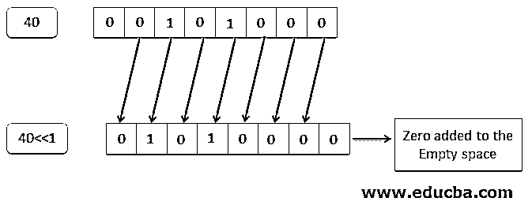
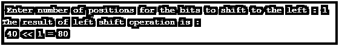
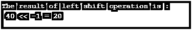
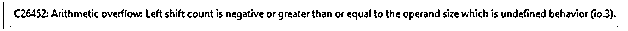
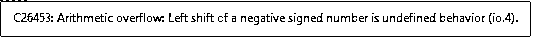
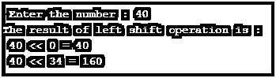
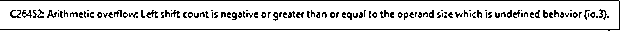

# C 语言中的左移运算符

> 原文：<https://www.educba.com/left-shift-operator-in-c/>


## C 语言中左移运算符介绍

左移运算符是 C #中的一个按位移位运算符，它对位进行运算。它是一个二元运算符，这意味着它需要两个操作数。以下是关于 C 语言中左移运算符的一些要点:

*   它由'<
*   它用于将一个值的位向左移位，方法是在移位后在右侧创建的空白位置添加零。
*   第一个操作数的位向左移动第二个操作数指定的位数。

**语法:**

<small>网页开发、编程语言、软件测试&其他</small>

C 语言中左移运算符的语法如下:

```
variable_name<<number_of_positions
```

在上面的语句中，有两个值；第一个是一个整数变量，我们希望对它应用左移运算符。该变量的名称可以是用户给定的任何名称。第二个值是一个数字，它指定了用户希望向左移动的位数。

### C 语言中左移运算符是如何工作的？

左移运算符需要处理两个操作数。左移运算符的两个操作数都应该是整型。它将第一个操作数的位向左移动第二个操作数指定的位数。同时，由向左移位的位产生的空白空间被填充零。包括符号位，移至末尾的位则被丢弃。

以下是左移位操作结果未定义的一些情况:

*   如果第一个操作数的值为负，那么左移操作的结果将是未定义的。
*   同样，如果第二个操作数的值为负，或者大于或等于第一个操作数的位数，则左移操作的结果将是未定义的。
*   如果第二个操作数的值大于整数的大小，则左移操作的结果也将是未定义的。

因此，当两个操作数都为正时，将执行左移操作。

另一方面，如果第二操作数的值为零，则不会执行左移操作。如 40<<0 的结果将等于 40 本身。

现在让我们借助一个例子来理解左移运算符的工作原理。在这个例子中，我们将采用一个十进制数，比如 40。40 的二进制等值是 101000。我们将对这个二进制值执行左移操作。




在上面的例子中，我们可以看到，在对一个二进制值执行左移操作时，它的所有位都被左移，并且在右侧创建的空白空间被填充为零。

因此，40<<1 的值是 01010000。这个二进制值的十进制等效值是 80。

**Note:** Whenever we will perform left shift operation on an integer ‘a’ with an integer ‘b’. The result of the operation will always be equal of multiplying ‘a’ with ‘2^b’. In the above case a = 40 and b = 1\. Thus, the result of a<<b i.e. 40<<1 is ’40 * 2<sup>1</sup>’ which will be 80.

### 用 C 语言实现左移运算符的例子

下面是 C 语言中左移运算符的例子:

#### 示例#1

显示对两个正操作数执行左移操作的示例。

**代码:**

```
#include<stdio.h>
#include<conio.h>
main()
{
int a = 40;
int b = 0;
printf("\n Enter number of positions for the bits to shift to the left : ");
// accepting the value of second operand from the user
scanf("%d", &b);
printf("The result of left shift operation is : ");
// Binary value of 40 is 101000
printf("\n %d << %d = %d", a, b, a<<b);
}
```

**输出:**




#### 实施例 2

显示第二个操作数的值为负的情况的示例。

**代码:**

```
#include<stdio.h>
#include<conio.h>
main()
{
int result = 0;
result = 40 << -1;
printf("The result of left shift operation is : ");
// Binary value of 40 is 101000
printf("\n 40 << -1 = %d", result);
}
```

**输出:**




除此之外，程序中还有一个警告，用黄色突出显示。

**下面是警告:**




我们得到这个警告是因为我们的第二个操作数是负的。

#### 实施例 3

第一个操作数的值为负时的场景示例。

**代码:**

```
#include<stdio.h>
#include<conio.h>
main()
{
int result = 0;
result = -40 << 1;
printf("The result of left shift operation is : ");
// Binary value of 40 is 101000
printf("\n -40 << 1 = %d", result);
}
```

**输出:**


除此之外，程序中还有一个警告，用黄色突出显示。

**下面是警告:**




我们得到这个警告是因为我们的第一个操作数是负的。

#### 实施例 4

示例显示了要移动的位置数为零且大于整数大小时的情况。

**代码:**

```
#include <stdio.h>
#include <conio.h>
main()
{
int a = 0;
int b = 0;
int result1 = 0, result2 = 0;
printf("\n Enter the number : ");
// accepting the value of first operand from the user
scanf("%d", &a);
result1 = a << 0;
result2 = a << 34;
printf("The result of left shift operation is : ");
printf("\n %d << 0 = %d", a, result1);
printf("\n %d << 34 = %d", a, result2);
}
```

**输出:**




除此之外，程序中还有一个警告，用黄色突出显示。

**下面是警告:**




我们得到这个警告是因为操作数的大小大于整数的大小。

### 结论

*   左移运算符是逻辑按位运算符。
*   它是一个二元运算符，对两个正整数操作数进行运算。
*   它将位向左移动第二个操作数指定的位数。
*   右边创建的空白用零填充。

### 推荐文章

这是一个关于 C 语言中左移运算符的指南。这里我们讨论 C 语言中左移运算符的介绍，以及它是如何与不同的例子和它的代码实现一起工作的。您也可以浏览我们推荐的其他文章，了解更多信息——

1.  [C 中的质数(例题)](https://www.educba.com/prime-numbers-in-c/)
2.  [C 中如何反数？](https://www.educba.com/reverse-number-in-c/)
3.  [C 语言中反串介绍](https://www.educba.com/reverse-string-in-c/)
4.  [在 PHP | Loops 中反转字符串](https://www.educba.com/reverse-string-in-php/)


