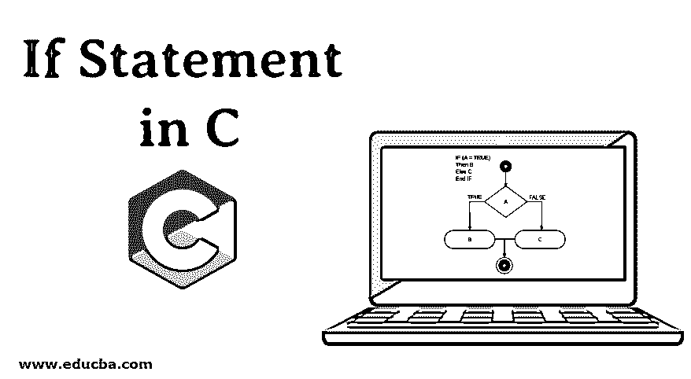
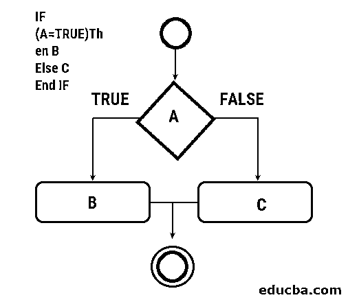

# C 语言中的 If 语句

> 原文：<https://www.educba.com/if-statement-in-c/>




## C 语言中的 If 语句是什么？

If 语句只是一组可用于比较表达式的操作。这些一般有 LHS 和 RHS 两个值。该运算符比较左侧和右侧的表达式。相比之下，它只是返回一个布尔值。

**语法**

<small>网页开发、编程语言、软件测试&其他</small>

C 中 If 语句的一般语法是，

```
if(expression to be evaluated ) {
// sets of instruction which needs to be executed
}
```

### 语法解释

现在，让我们理解上面的语法

一般的 If 语句以上述方式折衷，它包含不同的部分。让我们解释每一部分。

*   **待评估表达式—**在这一部分中，对语句进行评估。该部分通常由左侧和右侧组成。对左侧的 LHS 和右侧的 RHS 进行比较和评估。如果 LHS 等于 RHS 或表达式为真，则控制进入 If 部分
*   **需要执行的指令集—**如果满足 If 块的表达式，则需要执行的指令集被执行

第一部分的典型示例可能是“1 小于 10”，而需要执行的代码的简单示例可能是打印任何数字。

### C 语言中不同类型的 If 语句

这些是不同类型的 If 语句。让我们用语法来深入解释一下。

*   [If-else 语句](https://www.educba.com/if-else-statement-in-matlab/)
*   If-elseif-else 语句

#### If-else 语句

在这个语法中类似于:

```
if(expression to be evaluated ) {
// sets of instruction which needs to be executed
} else {
// sets of instruction which needs to be executed
}
```

#### If-elseif-else 语句

在这个语法中类似于:

```
if( expression to be evaluated ) {
// sets of instruction which needs to be executed for if-block
} else if{
// sets of instruction which needs to be executed for else-if block
} else {
// sets of instruction which needs to be executed for else block
}
```

在这一部分中，对每个块进行评估，并根据评估结果执行代码。

现在让我们看看 C 语言中 If 语句的一般流程图

### If 语句流程图

下面给出了 If 语句的流程图。




### 例子

现在，让我们用例子来理解上述语法

#### If 语句示例

让我们看一个例子

```
#include <stdio.h>
void main () {
int varNumValue = 1;
if( varNumValue < 10 ) { // checks the condition
printf("if statement instructions");  // sets of instructions which needs to be executed
}
}
```

现在，复制上面的代码片段并运行它

它将显示以下输出


#### If-else 语句示例

让我们看一个例子

```
#include <stdio.h>
void main () {
char favoritePlaceToVisit[] = "New York";
if (favoritePlaceToVisit ==  "New York") { // checks the condition
printf(" Your favorite place to visit is New York ");  // sets of instructions which needs to be executed for if block
} else {
printf("Your favorite place is different city");  // sets of instructions which needs to be executed for else block
}
}
```

现在，复制上面的代码片段并运行它

它将显示以下输出:


现在，让我们用一个值初始化变量 favoritePlaceToVisit，比如“Vegas ”,以便执行 else 块。


让我们看一个例子

```
#include <stdio.h>
void main () {
char favoriteFruit[] = "Apple";
if (favoriteFruit ==  "Kiwi") { // checks the condition
printf("You like to eat Apple");  // sets of instructions which needs to be executed for if block
} else {
printf("You don't like to eat Apple");  // sets of instructions which needs to be executed for else block
}
}
```

现在，复制上面的代码片段并运行它

它将显示以下输出:


现在，很容易理解[什么是 If 语句](https://www.educba.com/if-statement-in-shell-scripting/)，什么是 if-else 语句。

#### if-elseif-else 语句示例

```
#include <stdio.h>
void main () {
int enterNumberOfCarsYouHave = 1;
if( enterNumberOfCarsYouHave == 1 ) { // checks the condition
printf("You have one car");  // sets of instructions which needs to be executed for if block
}
else if( enterNumberOfCarsYouHave == 2 ) { // checks the condition
printf("You have two cars");  // sets of instructions which needs to be executed for if else block
}
else if( enterNumberOfCarsYouHave == 3 ) { // checks the condition
printf("You have three cars");  // sets of instructions which needs to be executed for if else block
}
else if( enterNumberOfCarsYouHave == 4 ) { // checks the condition
printf("You have four cars");  // sets of instructions which needs to be executed for if else block
}
else if( enterNumberOfCarsYouHave == 5 ) { // checks the condition
printf("You have five cars");  // sets of instructions which needs to be executed for if else block
}
else if( enterNumberOfCarsYouHave == 6 ) { // checks the condition
printf("You have six cars");  // sets of instructions which needs to be executed for if else block
}
else if( enterNumberOfCarsYouHave == 7 ) { // checks the condition
printf("You have seven cars");  // sets of instructions which needs to be executed for if else block
}
else if( enterNumberOfCarsYouHave == 8 ) { // checks the condition
printf("You have eight cars");  // sets of instructions which needs to be executed for if else block
}
else if( enterNumberOfCarsYouHave == 9 ) { // checks the condition
printf("You have nine cars");  // sets of instructions which needs to be executed for if else block
}
else {
printf("You have more than 10 cars");  // sets of instructions which needs to be executed for else block
}
}
```

现在，复制上面的代码片段并运行它

它将显示以下输出:


### 结论

c 是一种编程语言，其中有许多概念需要学习。假设该语句是其中之一。这些运算符基本上执行代码来检查表达式值是否为真。基于表达式计算，它执行代码。而如果语句被广泛用于任何[编程语言](https://www.educba.com/what-is-a-programming-language/)到各种逻辑编程表达式。

### 推荐文章

这是一个关于 c 语言中 If 语句的指南，在这里我们讨论不同类型的 If 语句，并给出相应的语法解释和示例代码。您也可以看看以下文章，了解更多信息–

1.  [C# if 语句](https://www.educba.com/c-sharp-if-statement/)
2.  [C 语言中的 If-else 语句](https://www.educba.com/if-else-statement-in-c/)
3.  [Python 中的 If Else 语句](https://www.educba.com/if-else-statement-in-python/)
4.  [Python 中的 If 语句](https://www.educba.com/if-statement-in-python/)


