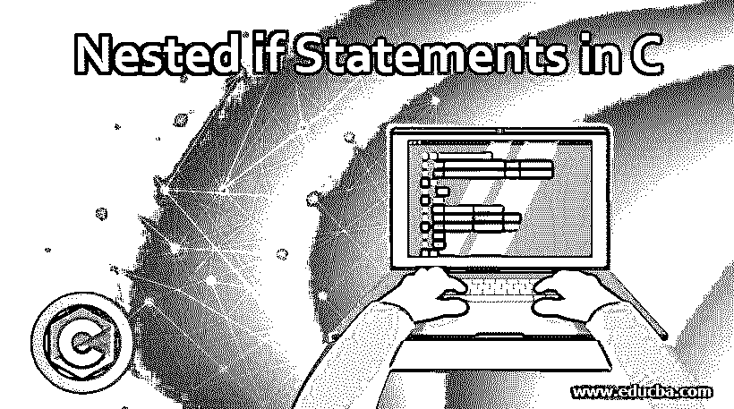
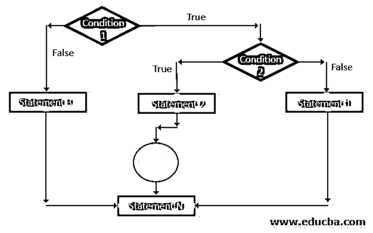
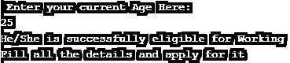
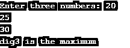
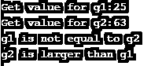

# C 语言中的嵌套 if 语句

> 原文：<https://www.educba.com/nested-if-statement-in-c/>




## C 语言中嵌套 if 语句介绍

C #中的嵌套 if 语句是一个 if 语句嵌套在另一个 if 语句中，一个 if 语句嵌套在一个 else 语句中。一旦 else 语句失败，下一次执行语句时会返回一个 true 语句，这时我们需要嵌套 if 语句，使整个代码流按照语义顺序。C 语言中的嵌套 if 语句在用 else 仔细检查 if 语句的内部嵌套语句时起着非常关键的作用。

**语法:**

<small>网页开发、编程语言、软件测试&其他</small>

```
if ( check 1<sup>st</sup> condition)
{
if ( check 2<sup>nd</sup> condition)
{
Verify True statements of 2<sup>nd</sup> condition;
}
else
{
Verify False statements of 2<sup>nd</sup> condition;
}
else
{
Verify False statements of 1<sup>st</sup> condition;
}
```

**说明:**

嵌套 if 语句的语法流程是这样的:if 语句将检查第一个条件，如果它对真值满意，那么它将检查第二个<sup>和</sup>条件。同样，如果第二个<sup>和第三个</sup>条件得到满足，并且值为真，那么该组语句将被执行。如果它不满足为真，它将转到 else 部分以验证第二个条件是否为假。最后嵌套 if 或 else 来检查真实条件。

**流程图:**




执行流程是这样的，条件 1 将被测试，如果它为假，那么语句 3 将被执行。如果条件 1 得到满足，即如果它为真，那么它将进行测试条件 2 的下一次执行。如果条件 2 的语句为假或不满足，那么它将考虑语句 2 执行 else。

### C 语言中嵌套 if 语句的使用

有一个例子可以很好地说明嵌套 if 语句的工作原理。我们举个例子了解一下。一旦年满 18 岁，每个人都有资格工作，否则没有资格工作。此外，任何组织将提供一份工作，如果他或她超过 18 岁，否则没有工作是有保证的，这意味着条件，然后就变成假的。因此，我们将利用另一个嵌套的 if 语句来检查所需的资格或任何其他特殊技能或要求是否满足。

嵌套 if 语句的工作方式是，当 if 条件为真时，其他语句可以为假条件，但随后它假定它必须为真，并且满足具有第二个条件的其他语句，则需要嵌套 if 语句。描述这种不确定逻辑背后的一个非常特殊的特征是嵌套 If 语句。

像 if 这样的控制语句可以很容易地嵌套在另一个嵌套的 if 语句中，此外，如果外部语句失败，编译器将跳过整个块，而不考虑任何其他内部语句条件。

### C 语言中嵌套 if 语句的示例

下面是 C 语言中嵌套 if 语句的示例:

#### 示例#1

使用嵌套的 if 语句分析特定年龄组的人的程序，如果他们的条件和标准得到满足，他们就有资格获得合适的工作。

**代码:**

```
#include <stdio.h>
int main()
{
int a;
printf(" Enter your current Age Here:\n");
scanf("%d",&a);
if ( a < 18 )
{
printf("Consider as minor \n");
printf("Not fit for Working");
}
else
{
if (a >= 18 && a <= 50 )
{
printf("He/She is successfully eligible for Working \n");
printf("Fill all the details and apply for it\n");
}
else
{
printf("Age is not satisfactory according to the organization norms\n");
printf("Ready for retirement and can collect pension \n");
}
}
return 0;
}
```

**输出:**




#### 实施例 2

程序在考虑的数字中找出哪个数字更大，然后在嵌套 if 语句的帮助下如何执行。如果流成功，那么它被算作正常流。

**代码:**

```
#include <stdio.h>
int main()
{
int x = 65, y = 35, z = 2;
if (x > y)
{
if (x > z)
{
printf("x is larger than y and z ");
}
}
printf("\n flow for the program is proper ");
return 0;
}
```

**输出:**


#### 实施例 3

程序从三个数字中找出最大的数字，用嵌套的 if 进行一定的排列和组合，然后得到三个最大数字的输出。

**代码:**

```
#include <stdio.h>
int main()
{
int dig1, dig2, dig3;
printf("Enter three numbers: ");
scanf("%d%d%d", &dig1, &dig2, &dig3);
if(dig1 > dig2)
{
if(dig1 > dig3)
{
printf("dig1 is the maximum");
}
else
{
printf("dig3 is the maximum");
}
}
else
{
if(dig2 > dig3)
{
printf("dig2 is the maximum");
}
else
{
printf("dig3 is the maximum");
}
}
return 0;
}
```

**输出:**




#### 实施例 4

程序接受用户输入的某些数字，然后从这些数字中计算出最大值，然后给出结果，在使用嵌套的 if 语句处理后，该值是否大于或等于。

**代码:**

```
#include <stdio.h>
int main()
{
int g1, g2;
printf("Get value for g1:");
scanf("%d", &g1);
printf("Get value for g2:");
scanf("%d",&g2);
if (g1 != g2)
{
printf("g1 is not equal to g2\n");
if (g1 > g2)
{
printf("g1 is larger than g2\n");
}
else
{
printf("g2 is larger than g1\n");
}
}
else
{
printf("g1 is equal to g2\n");
}
return 0;
}
```

**输出:**

**

** 

通过上面举例说明的程序，可以很好地分析出，当涉及断言和操作的所有关键决策语句的场景满足条件时，嵌套 if 语句起着非常关键的作用。

### 结论

可以很容易地得出这样的结论:嵌套 if 语句可以执行，但当它进入 else 部分时，需要处理 false 语句，需要执行控制并将其设置为 true 值，然后嵌套 if 语句，因为它是救世主。

### 推荐文章

这是一个 C 语言中嵌套 if 语句的指南，这里我们讨论 C 语言中嵌套 if 语句的介绍，它的例子以及它的代码实现。您也可以浏览我们推荐的其他文章，了解更多信息——

1.  [反转 C 中的字符串](https://www.educba.com/reverse-string-in-c/)
2.  [Java 中嵌套的 if 语句](https://www.educba.com/nested-if-statements-in-java/)
3.  [在 JavaScript 中嵌套 if](https://www.educba.com/nested-if-in-javascript/)
4.  [C 语言中的函数原型](https://www.educba.com/function-prototype-in-c/)


