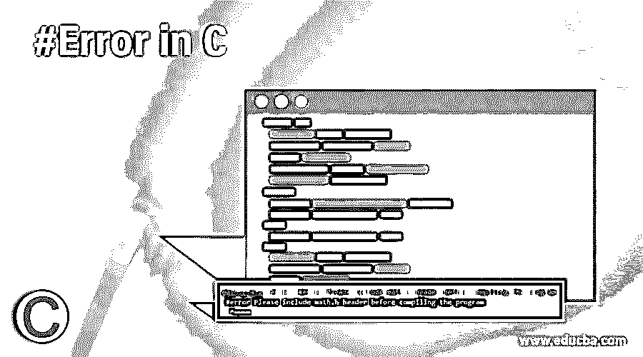

# # C 中的错误

> 原文：<https://www.educba.com/sharp-error-in-c/>




## C #错误简介

C #中的#error 是 C 预处理器最有用的特性之一，它是一个指示错误的指令。它导致编译失败，同时允许我们发出一条将显示为编译错误的语句。#error 指令可以与 if 条件或 elif 条件或 else 条件结合使用，以导致编译失败并显示相应的消息。只要在程序中遇到#error 指令，并且条件为真，相应的消息就会显示为编译错误输出，并且跳过程序编译的其余部分。

**C 中#Error 的语法如下:**

<small>网页开发、编程语言、软件测试&其他</small>

```
#error <Compilation failed error message to be displayed as the output>
```

### 在 C 语言中#Error 的工作方式如下

*   每当需要在显示适当的编译错误信息时指出错误并跳过程序其余部分的执行时，我们就使用# error 指令。
*   当我们在 C 中使用#error 时，它会导致编译失败，同时允许我们发出一个将显示为编译错误的语句。
*   #error 指令可以与 if 条件或 elif 条件或 else 条件结合使用，以导致编译失败并显示相应的消息。
*   只要在程序中遇到#error 指令，并且条件为真，相应的消息就会显示为编译错误输出，并且跳过程序编译的其余部分。

### C #中的#Error 示例

下面是 C #中的#Error 示例:

#### 示例#1

一个 c 程序，演示如何在程序中使用#error 指令，以在条件为真时显示遇到#error 指令时的自定义编译错误信息，并跳过程序其余部分的编译

**代码:**

```
#include<stdio.h>
//making use of if-else condition while including #error directive with the appropriate compilation failed message to be displayed on the output screen
#ifndef __MATH_H
#error Please include math.h header before compiling the program
#else
//if the #error directive condition is false, then the else part containing the main method is executed which consists of three doubles variables to store double values and then make use of pow function to find the power and display the value.
int main()
{
double a = 2.0;
double b = 2.0;
double c;
c = pow(a, b);
printf("The power of a raised to b is : %lf", c);
return 0;
}
//if else condition ends here
#endif
```

**输出:**


在上面的程序中，我们利用 if-else 条件，同时包括#error 指令，并在输出屏幕上显示适当的编译失败消息。这里我们检查 math.h 头文件是否包含在程序中，或者是否包含在 if-else 条件中，因为程序使用了 math.h 头文件中的数学函数。如果不包括头文件，将显示 custom #error 指令消息，并跳过程序的其余部分。如果程序中包含 math.h 头，则执行 else 部分，在给定两个数字的情况下，计算一个数字的幂，并显示输出。输出如上面的快照所示。

#### **例 2**

一个 c 程序，演示如何在程序中使用#error 指令，以在条件为真时显示遇到#error 指令时的自定义编译错误信息，并跳过程序其余部分的编译

**代码:**

```
#include<stdio.h>
//making use of if else condition while including #error directive with the appropriate compilation failed message to be displayed on the output screen
#ifndef __MATH_H
#error Please include math.h header before compiling the program
#else
//if the #error directive condition is false, then the else part containing the main method is executed which consists of three doubles variables to store double values and then make use of pow function to find the power and display the value.
int main()
{
int a, b;
a = abs(-50);;
printf("The absolute value of the given number is: %d\n", a);
b = abs(-100);;
printf("The absolute value of the given number is: %d\n", b);
return 0;
}
//if else condition ends here
#endif
```

**输出:**


在上面的程序中，我们利用 if-else 条件，同时包括#error 指令，并在输出屏幕上显示适当的编译失败消息。这里我们检查 math.h 头是否包含在程序中，或者是否包含在 if-else 条件中，因为程序使用了 math.h 头中的数学函数。如果不包括头文件，将显示 custom #error 指令消息，并跳过程序的其余部分。如果 math.h 头包含在程序中；执行 else 部分，查找给定数字的绝对值并显示输出。输出如上面的快照所示。

### C # Error 的优点

在 c 中使用#error 指令有几个优点，它们是:

*   通过在程序中使用#error 指令，可以节省编译整个程序所需的编译时间，因为一旦在程序中遇到#error 指令，程序的编译就在那里停止，并跳过程序其余部分的编译。
*   通过使用#error 指令，可以将自定义编译失败的消息显示为输出。

### 结论

在本教程中，我们将通过编程示例及其输出来了解 C #error 指令的定义、语法和工作原理，以及在我们的程序中使用# error 指令来显示自定义编译失败消息和跳过程序其余部分的编译的优点。

### 推荐文章

这是一个 C # Error 的指南。这里我们讨论 C # Error 的语法和例子，以及代码和输出。您也可以看看以下文章，了解更多信息–

1.  [C 编程中的数组](https://www.educba.com/arrays-in-c-programming/)
2.  [C 编程中的模式](https://www.educba.com/patterns-in-c-programming/)
3.  [C 语言中的编程错误](https://www.educba.com/programming-errors-in-c/)
4.  [C 编程矩阵乘法](https://www.educba.com/c-programming-matrix-multiplication/)


