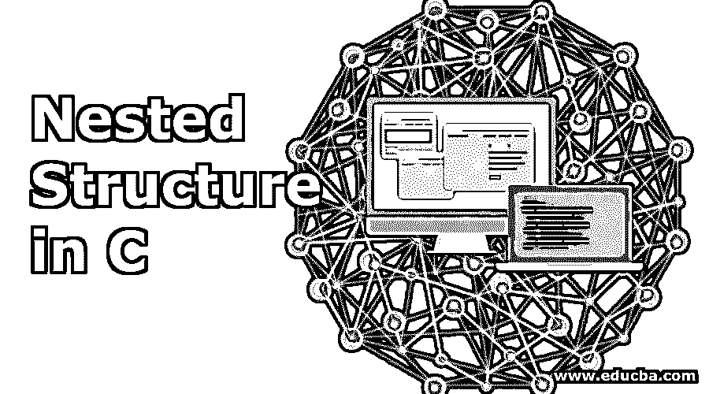
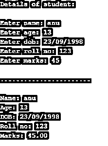
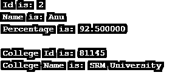
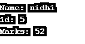
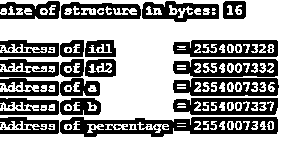

# C 语言中的嵌套结构

> 原文：<https://www.educba.com/nested-structure-in-c/>




## C 语言中的嵌套结构介绍

任何编程语言都有自己定义和描述结构的方式。所以在 C 语言中，嵌套结构就像它的名字一样，是在一个结构中定义另一个结构。任何成员变量都可以在一个结构中定义，反过来，该结构可以进一步移动到另一个结构中。结构中的变量可以是任何东西，比如 normal 或 pointer 或任何东西，可以放在结构中的任何地方。

可以通过两种方式访问嵌套结构:

<small>网页开发、编程语言、软件测试&其他</small>

1.  使用指针变量在 C #中的结构内部构造。
2.  使用普通变量在 C #中的结构内部构造。

**语法:**

以下是创建嵌套结构的语法:

```
structure tagname_1
{
var_1;
var_2;
var_3;
.
.
.
.
var n;
structure tagname_2
{
var_1;
var_2;
var_3;
.
.
.
var_n;
}, mem1
} mem2;
```

### C 语言中嵌套结构的使用

从上面的语法中，我们可以推断出这样一个事实:嵌套在 member1 结构中的 mem1 结构将包含要访问的成员或变量，并且可以使用。(点)运算符。

*   **mem2.mem1.var_1:** 这是指结构 tagname_1 的变量的第一个成员。
*   **mem2.mem1.var_2:** 这是指结构 tagname_2 的变量的第二个成员。

我们将举更多的例子来阐明语法如何满足嵌套结构的工作。

#### 示例#1

```
struct employee
{
struct man
{
char name [20];
int age;
char dob[10];
} d;
int empid;
char desg[10];
} emp;
```

在上面的例子中，man 结构是在 employee 结构中定义的，employee 结构是一个嵌套结构。可以使用下面的语法或格式访问嵌套结构中的成员。

像在给定的例子中一样

*   雇员。name: 它讲述了雇员结构中的那个人的名字。
*   雇员。年龄:它将显示作为雇员的男子的年龄。

重要的是要注意这样一件事，雇员结构中的 man 结构不能被重用，这意味着它不能在整个代码中的任何地方被再次调用，因为它不是自生成的。

相反，对此的解决方法可以是:

我们可以在外部定义结构，然后在结构内部声明变量，只要我们想在代码中访问它。

#### 示例#2

```
Struct man
{
char name[20];
int age;
char dob [10];
};
```

此外，这个结构可以被外部结构重用。

```
struct employee
{
struct man info;
int id;
char desg [10];
}
```

使用这种类型的结构声明的优点是，我们可以在整个程序的任何地方声明 struct man 类型的变量。

**Note:** Nesting of structure within itself is never allowed.

让我们看一个不允许结构嵌套的例子。

```
struct teacher
{
char name[20];
char address[100];
int age[];
struct teacher principal; // totally invalid way to create nested structure.
} 
```

### C 语言中嵌套结构的例子

下面是 C 语言中嵌套结构的不同例子:

#### 示例 1–嵌套结构的初始化

嵌套结构的初始化可以在声明时进行。

**代码:**

```
struct student
{
struct person info;
int rollno;
float marks[10];
}
struct student student_1 = {
{"Anji", 26, 1995},
103,
92
};
```

**例子**

**代码:**

```
#include <stdio.h>
struct person
{
char name[20];
int age;
char dob[10];
};
struct student
{
struct person info;
int roll_no;
float marks;
};
int main ()
{
struct student p1;
printf("Details of student: \n\n");
printf("Enter name: ");
scanf("%s", p1.info.name);
printf("Enter age: ");
scanf("%d", &p1.info.age);
printf("Enter dob: ");
scanf ("%s", p1.info.dob);
printf("Enter roll no: ");
scanf("%d", &p1.roll_no);
printf("Enter marks: ");
scanf ("%f", &p1.marks);
printf("\n.......................\n\n");
printf("Name: %s\n", p1.info.name);
printf("Age: %d\n", p1.info.age);
printf("DOB: %s\n", p1.info.dob);
printf("Roll no: %d\n", p1.roll_no);
printf("Marks: %.2f\n", p1.marks);
return 0;
}
```

**输出:**




#### 示例 2——使用指针访问嵌套结构中的成员

**代码:**

```
#include <stdio.h>
#include <string.h>
struct student_college_info
{
int college_id;
char college_name[50];
};
struct student_info
{
int id;
char name[20];
float percentage;
struct student_college_info clg_data;
} stu_data, *stu_data_ptr;
int main()
{
struct student_info stu_data = {2, "Anu", 92.5, 81145,
"SRM University"};
stu_data_ptr = &stu_data;
printf(" Id is: %d \n", stu_data_ptr->id);
printf(" Name is: %s \n", stu_data_ptr->name);
printf(" Percentage is: %f \n\n",
stu_data_ptr->percentage);
printf(" College Id is: %d \n",
stu_data_ptr->clg_data.college_id);
printf(" College Name is: %s \n",
stu_data_ptr->clg_data.college_name);
return 0;
}
```

**输出:**




#### 示例 3–将结构成员作为参数传递给函数

**代码:**

```
struct teacher
{
char name [20];
int id;
int marks;
};
void print_struct (char name [], int id, int marks);
int main ()
{
struct teacher tea = {"nidhi", 5, 52};
print_struct (tea.name, tea.id, tea.marks);
return 0;
}
void print_struct (char name [], int id, int marks)
{
printf ("Name: %s\n", name);
printf ("id: %d\n", id);
printf ("Marks: %d\n", marks);
printf("\n");
}
```

**输出:**




#### 示例 4–使用普通变量的结构内部结构

**代码:**

```
#include <stdio.h>
#include <string.h>
struct student_college_detail
{
nt college_id;
char college_name[50];
};
struct student_detail
{
int id;
char name[20];
float percentage;
struct student_college_detail clg_data;
} stu_data;
int main()
{
struct student_detail stu_data = {8, "Moam", 50.5, 562345,
"CSS University"};
printf(" Id is: %d \n", stu_data.id);
printf(" Name is: %s \n", stu_data.name);
printf(" Percentage is: %f \n\n", stu_data.percentage);
nbsp;
printf(" College Id is: %d \n",
stu_data.clg_data.college_id);
printf(" College Name is: %s \n",
stu_data.clg_data.college_name);
return 0;
}
```

**输出:**


**例子**

**代码:**

```
#include <stdio.h>
#include <string.h>
struct student
{
int id1;
int id2;
char e;
char f;
float percentage;
};
int main ()
{
int i;
struct student recrd1 = {3, 4, 'C', 'B', 80.5};
printf ("size of structure in bytes: %d\n",
sizeof(recrd1));
printf ("\nAddress of id1        = %u", &recrd1.id1);
printf("\nAddress of id2        = %u", &recrd1.id2 );
printf("\nAddress of a          = %u", &recrd1.e );
printf("\nAddress of b          = %u", &recrd1.f );
printf("\nAddress of percentage = %u”, &recrd1.percentage);
return 0;
}
```

**输出:**




**Note:** Although it is good to pass structure variables as an argument because it allows us to pass all members of structure to function but still this is not a conventional method to do so.

### 结论

C 中的 Structures 是一种非常有趣的方法，可以将所有用户定义的成员变量和函数聚集到一个实体中。但是，它仍然有一些限制，比如它不允许结构变量和整个结构包含内置数据类型，也不允许使用运算符。因此，在不久的将来，也许这些功能可以得到照顾。

### 推荐文章

这是一个关于 C 语言中嵌套结构的指南，这里我们讨论了 C 语言中嵌套结构的工作，以及不同的例子和代码实现。您也可以阅读以下文章，了解更多信息——

1.  [C 编程中的模式](https://www.educba.com/patterns-in-c-programming/)
2.  [C 语言中的左移运算符](https://www.educba.com/left-shift-operator-in-c/)
3.  [C 语言中的表达式求值](https://www.educba.com/expression-evaluation-in-c/)
4.  [C 语言中的十进制到十六进制](https://www.educba.com/decimal-to-hexadecimal-in-c/)


