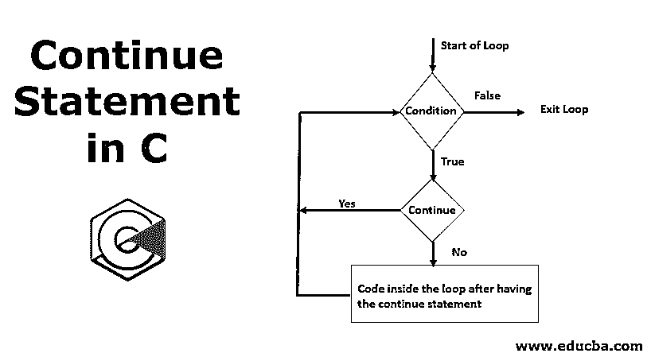
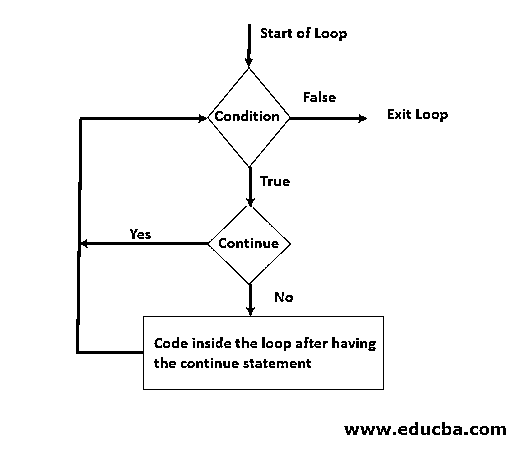
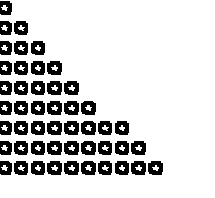

# C 语言中的 Continue 语句

> 原文：<https://www.educba.com/continue-statement-in-c/>




## C 语言中的 Continue 语句简介

在这里，我们将学习 c 语言中的 continue 语句。该语句主要用于迭代器的[情况或循环情况。顾名思义，该语句确保代码在特定语句执行后继续运行。它的使用方式与](https://www.educba.com/iterators-in-c-sharp/)[break 语句](https://www.educba.com/break-statement-in-javascript/)相同，但是 break 语句将停止循环或一系列语句的执行，而 continue 语句将继续代码的执行。

下面是 c 语言中 continue 语句的语法。

<small>网页开发、编程语言、软件测试&其他</small>

**语法:**

```
continue;
```

如前所述， [continue 语句在循环中使用](https://www.educba.com/continue-statement-in-c-plus-plus/)。所以该语句的唯一语法应该如上所示。

### 流程图

通过流程图我们可以更好的理解；下面来看看。




**解释**

*   众所周知，任何循环都是以一个条件开始的，它有两种情况。一个是当条件为真时必须执行的语句，另一个是当条件为假时必须执行的语句。
*   当条件为假时，它显然会退出循环。
*   当一个条件为真并且有 continue 语句时，[迭代器再次返回到条件，上述过程继续。](https://www.educba.com/iterator-in-java/)
*   如果条件没有 continue 语句，则执行下面的代码。

现在让我们继续在我们的程序中使用这个语句，看看它是如何工作的。

### 例子

我们将看 3 个例子来说明如何在 C 语言中使用 continue 语句。

#### 示例#1

寻找从 0 到 20 的奇数。

**代码:**

```
#include <stdio.h>
int main()
{
int i;
for(i=0;i<20;i++)
{
if(i%2==0)
{
continue;
}
printf("%d ",i);
}
}
```

**输出:**


根据观察，我们可以看到程序是如何工作的:

*   我们声明了一个变量。
*   我们通过将 I 的值初始化为 0 并递增 1 直到数字小于 20 来进行循环。
*   然后我们还有另一个条件，如果，I 除以 2 的模是零；也就是说，它将表示一个偶数，然后我们使用 continue 语句，通过将它的值递增 1，依次将程序迭代回它们，进行循环。
*   如果变量 I 不是偶数，那么正在执行 print 语句，它反过来只打印奇数。

现在，如果我们试着在 continue 语句后写一些代码或者语句会怎么样呢？那些会被执行吗？让我们检查这里。

我们刚刚修改了上面的程序；我们刚刚在 continue 语句下面添加了一个 print 语句。

**代码:**

```
#include <stdio.h>
int main()
{
int i;
for(i=0;i<20;i++)
{
if(i%2==0)
{
continue;
printf("This will not be executed");
}
printf("%d ",i);
}
}</code>
```

**输出:**


获得了与第一个示例程序相同的输出。通过这个变化，我们可以看出，在遇到 continue 语句之后；迭代直接再次进行。在同一个循环或 if/else 条件中出现的任何紧接在下面的语句或 continue 语句都不会被执行。

#### 实施例 2

假设一个电影院有 30 个座位，从第 15 个<sup>到第</sup>个座位有 5 个座位被预定了，那我们怎么把剩下的座位给人看。

我们试图使用 do-while 循环来编写这个代码，我们可以用与上面类似的方式来显示数字。

**代码:**

```
#include <stdio.h>
int main () {
int a = 0;
/* do loop execution */
do {
if( a == 15) {
a = a + 5;
continue;
}
printf("%d ", a);
a++;
} while( a < 30 );
return 0;
}
```

**输出:**


这些是我们编写代码的步骤。

*   我们将 a 的值初始化为零，并且 having do 循环。
*   然后我们有一个 if 循环，条件是变量 a 等于 15。
*   然后将 a 的值增加 5，然后[使用继续再次开始循环](https://www.educba.com/continue-in-c-sharp/)。
*   然后我们可以得到 20 个数字之后的数字，然后我们的 while 循环将检查“a”值，直到 30 个数字。

#### 实施例 3

按升序打印星号，跳过打印星号计数为 7 的行。

**代码:**

```
#include <stdio.h>
int main()
{
int a = 1;
int count = 0;
for (int a = 1; a <= 10; )
{
if (count < a)
{
printf("* ");
count++;
continue;
}
if(count==6)
{
count++;a++;
continue;
}
if (count == a)
{
printf("\n");
a++;
count = 0;
}
}
}
```

**输出:**




我们到底做了什么？

*   首先，我们声明并初始化了两个值。一个用于由‘a’表示的行计数，另一个用于由‘count’表示的星计数。
*   然后我们运行循环，行数少于 10。
*   在里面，我们有 3 个 if 循环。
*   第一个 if 循环将打印星星，并确保行号与星星的编号同步。
*   第三，一旦行数和星数相等，循环将增加行数。
*   第二个 if 循环是我们的条件，如果我们遇到计数为 6，我们只是增加计数和行号，这样行号为 7 的第 7 行被禁止打印。

我们在这里看到了不同的例子。

所以作为一个练习，你能不能试着从 20 号开始按降序只打印偶数个星星？

同样的，你能试着在 case 函数中写这个 continue 语句吗？

### 结论–继续 C 语言中的语句

我希望您在学习 continue 语句的过程中度过了愉快的时光，并且理解了我们到底在哪里需要这个语句。我们已经讨论了在哪里可以使用它，以及它如何在不同的编程场景中帮助我们。不断尝试和尝试，在不同的场景中继续陈述，享受学习的乐趣。

### 推荐文章

这是一个 c 语言中 continue 语句的指南，这里我们讨论了 c 语言中 Continue 语句的语法、流程图和不同的例子，以及代码实现。您也可以阅读以下文章，了解更多信息——

1.  [C 语言中的 Switch 语句](https://www.educba.com/switch-statement-in-c/)
2.  [C 存储类](https://www.educba.com/c-storage-classes/)
3.  [换入 C](https://www.educba.com/swapping-in-c/)
4.  [最佳 C 编译器](https://www.educba.com/best-c-compilers/)


