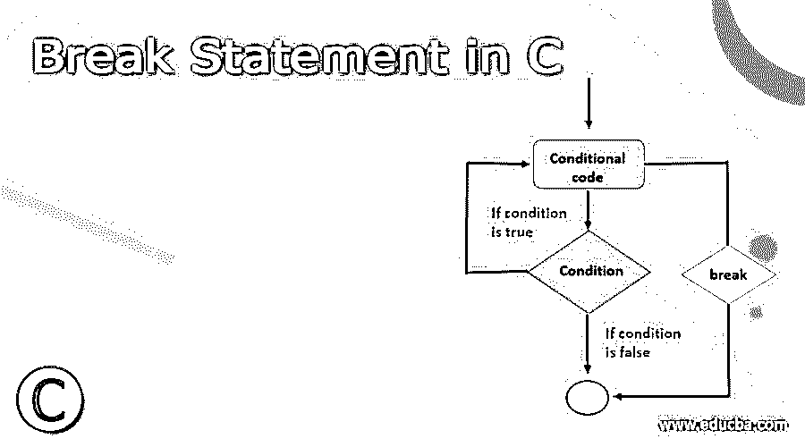
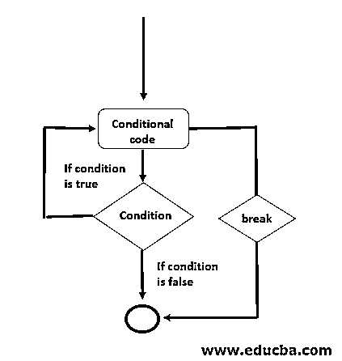
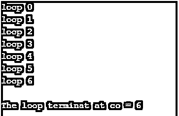
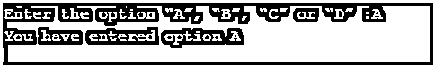
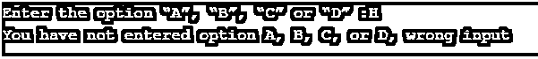
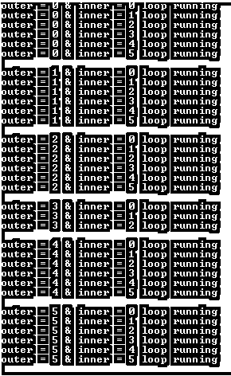
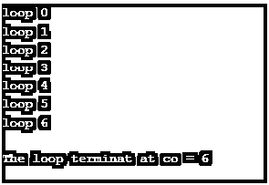
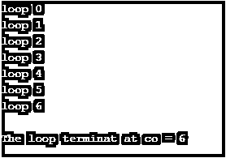
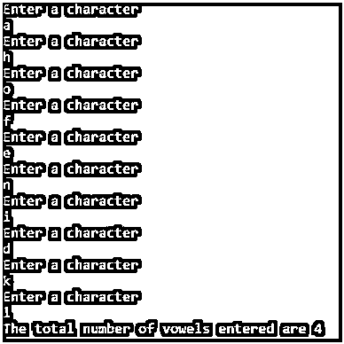
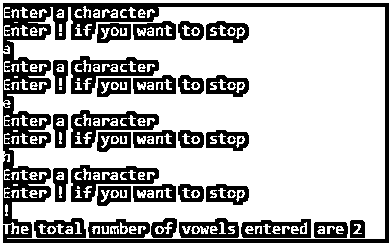

# C 语言中的 Break 语句

> 原文：<https://www.educba.com/break-statement-in-c/>




## C 语言中 Break 语句介绍

C 中的 Break 语句是一个循环[控制语句，用来](https://www.educba.com/control-statements-in-c/)终止循环。有两种用法，下面解释给定的语句。

*   **循环内:**如果 break 语句在循环内与[If 语句](https://www.educba.com/if-statement-in-python/)一起使用，那么如果条件为真，循环立即终止，循环后的下一条语句由程序控制开始执行。
*   **Switch case 内:**如果 C 中的 break 语句是在每个 [switch case](https://www.educba.com/switch-case-in-shell-scripting/) 后的 Switch Case 内使用的[，那么 Break 语句在执行完一个 Case 后终止该 Case。](https://www.educba.com/switch-case-in-powershell/)

一般来说，我们在需要根据条件停止循环执行或者不确定循环要迭代多少次的情况下使用 break 语句。如果 break 语句[在嵌套循环](https://www.educba.com/nested-loop-in-c-plus-plus/)内部使用，那么 break 语句会中断内部循环，并在程序控制的内部循环继续到外部循环后开始执行该语句。

<small>网页开发、编程语言、软件测试&其他</small>

**Break 语句的语法:**

```
// inside switch case or loop
break;
```

### 流程图

图-中断语句的流程图




### 用 C 语言实现 Break 语句的例子

以下是用 C 语言实现的不同示例:

#### 程序示例#1

for 循环中的 Break 语句

```
#include<stdio.h>
int main ()
{
int co;
for(co = 0; co < 10; co++)
{
printf("loop %d\n",co);
if(co == 6)
break;
}
printf("\n",co);
printf("The loop terminat at co = %d", co);
return 0;
}
```

**上面代码的输出:**




#### 程序示例#2

开关盒内的 Break 语句

```
#include <stdio.h>
void main()
{
char opt;
printf("Enter the option \“A\”, \“B\”, \“C\” or \“D\” :");
scanf( "%c", &opt );
switch (opt)
{
case 'B':
printf( "You have entered option B " );
break;
case 'A':
printf( "You have entered option A " );
break;
case 'D':
printf( "You have entered option D ");
break;
case 'C':
printf( "You have entered option C " );
break;
default:
printf ( "You have not entered option A, B, C, or D, wrong input ");
}
}
```

**上面代码的输出:**







#### 程序示例#3

嵌套循环内的 Break 语句[，在嵌套的情况下，它只中断内部循环，而不中断外部循环，这是代码可以理解的](https://www.educba.com/nested-loop-in-javascript/)

```
#include<stdio.h>
int main()
{
int inner, outer;
for( outer=0; outer <= 5; outer++)
{
for(inner=0; inner <= 5; inner++)
{
printf("outer = %d & inner = %d loop running\n",outer,inner);
if(outer == 3 && inner == 2)
{
break;
}
}
printf("\n");
}
return 0;
}
```

**上面代码的输出:**




因此，在上面的输出中，当 outer = 3 & inner = 2 时，内部循环中断，执行继续到第四次迭代的外部循环。

#### 程序示例#4

while 循环中的 Break 语句

考虑下面的例子[在 while 循环中使用 break 语句](https://www.educba.com/break-vs-continue/)。

```
#include <stdio.h>
int main ()
{
int co = 0;
while(co < 10)
{
printf("loop %d\n",co);
if(co == 6)
break;
else
co = co +1;
}
printf("\n",co);
printf("The loop terminat at co = %d", co);
return 0;
}
```

**上面代码的输出:**




#### 程序示例#5

do-while 循环中的 Break 语句

考虑下面的例子，在 do-while 循环中使用 break 语句。

```
#include<stdio.h>
int main ()
{
int co = 0;
do
{
printf("loop %d\n",co);
if(co == 6)
break;
else
co = co +1;
}while(co < 10);
printf("\n",co);
printf("The loop terminat at co = %d", co);
return 0;
}
```

**上面代码的输出:**




#### 程序示例#6

接下来，我们用 break 语句编写一些 c 程序示例

```
#include <stdio.h>
void linearsearch(int a[], int key)
{
// search for key by traverse to array one by one element in loop
for (int indx = 0; indx <= (sizeof(a) / sizeof(a[0])) ; indx++) {
if (a[indx] == key) {
printf( "Element present at position : %d ", (indx + 1));
// stop execution of the loop by break
break;
}
}
}
int main() {
int a[] = { 11, 22, 33, 44, 55, 65 };
// search for key 22
int key = 22;
// linearserch function call to serach key 22
linearsearch(a, key);
return 0;
}
```

**上面代码的输出:**


#### 程序示例#7

接下来，我们编写 c 程序示例来接受用户输入的字符，并计算用户输入的元音数。

```
#include<stdio.h>
int main ()
{
char inp, opt;
int count=0,i;
for(i=1;i<=10;i++)
{
printf( "Enter a character \n" );
scanf( "%c", &inp );
fflush( stdin );
if( inp=='a' || inp=='e' || inp=='i' || inp=='o' || inp=='u' )
{
count = count+1;
}
}
printf("The total number of vowels entered are %d ", count);
return 0;
}
```

**上面代码的输出:**




#### 程序示例#8

上面的代码我们用 break 语句重写，如下面的 c 程序所示

```
#include <stdio.h>
#include<stdio.h>
int main ()
{
char inp, opt;
int count=0,i;
for(i=1;i<=10;i++)
{
printf( "Enter a character \n" );
printf( "Enter ! if you want to stop \n" );
scanf( "%c", &inp );
fflush(stdin);
if( inp=='a' || inp=='e' || inp=='i' || inp=='o' || inp=='u' )
{
count = count+1;
}
if( inp=='!' )
{
break;
}
}
printf("The total number of vowels entered are %d ", count);
return 0;
}
```

**上面代码的输出:**




### 结论

使用的 break 关键字将程序控制从循环执行中带出。C 编程中 break [语句有两种用法，一是在循环内部，二是在开关盒](https://www.educba.com/c-programming-matrix-multiplication/)内部[。](https://www.educba.com/python-switch-case/)

### 推荐文章

这是 C 语言中 break 语句的指南，这里我们讨论 C 语言中 Break 语句的语法、流程图和用法，以及不同的例子和代码实现。您也可以浏览我们推荐的其他文章，了解更多信息——

1.  [网站类型](https://www.educba.com/types-of-websites/)
2.  什么是虚拟主机？
3.  [网络应用安全](https://www.educba.com/web-application-security/)
4.  [什么是 Selenium Web 驱动？](https://www.educba.com/what-is-selenium-web-driver/)
5.  [c++中控制语句的完整指南](https://www.educba.com/control-statement-in-c-plus-plus/)
6.  [JavaScript 中控制语句的类型](https://www.educba.com/control-statement-in-javascript/)
7.  [概述和 Java 中不同的控制语句](https://www.educba.com/control-statement-in-java/)
8.  [PHP 6 大突破实例指南](https://www.educba.com/break-in-php/)


