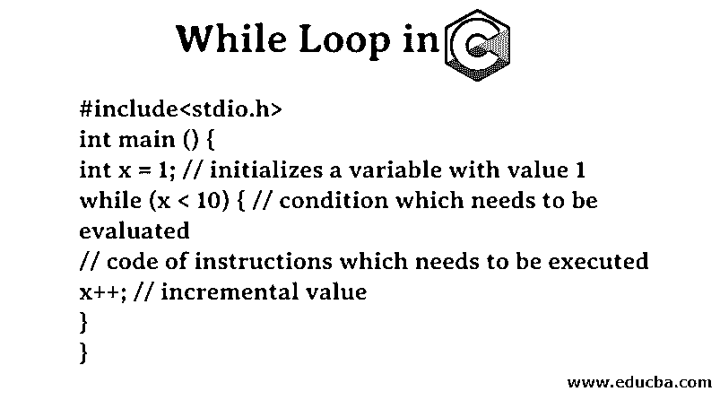
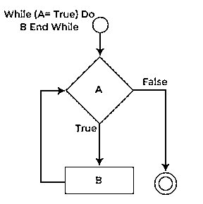
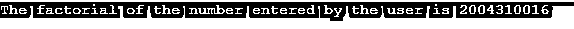
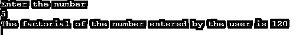

# 在 C 语言中循环时

> 原文：<https://www.educba.com/while-loop-in-c/>




## C 语言中的 While 循环介绍

随着科技的到来，计算机得到了发展，这反过来又带来了对编程语言的要求。有许多编程语言，包括低级语言和高级语言。与低级语言相比，高级语言更容易使用，因为它们更容易理解。c 就是这样一种广泛用于编程目的的高级语言。然而，有许多概念需要学习和实践才能理解基本概念。在本文中，我们将讨论 c 语言中的 While 循环。

### C 中的 While 循环是什么？

C 中有几个条件方法，如 if-else 方法、if-else-if 方法、while 方法、do-while 方法以及其他几个方法。在 C 语言的不同方法中，有一种方法是 while 循环方法。如果条件满足，我们使用这个方法来运行一组特定的指令或代码。while 循环语句通常包含多组指令。根据条件，如果表达式为真，可能会执行一行或多行代码。如果表达式不满足，那么循环中的指令代码将不被执行。当表达式得到满足时，它被执行。

<small>网页开发、编程语言、软件测试&其他</small>

### C 语言中 While 循环的语法

让我们试着理解一下 c 语言中 while 循环的基本语法。

```
While (condition which needs to be evaluated)
{
Instructions of code
Increment of the value;
}
```

现在，让我们试着理解这个语句块实际上是如何运行的。

*   **需要评估的条件:**括号内的代码用于提供需要评估的条件。如果这个求值条件得到满足，那么就执行代码的指令。一个典型的例子是检查变量 x 是否小于 10。
*   **代码说明:**这里，我们添加了那些一旦条件得到满足就需要执行的代码行，并且执行是在 while 循环内部。一个典型的例子是打印循环运行的变量的值。
*   **值的增量:**在本节中，简单地说就是值的增量。递增的变量值是循环执行时使用的变量。

### 流程图

现在，让我们看看流程图。




现在，让我们看看 while 循环在 c 语言中是如何工作的。

### 在 C 语言中 While 循环是如何工作的？

正如本文前面所解释的，while 循环通常包含三个子部分，它们是

*   **需要评估的条件:**括号内的代码用于提供需要评估的条件。如果这个求值条件得到满足，那么就执行代码的指令。一个典型的例子是检查变量 x 是否小于 10。
*   **代码指令**:这里，我们添加了那些一旦条件得到满足就需要执行的代码行，并且执行是在 while 循环内部。一个典型的例子是打印循环运行的变量的值。
*   **值的增量:**在本节中，简单地说就是值的增量。递增的变量值是循环执行时使用的变量。

### C 语言中 While 循环的例子

下面我们通过一些例子来了解一下如何在 C 中使用 While 循环。

#### 示例#1

写一个程序从 1 到 10 循环一个变量。

**代码:**

```
#include<stdio.h>
int main () {
int x = 1; // initializes a variable with value 1
while (x < 10) { // condition which needs to be evaluated
// code of instructions which needs to be executed
x++; // incremental value
}
}
```

现在，复制代码并在 C 环境中运行它。它将简单地运行上面的代码。

#### 实施例 2

写一个程序，使用 While 循环打印 15 的阶乘。

**代码:**

```
#include<stdio.h>
int main () {
int i = 15, factorial = 1;
while (i >= 1){
factorial = factorial * i;
i--;
}
printf ("The factorial of the number entered by the user is %d", factorial);
return 0;
}
```

**输出:**




**描述:**用户输入的数字的阶乘是 1307674368000。

在上面的例子中，我们声明了值为 15 的变量 I，我们需要找到它的阶乘。现在，我们将在变量 I 上迭代 while 循环。变量 factorial 将用于存储阶乘值。

现在，在下一节中，我们将使用这个例子来接收我们需要从用户那里找到其阶乘的数字。现在，它将更加动态，可以根据用户值找到任意数字的阶乘。

#### 实施例 3

现在让我们修改上面的代码，从用户那里接收数字作为输入，并打印它的阶乘。

**代码:**

```
#include<stdio.h>
int main () {
int numFromUser, i, factorial = 1;
printf ("Enter the number\n");
scanf ("%d", &numFromUser);
i = numFromUser;
while (i >= 1){
factorial = factorial * i;
i--;
}
printf ("The factorial of the number entered by the user is %d", factorial);
return 0;
}
```

**代码说明**

*   变量 numFromUser 存储来自用户的值。
*   变量 factorial 保存阶乘值。

**输出:**




### 结论

c 是一种编程语言，其中有许多概念需要学习。While Loop 就是其中之一。这些条件语句主要执行代码来检查表达式是否满足条件。然后，基于表达式计算，它执行代码。条件语句广泛用于任何编程语言中的各种逻辑编程表达式。

### 推荐文章

这是一个 C 语言中 While 循环的指南。这里我们讨论什么是 C 语言中的 While 循环，流程图，While 循环在 C 语言中如何工作，以及在 C 语言中 While 循环的例子。你也可以浏览我们的其他建议文章

1.  [Java 中的 While 循环](https://www.educba.com/while-loop-in-java/)
2.  [C# While 循环](https://www.educba.com/c-sharp-while-loop/)
3.  [C 编程中的模式](https://www.educba.com/patterns-in-c-programming/)
4.  [最佳 C 编译器](https://www.educba.com/best-c-compilers/)


