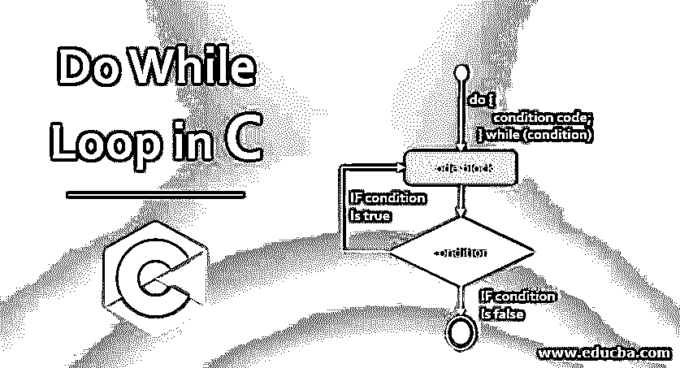
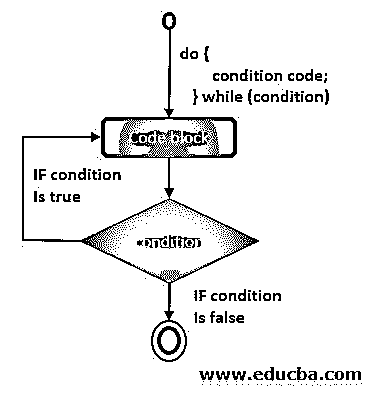
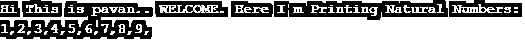
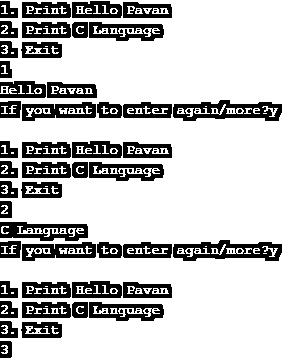
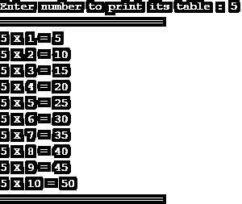
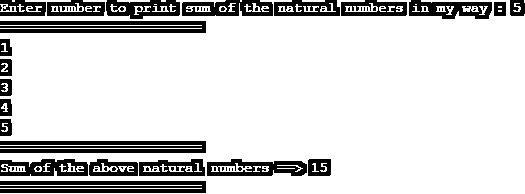
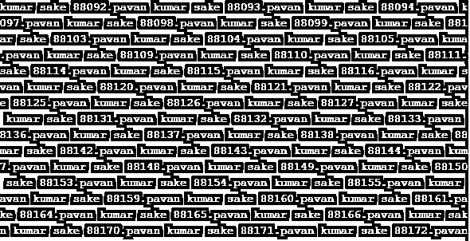
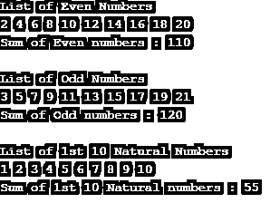
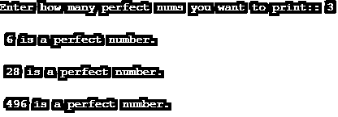
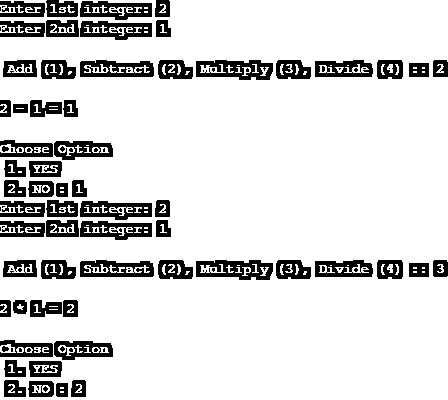

# C 语言中的 Do While 循环

> 原文：<https://www.educba.com/do-while-loop-in-c/>




## C 语言中的 Do While 循环介绍

DO WHILE 循环与 C 编程语言/许多其他编程语言的 WHILE 循环内置术语相同，但 [DO WHILE 循环首先执行](https://www.educba.com/do-while-loop-in-matlab/)程序语句，然后检查条件。这是我们与 WHILE 循环相比的主要不同之处。WHILE 循环将首先检查条件，然后首先执行编程语句。DO WHILE 将首先执行程序，即使条件最初是有效的/不适当的/假的。

**语法:**

<small>网页开发、编程语言、软件测试&其他</small>

```
do{
//Program Statements which are to be executed if the condition of the LOOP is TRUE.
}while(Condition);
```

**参数:**

*   只有当循环的条件第二次为真时，do while 中的语句才会基于其指令执行。首先，在不检查循环条件的情况下执行并打印语句。
*   **While(Condition):** 循环中的条件是运行程序的参数，如果条件为真，则不执行循环中的编程语句

### Do While 循环的流程图

下面给出了 C 中 do while 循环的流程图:




### While 循环在 C 中是如何工作的？:

do while 循环基于 while()参数中的条件工作，但在 1 <sup>st</sup> 时，将执行 do while 中的程序，然后检查条件。这是 while 和 do while 程序之间的主要区别。

### C 语言中 Do While 循环的示例

下面给出了 C 编程中 do while 的示例:

#### 示例#1

下面的例子是用 do while 循环打印从 1 开始的 10 以内的自然数。

**代码:**

```
#include <stdio.h>
int main() {
int i=1; //assisning number 1 to i variable to start the natural numbers
printf("Hi This is pavan.. WELCOME. Here I m Printing Natural Numbers:\n");
do{
printf("%d",i);//printing i variable's value
printf(",");
i=i+1; // assigning incrementation to the i variable
}while(i<10); //loop with the condition
printf("\n"); //For printing the line break
return 0;
}
```

**输出:**




#### 实施例 2

当程序执行时，根据嵌入/显示在终端/编译器程序中的选项列表，切换列出的 do while 程序以打印某些特定文本。

**代码:**

```
#include<stdio.h>
#include<stdlib.h>
void main ()
{
char c1;
int choice1,dummy1;
do{
printf("\n1\. Print Hello Pavan\n2\. Print C Language\n3\. Exit\n");
scanf("%d",&choice1);
switch(choice1)
{
case 1 :
printf("Hello Pavan\n");
break;
case 2:
printf("C Language\n");
break;
case 3:
exit(0);
break;
default:
printf("Atleast Now enter a valid choice/option");
}
printf("If you want to enter again/more?");
scanf("%d",&dummy1);
scanf("%c",&c1);
}while(c1=='y');
}
```

**输出:**




#### 实施例 3

这是一个 C 程序，用来打印系统用户作为输入给终端/编译器的数字表。在这里，您可以打印任何类型的表格，最多可以打印用户输入数字的 10 倍。请尝试一下，并使用 do while 了解该表的程序是如何工作的。即使 do while 中的条件不正确/为假，循环中的程序也只会执行一次，不会出现任何错误/其他错误。

**代码:**

```
#include<stdio.h>
int main(){
int i1=1,number1=0;
printf("Enter number to print its table : ");
scanf("%d",&number1);
printf("========================\n");
do{
printf("%d X ",number1);
printf("%d = ",i1);
printf("%d \n",(number1*i1));
i1++;
}while(i1<=10);
printf("========================\n");
return 0;
}
```

**输出:**




#### 实施例 4

下面的 C 程序是以我的方式使用 do while 循环打印自然数的和。检查它，你会得到一个小想法，以建立许多大项目的编程在未来。

**代码:**

```
#include<stdio.h>
int main(){
int i1=1,number2=0,number1,a1;
printf("Enter number to print sum of the natural numbers in my way : ");
scanf("%d",&number1);
printf("========================\n");
do{
printf("%d \n",i1);
number2=number2+i1;
a1=number2;
a1=a1+number2;
i1++;
}while(i1<=number1);
printf("========================\n");
printf("Sum of the above natural numbers ==> %d",number2);
printf("\n========================\n");
return 0;
}
```

**输出:**




#### 实施例 5

C 语言 do while 循环语法中的无限循环程序。

**代码:**

```
#include <stdio.h>
int main(){
int i=1;
do{
printf("%d.",i);
// prints numbers from 1
printf("pavan kumar sake ");
// prints pavan kumar sake
i=i+1;
//incrementing the I value
}while(1);  //it is true every time so the statements inside will be executed everytime
}
```

**输出:**




#### 实施例 6

下面这个 C 语法程序的例子将以一种清晰的方式打印自然数、奇数、质数及其总和。

**代码:**

```
#include<stdio.h>
#include<conio.h>
int main()
{
int nums1=1,nums2,nums3=1,nums4=0,nums5=0, nums6=0, nums7=1;  //initializing the variable
printf("List of Even Numbers \n");
do           //do-while loop
{
printf("%d ",2*nums1);
nums4=nums4+(2*nums1);
nums1++;                            //incrementing operation
}while(nums1<=10);
printf("\n");
printf("Sum of Even numbers : %d \n",nums4);
printf("\n");
printf("List of Odd Numbers \n");
do           //do-while loop
{
nums2= (2*nums3)+1;
nums5 = nums5+nums2;
printf("%d ",nums2);
nums3++;                            //incrementing operation
}while(nums3<=10);
printf("\n");
printf("Sum of Odd numbers : %d \n",nums5);
printf("\n");
printf("List of 1st 10 Natural Numbers \n");
do           //do-while loop
{
nums6 = nums6+nums7;
printf("%d ",nums7);
nums7++;                            //incrementing operation
}while(nums7<=10);
printf("\n");
printf("Sum of 1st 10 Natural numbers : %d \n",nums6);
return 0;
}
```

**输出:**




#### 实施例 7

这是一个用 C 语言语法的 DO WHILE 程序打印完全数的例子。

**代码:**

```
#include<stdio.h>
int main()
{
int n,k,l;
printf("Enter how many perfect nums you want to print:: ");
scanf("%d",&n);
int c=0;
int i=1;
do{
l=0;
for(k=1;k<i;k++){
if (i%k==0){
l=l+k;
}
}
if(i==l){
printf("\n %d is a perfect number.\n",i);
c=c+1;
}
if(c==n){
break;
}
i=i+1;
}while(i>0);
return 0;
getchar();
}
```

**输出:**




#### 实施例 8

使用 do while 和[开关条件](https://www.educba.com/python-switch-case/)的基本简单计算器程序。检查语法。在下面列出的 do while c 程序中，一切都很简单。

**代码:**

```
#include <stdio.h>
int main()
{
int yes1;
int a1, b1, c1, choice1;
yes1 = 1;
do
{
printf("Enter 1st integer: ");
scanf("%d", &a1);
printf("Enter 2nd integer: ");
scanf("%d", &b1);
printf("\n Add (1), Subtract (2), Multiply (3), Divide (4) :: ");
scanf("%d", &choice1);
printf("\n");
switch(choice1)
{
case(1):
c1 = a1 + b1;
printf("%d + %d = %d\n", a1, b1, c1);
break;
case(2):
c1 = a1 - b1;
printf("%d - %d = %d\n", a1, b1, c1);
break;
case(3):
c1 = a1 * b1;
printf("%d * %d = %d\n", a1, b1, c1);
break;
case(4):
c1 = a1 / (float)b1;
printf("%d / %d = %d\n", a1, b1, c1);
break;
default:
printf("Incorrect choice. Try again.\n");
}
printf("\nChoose Option \n 1\. YES \n 2\. NO : ");
scanf("%d", &yes1);
}while(yes1 == 1);
return 0;
}
```

**输出:**




### 推荐文章

这是一个 C 语言中 do-while 循环的指南，这里我们讨论了 C 语言中 Do-While 循环的基本概念和参数，以及不同的例子和它的代码实现。您也可以阅读以下文章，了解更多信息——

1.  [JavaScript 中的 do While 循环](https://www.educba.com/do-while-loop-in-javascript/)
2.  [Python 中的 Do While 循环](https://www.educba.com/do-while-loop-in-python/)
3.  [Java 中的 do While 循环](https://www.educba.com/do-while-loop-in-java/)
4.  [PHP Do While 循环](https://www.educba.com/php-do-while-loop/)


