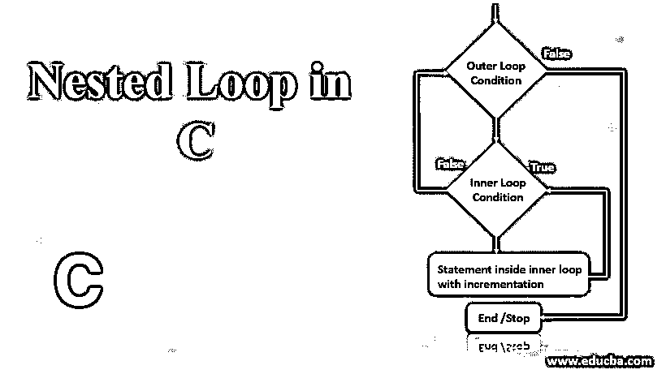
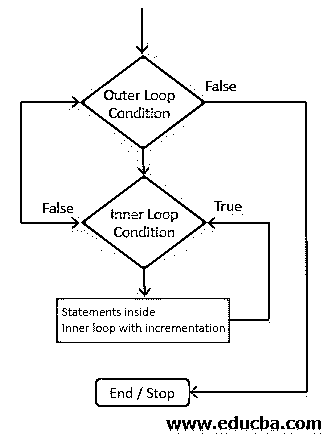
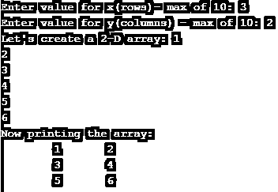
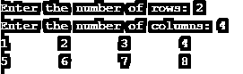

# C 语言中的嵌套循环

> 原文：<https://www.educba.com/nested-loop-in-c/>




## C 语言中嵌套循环介绍

顾名思义，循环中的循环称为嵌套循环。一个循环中可以有任意数量的循环。我们知道通常有许多循环条件，如 for、while 和 do-while。我们可以让不同类型的循环互相循环，形成嵌套循环。c 语言支持嵌套循环的这种功能。下面是 c 语言中嵌套循环的语法。

**语法:**

<small>网页开发、编程语言、软件测试&其他</small>

```
Outside_loop
{
//Outside Loop Statements
Inside_loop
{
//Inside loop Statements
}
}
```

上面的语法是循环条件中的单个循环条件。这样，也可以有很多条件。

```
Outside_loop
{
//Outside Loop Statements
Inside_loop_1
{
//Inside loop 1 Statements
}
Inside_loop_2
{
//Inside loop 2 statements
}
Inside_loop_3
{
//Inside loop 3 statements
}
……… continues
}
```

### 嵌套循环的流程图

这里，让我们看看这些嵌套循环的实际流程。




在上面的流程图中，我们可以看到给出了两个条件。只有当外部循环条件给出的布尔输出为真时，才会执行内部循环条件。否则，流量控制将直接退出两个循环。现在进入内循环执行，如果循环条件给出真结果，那么该循环和增量条件下的语句块将被执行。反过来，如果条件给出的布尔条件为假，则内部循环将其控制交还给外部循环，并且再次执行/重复相同的条件/循环。

### 用 C 语言实现嵌套循环的例子

让我们看看下面几个 C 语言中嵌套 for 循环功能的例子，并理解它是如何在程序中工作的。

#### 示例#1

“for”条件中的嵌套循环。我们通常可以用它来创建或打印多维数组。

**代码:**

```
#include <stdio.h>
int main()
{
int i,j,x,y;
int a[10][10];
printf("Enter value for x(rows)- max of 10: ");
scanf("%d", &x);
printf("Enter value for y(columns) - max of 10: ");
scanf("%d",&y);
printf("Let's create a 2-D array: ");
for(i=0;i<x;i++)
{
for(j=0;j<y;j++)
{
scanf("%d",&a[i][j]);
}
}
printf("Now printing the array: ");
printf("\n");
for(i=0;i<x;i++)
{
for(j=0;j<y;j++)
{
printf("\t");
printf("%d",a[i][j]);
}
printf("\n");
}
return 0;
}
```

**输出:**




让我们看看上面的示例代码是如何工作的:

*   首先，我们声明用于定义行数和列数的整数值。
*   接下来，数组声明完成。
*   然后，我们必须按照为行数和列数指定的值接受用户的输入。
*   当我们创建一个二维数组时，[用户输入是在“two for loops”的](https://www.educba.com/python-user-input/)的帮助下进行的。
*   第一个“for-loop”是行数，第二个循环是列数。
*   在接受用户对数组的输入时，我们认为这是一个逐行的概念。
*   因此，当第一行中的所有列都被完全填充时，编译器指针将递增到所有列都被填充的下一行，并且该过程继续。
*   对于以数组格式打印相应输出的循环，继续相同的处理流程。

以这种方式，实现了嵌套循环。现在，让我们看另一个嵌套循环的例子。

#### 实施例 2

**代码:**

```
#include <stdio.h>
int main()
{
int x,y;
int k=1;
printf("Enter the number of rows: ");
scanf("%d", &x);
printf("Enter the number of columns: ");
scanf("%d", &y);
int a[x][y];
int i=1;
while(i<=x)
{
int j=1;
while(j<=y)
{
printf("%d\t",k);
k++;
j++;
}
i++;
printf("\n");
}
}
```

如上所述，我们已经使用“while loop”创建了另一个二维数组。

**输出:**




正在进行与“for 循环”相同级别的编译。一旦外部 while 循环得到一个布尔值“True”作为输出，下一个编译代码就进入内部条件。一旦内部条件给出的输出为“假”，赋值再次到达外部循环条件。

#### 实施例 3

这里，我们将有一个小的 for 循环程序的 inter 混合。

**代码:**

```
#include <stdio.h>
int main()
{
int n=1;
int i;
while(n<5)
{
printf("*");
printf("\n");
n=n+1;
for(i=1;i<n;i++)
{
printf("$");
}
}
}
```

**输出:**


在上面的程序中，正如你已经注意到的，我们使用 while 和 for 循环一个接一个地打印了两个不同的符号。组合使用不同的嵌套循环在编写不同层次的程序中起着重要的作用。

#### 实施例 4

让我们看一个处理 do-while 嵌套循环的例子。这个例子也让打印一些随机的图案。

**代码:**

```
#include <stdio.h>
int main()
{
int n=1;
int i=0;
do
{
printf("$");
printf("\n");
n=n+1;
do
{
printf("*");
i=i+1;
}while(i<n);
}while(n<5);
}
```

**输出:**


在上面的程序中，我们也使用了嵌套的 do-while 循环来打印基于给定输入的模式。

**NOTE:** As an exercise, try possibilities in many ways of handling different loops together.

### 结论

在这里，我们得到了基本的语法并理解了一些关于不同嵌套函数的例子。我们已经学习了流程图中的实际流程，并解释了嵌套“for”循环的工作原理。所以，坚持练习，享受学习 c。

### 推荐文章

这是 C 语言中嵌套循环的指南。这里我们讨论 C 语言中嵌套循环的介绍和它的例子，以及嵌套循环的流程图。您也可以浏览我们推荐的其他文章，了解更多信息——

1.  [JavaScript 中的嵌套循环](https://www.educba.com/nested-loop-in-javascript/)
2.  [c++中的嵌套循环](https://www.educba.com/nested-loop-in-c-plus-plus/)
3.  [Java 中的嵌套循环](https://www.educba.com/nested-loop-in-java/)
4.  [Matlab 中的嵌套循环](https://www.educba.com/nested-loop-in-matlab/)


