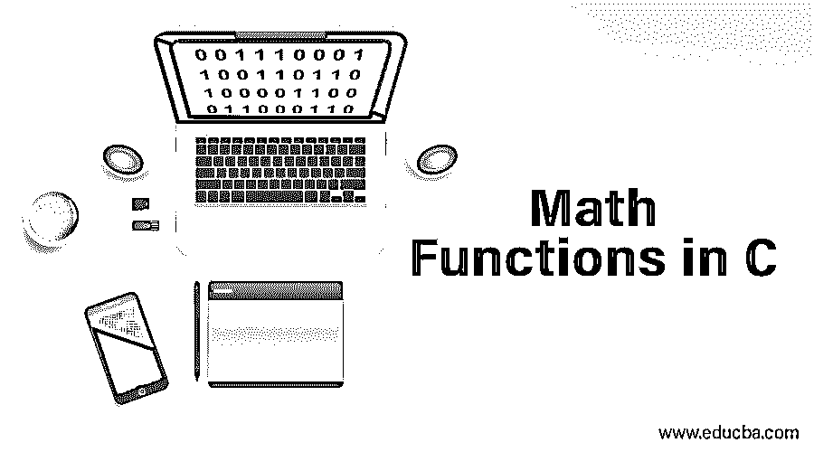
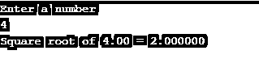
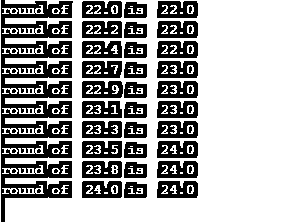
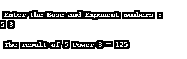
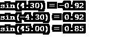
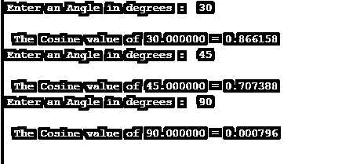
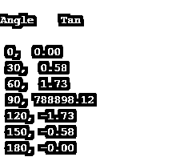
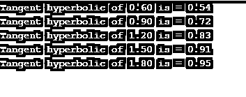
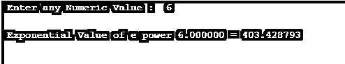
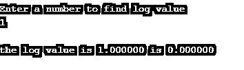

# C 语言中的数学函数

> 原文：<https://www.educba.com/math-functions-in-c/>




## C 语言中的数学函数介绍

本文列出了 C 编程语言中使用的不同数学函数，并附有工作代码说明。计算机进行大量的数学计算和大量数字的分析，为此我们使用了 C 中的数学特性。在开始之前，我们需要知道 C 语言使用名为 Math.h 的头文件/库来处理各种数学函数。这有助于计算三角运算，对数，绝对值，平方根。因此，让我们探索一下这个库中使用的不同类型的函数。所有这些函数都将 double 作为数据类型，并返回相同的值。

### C 语言中的各种数学函数

让我们看看 math.h 中定义的各种函数，数学库分为三种主要类型:[三角函数](https://www.educba.com/trigonometric-functions-in-python/)，数学函数，Log/expo 函数。为了实现以下功能，必须在代码中包含< cmath.h >或< math.h >。

<small>网页开发、编程语言、软件测试&其他</small>

#### 1.地板(双 a)

此函数返回不大于“a”值的最大整数值。它对一个值进行舍入，并返回一个 double 值作为结果。当负数舍入到下一个负数时，它的行为有所不同。

例如:下限(7.2)是 7.0
下限(-7.2)是-8.0

**举例:**

这个程序演示了如何计算申报值的下限，并舍入到下一个值 10。

```
#include <stdio.h>
#include <math.h>
int main()
{
double f= -9.33;
int final;
final = floor(f);
printf("Floor value of %.2f = %d", f, final);
return 0;
}
```

**输出:**


#### 2.细胞()

**语法:**

```
double ceil (double b)
```

该函数返回大于或等于 b 的最小整数值，并将该值向上舍入。对于负值，它向左移动。示例 3.4 返回-3 有输出。

**举例:**

这个程序通过接受 float 参数中的输入来解释，并返回 ceil 值。

```
#include <stdio.h>
#include <math.h>
int main()
{
float n, ceilVal;
printf("  Enter any Numeric element :  ");
scanf("%f", &n);
ceilVal = ceil(n);
printf("\n The  Value of %.2f = %.4f ", n, ceilVal);
return 0;
}
```

**输出:**


#### 3.Sqrt()

该函数返回指定数字的平方根。

**语法:**

```
sqrt( arg)
```

**举例:**

下面的代码解释了最著名的数学函数 sqrt()，它采用“n”个值来计算不同“n”个值的平方根。

```
#include <stdio.h>
#include <math.h>
int main()
{
double n,output;
printf("Enter a number\n");
scanf("%lf", &n);
output = sqrt(n);
printf("Square root of %.2lf = %f", n,output);
return 0;
```

**输出:**




#### 4.圆形()

此函数对给定输入的最近值进行舍入。如果值太大，它会抛出错误。其他函数如 lround()、llround()也对最接近的整数进行舍入。

**语法:**

```
int round(arg)
```

**举例:**

下面的代码非常简单，它在 for 循环中舍入到最近的“r”值。

```
#include <stdio.h>
#include <math.h>
int main ()
{
for(double r=110;r<=120;r+=1.1)
printf("round of  %.1lf is  %.1lf\n", r/5.0, round(r/5.0));
return 0;}
```

**输出:**




#### 5.pow()

该功能返回给定数量的电源(a <sup>b</sup> )。它返回 a 的 b 次幂，它有两个参数 base 和 exponent。

**举例:**

在下面的源代码中，我们允许用户输入一个输入值来计算给定的两个参数的幂。

```
#include <stdio.h>
#include <math.h>
int main()
{
int r, ba, expr;
printf("\n Enter the Base and Exponent numbers :  \n");
scanf("%d %d", &ba, &expr);
r = pow(ba, expr);
printf("\n The result of %d Power %d = %d ", ba, expr ,r);
return 0;
}
```

**输出:**




#### 6.中继()

该函数有助于截断给定值。它返回整数值。为了截断浮点和双精度值，使用了 truncf()，truncl()。

**语法:**

```
double trunc(a);
```

**举例:**

下面的源代码采用两个输入值 a、b 来截断 double 值。

```
#include <stdio.h>
#include <math.h>
void main() {
double m, n, a, b;
a = 56.16;
b = 85.74;
m = trunc(a);
n = trunc(b);
printf("The value of a: %lf\n",m);
printf("The value of a: %lf\n",n);
}
```

**输出:**


#### 7\. fmod()

当 m 除以 n 时，此函数返回给定两个输入值的余数。

**语法:**

```
double fmod(double I, double j)
```

**举例:**

在下面的示例中，使用 fmod()函数从用户处获取两个值来计算余数。

```
#include<stdio.h>
#include<math.h>
int main(){
double fiN;
double secN;
double n;
printf("Enter the first number : ");
scanf("%lf",&fiN);
printf("Enter the second number : ");
scanf("%lf",&secN);
printf("fmod(firstNumber,secondNumber) is %lf \n",fmod(fiN,secN));
}
```

**输出:**


### 三角函数

以下是三角函数的不同功能:

#### 1.罪恶()

这个内置函数给出给定数字的正弦值，计算浮点值。asin()计算弧，对于双曲线它是 sinh()。

**语法:**

```
return type sin(y);
```

y 返回值以弧度表示，返回类型为 double。

**举例:**

在下面的源代码中，我采用了两个不同的输入值来计算 sin 值并返回 double。

```
#include <stdio.h>
#include <math.h>
int main()
{
double a;
double z;
a = 4.3;
z = sin(a);
printf("sin(%.2lf) = %.2lf\n", a, z);
a = -4.3;
z = sin(a);
printf("sin(%.2lf) = %.2lf\n", a, z);
a = 45;
z = sin(a);
printf("sin(%.2lf) = %.2lf\n", a, z);
return 0;
}
```

**输出:**




#### 2.辛赫()

这个数学函数计算给定数字的三角正切正弦值。

**语法:**

```
double sinh(x);
```

**例子**

在下面的源代码中，正弦双曲线是通过声明一个输入值来计算的。

```
#include <stdio.h>
#include <math.h>
#define PI 3.141592654
int main()
{
double gt = 3.60, z;
z = sinh(gt);
printf("Sine hyperbolic of %.2lf is = %.2lf", gt, z);
return 0;
}
```

**输出:**


#### 3.cos()

这个数学函数确定给定元素的三角余弦值。

**语法:**

```
return type cos(argument);
```

**例子**

```
#include <stdio.h>
#include <math.h>
#define PI 3.14
int main()
{
double cVal, rVal, dVal;
for(int i=0;i<=2;i++)
{
printf(" Enter an Angle in degrees :  ");
scanf("%lf", &dVal);
rVal = dVal * (PI/180);
cVal = cos(rVal);
printf("\n  The Cosine value of %f = %f ", dVal, cVal);
printf("\n");
}
return 0;
}
```

**输出:**




#### 4.科斯()

它返回给定值的混合余弦值。

**语法:**

```
double cosh(y);
```

**例子**

以下示例显示了计算双曲线需要两个不同的输入值。

```
#include <stdio.h>
#include <math.h>
int main ()
{
double k, r;
k = 0.6;
r = cosh(k);
printf("Hyperbolic cosine of %lf is = %lf\n", k, r);
k = -0.8;
r = cosh(k);
printf("Hyperbolic cosine of %lf is = %lf\n", k, r);
return 0;}
```

**输出:**


#### 5.谭()

此数学库函数计算数学表达式的角度正切值，以弧度为单位。

它可以被声明为

```
double tan(arguments);
```

**例子**

在下面的源代码中，计算以下角度的 tan 值，该值使用 for 循环递增。

```
# include <stdio.h>
# include <conio.h>
# include <math.h>
void main()
{
float z ;
int k ;
char ch ;
printf("\nAngle \t Tan \n") ;
for (k = 0; k <= 180; k = k + 30)
{
z = k * 3.14159 / 180 ;
printf("\n %d, %5.2f",k, tan(z));
}
getch() ;
}
```

**输出:**




#### 6.tanh()

tanh()函数返回给定值的双曲正切值。它只有一个参数。除了为 long double 和 float 寻找切线之外，tanhl()和 tanhf()也用于计算。

**语法:**

```
double tanh( val);
```

**举例:**

使用 for 循环计算“j”值的正切函数。让我们看看它是如何工作的。

```
#include <stdio.h>
#include <math.h>
#define PI 3.141592654
int main()
{
double val,  r;
for(double j=0.60; j<=2.0;j+=.30)
{
r = tanh(j);
printf("Tangent hyperbolic of %.2lf is = %.2lf",j, r);
printf("\n");
}
return 0;
}
```

**输出:**




### 对数算术函数

以下是对数算法的不同功能:

#### 1.exp()

该函数对给定值(e <sup>x</sup> )进行指数计算。还有其他子类型，如 frexp()、Idexp()返回尾数并乘以 x 的幂。

**语法:**

```
return type exp(value);
```

**举例:**

该程序从用户处获取数值来计算给定值的指数，并返回 double。

```
#include <stdio.h>
#include <math.h>
int main()
{
double numb, eVal;
printf(" Enter any Numeric Value :  ");
scanf("%lf", &numb);
eVal = exp(numb);
printf("\n Exponential Value of e power %lf = %lf ", numb, eVal);
printf("\n");
return 0;
}
```

**输出:**




#### 2.日志()

该函数返回给定数字的对数值。(对底座 e. log <sub>e</sub>

**语法:**

```
double log(arg);
```

**举例:**

在下面的示例中，使用函数计算给定数字的对数值。用户自定义函数 lgm()执行计算，函数在主函数中调用。

```
#include<stdio.h>
#include<math.h>
float lgm ( float iv );
int main ()
{
float q, r ;
printf ( "\nEnter a number to find log value \n");
scanf ( "%f", &q ) ;
r = lgm ( q ) ;
printf ( "\nthe log value is %f is %f",q,r );
}
float lgm ( float iv )   // function definition
{
float exe ;
exe = log(iv);
return ( exe ) ;
}
```

**输出:**

**

** 

### 结论

总之，我们已经看到了在 C 编程中使用的不同的数学函数，这些是可以直接使用的库函数。c 程序利用这些函数进行各种数学运算。为了解决一些复杂版本的计算，这个内置函数有利于面向数学的编程语言返回简单的值。

### 推荐文章

这是一个 C 语言中数学函数的指南，这里我们用例子讨论 C 语言中不同的数学函数。您还可以浏览我们推荐的其他文章——

1.  [PHP 数学函数](https://www.educba.com/php-math-functions/)
2.  [JavaScript 数学函数](https://www.educba.com/javascript-math-functions/)
3.  [JavaScript 字符串函数](https://www.educba.com/javascript-string-functions/)
4.  [Python 中的数学函数](https://www.educba.com/math-functions-in-python/)


