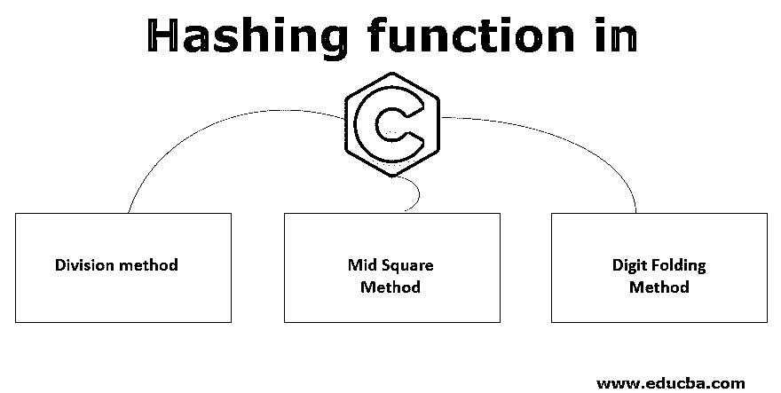
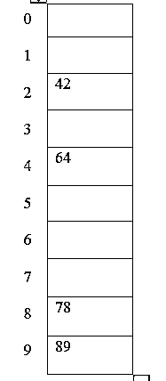
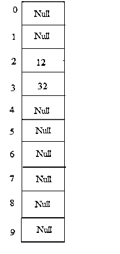
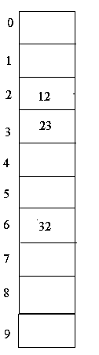
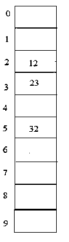

# C 语言中的散列函数

> 原文：<https://www.educba.com/hashing-function-in-c/>

## C 语言中散列函数的介绍

本文对哈希(哈希表和哈希函数)进行了简要说明。最重要的概念是“搜索”,它决定了时间复杂度。为了降低时间复杂度，引入了比任何其他数据结构更高的散列概念，其在平均情况下具有 O(1)时间，在最坏情况下将花费 O(n)时间。

哈希是一种更快访问元素的技术，它将给定的数据映射到一个较小的比较键。一般来说，在这种技术中，使用哈希函数将密钥跟踪到一个称为哈希表的表中。

<small>网页开发、编程语言、软件测试&其他</small>

### 什么是哈希函数？

哈希函数是一个使用常数时间操作来存储和检索哈希表中的值的函数，该值作为整数应用于关键字，并用作哈希表中值的地址。

### C 语言中散列函数的类型

C 语言中的散列函数类型解释如下:

#### 1.除法

在这种方法中，散列函数依赖于除法的余数。

示例:哈希表中要放置的元素是 42、78、89、64，我们假设表的大小为 10。

Hash (key) = Elements %表大小；

2 = 42 % 10;

8 = 78 % 10;

9 = 89 % 10;

4 = 64 % 10;

表格表示如下所示:

#### 2.中平方法

在这种方法中，平方元素的中间部分作为索引。

将被放置在散列表中的元素是 210，350，99，890，并且该表的大小是 100。

210* 210 = 44100，index = 1 作为结果(44100)的中间部分是 1。

350* 350 = 122500，index = 25 作为结果(122500)的中间部分是 25。

99* 99 = 9801，index = 80 作为结果(9801)的中间部分是 80。

890* 890 = 792100，index = 21 作为结果(792100)的中间部分是 21。

#### 3.数字折叠法

在这种方法中，要放置在表 uh 中的元素是 sing hash key，它是通过将元素分成各个部分，然后通过执行一些简单的数学运算来组合这些部分而获得的。

要放置的元素是 23576623、34687734。

*   哈希(密钥)= 235+766+23 = 1024
*   哈希键)= 34+68+77+34 = 213

在这些类型的散列中，假设我们有从 1 到 100 的数，并且散列表的大小=10。元素= 23，12，32

hash(key)= 23% 10 = 3；

hash(key)= 12% 10 = 2；

hash(key)= 32% 10 = 2；

从上面的例子中可以注意到，元素 12 和 32 都指向表中的第 2 位，在这种情况下，不可能在相同的位置写入这两个元素，这种问题称为冲突。为了避免这种问题，可以使用一些散列函数技术。

### 冲突解决技术的类型

让我们讨论冲突解决技术的类型:

#### 1.链接

顾名思义，在这种方法中，它为具有两个元素条目的表中的记录提供了一系列盒子。所以每当这种冲突发生时，这些盒子就会形成一个链表。

例如:23、12、32，表格大小为 10。

hash(key)= 23% 10 = 3；

hash(key)= 12% 10 = 2；

hash(key)= 32% 10 = 2；

#### 2.散列地址

##### 一.线性探测

这是解决碰撞问题的另一种方法。顾名思义，每当发生冲突时，应该将两个元素放在表中的同一条目上，但是通过这种方法，我们可以在表中搜索下一个空白空间或条目，并放置第二个元素。这又会导致另一个问题；如果我们在表中找不到任何空条目，那么就会导致聚类。因此，这就是所谓的聚类问题，可以通过以下方法解决。

示例:23、12、32，表格大小为 10

hash(key)= 23% 10 = 3；

hash(key)= 12% 10 = 2；

hash(key)= 32% 10 = 2；

在该图中，12 和 32 可以放置在索引为 2 的同一条目中，但是通过这种方法，它们被线性放置。

##### 二。二次探测

该方法解决了线性探测中的聚类问题。在该方法中，具有散列关键字的散列函数被计算为 hash (key) = (hash (key) + x * x) %表的大小(其中 x =0，1，2 …)。

示例:23、12、32，表格大小为 10

hash(key)= 23% 10 = 3；

hash(key)= 12% 10 = 2；

hash(key)= 32% 10 = 2；

在这里，我们可以看到 23 和 12 可以很容易地放置，但是 32 不能，因为 12 和 32 在表中使用相同的索引共享相同的条目，按照这个方法 hash (key) = (32 + 1*1) % 10 = 3。但是在这种情况下，索引为 3 的表条目被放置为 23，因此我们必须将 x 值增加 1。Hash (key) = (32 + 2 * 2) % 10 = 6。因此，我们现在可以将 32 放入表中索引为 6 的条目中。

##### 三。双重散列法

这种方法我们必须计算 2 个散列函数来解决冲突问题。第一个是用简单的除法计算出来的。其次必须满足两个规则；它不能等于 0，并且必须探测条目。

*   1 (key) =表的 key %大小。
*   2(key)= p-(key mod p)，其中 p 是表的[素数](https://www.educba.com/prime-numbers-in-c-sharp/) <大小。

示例:23、12、32，表格大小为 10

hash(key)= 23% 10 = 3；

hash(key)= 12% 10 = 2；

hash(key)= 32% 10 = 2；

在这种情况下，也可以使用 hash 2(key)= 5-(32% 5)= 3 来放置元素 32。所以 32 可以放在表中的索引 5 处，这个表是空的，因为我们必须跳转 3 个条目来放置它。

### 结论

哈希是使用哈希函数和哈希表以非常高效和快速的方法搜索数据的重要技术之一。可以使用不同的散列方法来搜索和放置每个元素。就时间系数而言，这种技术比任何其他数据结构都快。

### 推荐文章

这是一个 C 语言中散列函数的指南。这里我们讨论了简要的概述，C 语言中散列函数的类型和冲突解决技术的细节。您也可以浏览我们推荐的其他文章，了解更多信息——

1.  [数据库管理系统中的散列](https://www.educba.com/hashing-in-dbms/)
2.  [加密过程](https://www.educba.com/encryption-process/)
3.  [Java 中的散列函数](https://www.educba.com/hashing-function-in-java/)
4.  [PHP 中的哈希函数](https://www.educba.com/hashing-function-in-php/)

