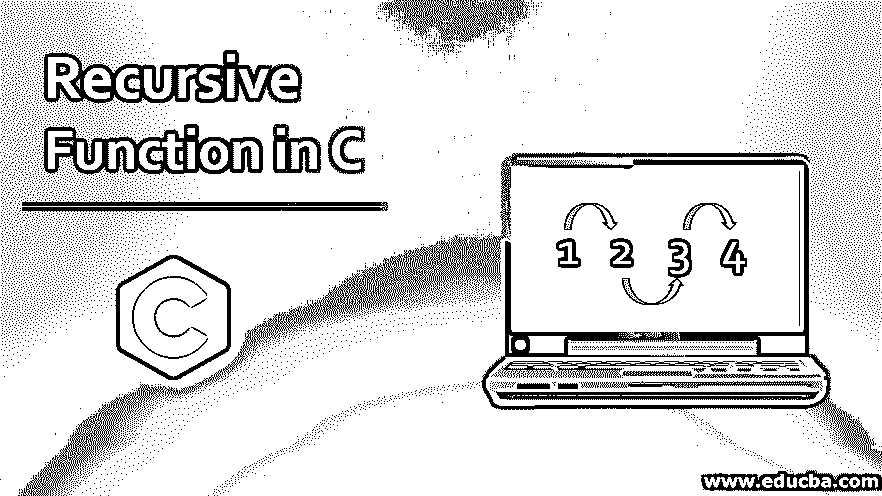
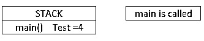
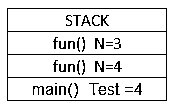
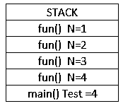
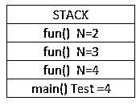
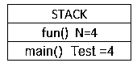
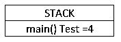

# C 语言中的递归函数

> 原文：<https://www.educba.com/recursive-function-in-c/>




## C 语言中递归函数的介绍

以与以前相似的方式重复这些项的过程称为递归。如果一个函数在自身内部被调用，就说它是递归的。编程语言 C 支持递归。下面是在 C 中实现递归的两个关键条件:

*   **退出条件:**该条件帮助函数识别何时退出该函数。如果我们不指定退出条件，那么代码将进入无限循环。
*   **改变计数器:**在每次调用该函数时改变计数器。

这样我们就可以在 [C 编程语言](https://www.educba.com/career-in-c-programming/)中实现一个递归函数。这些函数对于解决需要多次调用类似过程的货币数学问题非常有用。这类问题的例子是计算斐波那契数列的[数的阶乘。](https://www.educba.com/fibonacci-series-in-javascript/)

<small>网页开发、编程语言、软件测试&其他</small>

**语法:**

```
int  fun(a1)
{
If(base_condition) return val;
fun(a2);
}
```

### 递归函数在 C 中是如何工作的？

递归函数是用 C 编程语言实现等式的方法。调用递归函数时传递一个参数比如 n，堆栈中的内存分配给局部变量和函数。该函数中的所有操作都是使用该内存执行的。检查退出条件是否满足。当编译器检测到对另一个函数的调用时，它立即在栈顶分配新的内存，在那里创建相同局部变量和函数的不同副本。进入同样的过程继续进行。

当基本条件返回 true 时，将特定值传递给调用函数。分配给该函数的内存被清空。类似地，新值在调用函数中计算，然后返回给超级调用函数。通过这种方式对函数进行递归调用，delete 到达第一个函数，整个堆栈内存被清空，输出被返回。如果函数中没有指定基本条件或退出条件，那么对函数的递归调用会导致无限循环。

#### 递归函数示例

现在我们将看到 C 语言中递归函数的例子

**代码:**

```
#include <stdio.h>
int  fun(int n)
{
if(n==1) return 1 ; //exit or base condition which gives an idea when to exit this loop.
return n*fun(n-1); //function is called with n-1 as  it's argument .
//The value returned is multiplied with the argument passed in calling function.
}
int main(){
int test=4;
int result =0;
result =fun(test);
printf("%d",result);//prints the output result.
}
```

**输出:**


**上述代码的解释**

上面给出的例子是寻找一个数的[阶乘。当主函数调用 fun(4)时，首先检查退出条件(4==1)，然后调用 4*fun(3)。再次检查基本条件(3==1)。类似地，它将返回 3*fun(2)被调用，这一直持续到 2*fun(1)被调用，当它满足基本条件并返回 1 时，调用函数返回 2*1，然后，3*2*1，从第一次调用开始，返回 4*3*2*1。从而产生主函数存储器 24 并将其打印在输出端。](https://www.educba.com/factorial-in-c-sharp/)

### 递归函数的内存分配

在 c 语言中，每次调用一个函数都会导致堆栈顶部的内存分配。当一个递归函数被调用时，在已经分配给调用函数的内存之上，再分配给它内存，并且为函数的每次调用创建所有不同的局部变量副本。什么是基本条件，分配给函数的内存被破坏，指针返回到调用函数？重复这个过程，然后是第一个调用函数，最后堆栈内存变空。

上例中计算一个数的阶乘，下面是内存分配的场景。

**第一步**




**第二步**


**第三步**




**第四步**


**第五步**




**第六步**




**第七步**


**第八步**




**第 9 步**




### 递归的类型

下面给出了 C 编程中两种类型的递归:

#### 1.尾部和非尾部递归

上面给出的递归类型解释如下:

##### 尾部递归

这是一种递归函数，函数中的递归调用是函数定义中要做的最后一个动作。意味着递归调用发生在函数中的所有其他逻辑实现之后。

在我们的 Hans 程序中使用尾部递归可以提高程序的性能，还可以减少 so 函数的内存使用。之所以如此，是因为当函数中的其他逻辑已经被实现时，分配给调用函数的内存可以从堆栈中移除并被重用。

**代码:**

```
int fun1(n){
printf("the result is ");
return fun1(n-1);
}
void main()
{
fun1(4);
}
```

##### 无尾递归

这种递归类型的递归拼贴在函数定义的中间。男裤递归完成，值返回到调用函数，还有更多步骤要执行，因此无法清除内存。

**代码:**

```
int fun1(n){
printf("the result is");
return n* fun1(n-1);
}
void main(){
fun1(4);
}
```

#### 2.直接和间接递归

上面给出的递归类型解释如下:

##### 间接递归

当一个特定的函数被另一个函数以递归方式调用时，就发生了间接递归。

**代码:**

```
int fun1(){
fun2();
}
int fun2(){
fun1(); // calling the procedure recursively using another function.
}
void main(){
fun1();
}
```

##### 直接递归

当对函数的递归调用是在它自己的定义中进行时，称为直接递归。'

**代码:**

```
int fun1(){
fun1();
}
void main(){
fun1();
}
```

### 结论

很容易得出结论，递归函数对于解决数学问题是最重要的，这些问题需要一种类似的方法，所有的逻辑都要重复执行，直到满足退出条件。许多问题，如汉诺塔，树遍历，计算图的深度。

提到递归函数的基本条件[是很重要的。与迭代程序相比，递归程序对内存和时间的要求更高，因此必须小心使用。](https://www.educba.com/recursive-function-in-javascript/)

### 推荐文章

这是 c 语言中递归函数的指南。这里我们讨论了 c 语言中递归函数的基本概念、工作原理、类型、内存分配和示例。你也可以看看下面的文章来了解更多信息

1.  [C 编程中的数组](https://www.educba.com/arrays-in-c-programming/)
2.  [C 程序中的回文](https://www.educba.com/palindrome-in-c-program/)
3.  [C 编程中的模式](https://www.educba.com/patterns-in-c-programming/)
4.  [C 与 C++的区别](https://www.educba.com/c-vs-c-plus-plus/)


