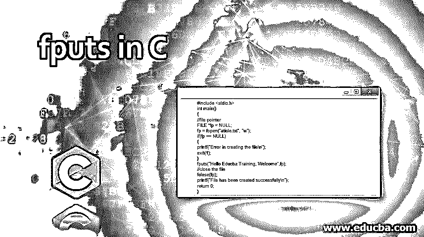

# C 语言输出

> 原文：<https://www.educba.com/fputs-in-c/>




## C 语言中的 fputs 介绍

在本文中，我们将讨论从流中读写字符串的 C 库函数，比如读写文件的 fputs 和 fgets 函数。我们正在详细说明 C 语言中的函数 fputs，它用于将字符串或字符数组写入或打印到指定的流中，该流将不包含空字符，因此空字符不会写入文件。该函数将字符串写入文件，该文件接受两个参数，一个指向字符串，另一个作为文件指针。因此，当字符串成功写入文件时，它将返回 0，否则，如果出现任何错误，它将返回 EOF 或-1。

### C 语言中 fputs 库函数的例子

在 C 编程语言中，有一些函数用于从流中读写字符串，它们是 fputs()和 fgets()。这些函数是 fputs()，用于将字符串或字符数组写入字符串，fgets()函数用于从文件中读取字符集或字符串。fputs 函数是一个库函数，用于将字符串或字符集写入文件，在文件处理中将字符串输出到流中。这个函数接受来自用户的字符串或字符数组，它将被存储在输入流中，为了接受下一个字符串，文件指针递增。现在让我们看看这个函数的语法。

<small>网页开发、编程语言、软件测试&其他</small>

**语法:**

```
int fputs(const char *s, FILE *stream)
```

**参数:**

*   **s:** 不包括空字符的一组字符或一个字符数组。
*   **stream:** 指向文件对象 file，表示要写入文件的字符串流。

fputs()函数返回非负的值，如果为真，则为 0，否则将为错误返回 EOF 或-1。

#### 示例#1

**代码:**

```
#include <stdio.h>
int main()
{
//file pointer
FILE *fp = NULL;
fp = fopen("aticle.txt", "w");
if(fp == NULL)
{
printf("Error in creating the file\n");
exit(1);
}
fputs("Hello Educba Training, Welcome",fp);
//close the file
fclose(fp);
printf("File has been created successfully\n");
return 0;
}
```

**输出:**


创建一个名为 article.txt 的文件，在该文件中，它将编写如下消息。


在上面的程序中，我们将以写模式创建文件，这样在创建文件后，我们可以使用 fputs()函数将消息写入该文件，并且在写入消息后有必要关闭该文件。

在 C 编程中，有两个函数分别通过 puts()或 fputs()函数将字符串或字符数组写入输出屏幕或文件。这些函数用于特定的原因，其中:puts 函数使用单个参数，而 fputs 函数接受两个参数，因为 fputs 用于文件处理，而 puts 仅用于在文件中打印消息。fputs()代表文件 put 字符串，您可以在 C 标准库头文件 stdio.h 中找到它。我们可以看到下面的示例，它在文件中打印了两行，其中 fputs()不会添加新行，直到它被手动写入。

#### 实施例 2

**代码:**

```
#include <stdio.h>
int main()
{
FILE *f = NULL;
f = fopen("aticle.txt", "w");
if(f == NULL)
{
printf("Error in creating the file\n");
exit(1);
}
fputs("Writing the first Line in the file.",f);
fputs("Writing the Second Line in the file.",f);
fclose(f);
puts("Writing the first Line on the output screen.");
puts("Writing the second Line on the output screen.");
return 0;
}
```

**输出:**


文件 article.txt 中打印的消息


在上面的程序中，我们可以看到我们正在创建一个文件，使用 fputs()函数来写入或打印消息，我们在文件中写入两行，我们可以在创建的文件 article.txt 中看到打印了两行，但在一行打印到文件后没有添加新行，这可以在第二个屏幕截图中看到，我们可以看到 article.txt 文件的内容。但是，尽管 puts()函数在默认情况下会为每个 puts()语句附加新行，但在使用 puts()函数时可以看到这一点，它会在控制台上打印每一行或新行，如我们在第一个屏幕截图中看到的那样。因此，puts()函数将字符串中的空字符(' \0 ')转换为换行符，而在 fputs()中，不包含空字符，也不像在 puts()函数中那样附加任何换行符。

### 结论

在本文中，我们讨论了文件的写函数，特别是文件处理函数 fputs()。在 C 编程语言中，有两个函数用于编写 puts()和 fputs()。在 C 中，puts()函数是将消息写入控制台或窗口终端，而 fputs()函数是将消息写入文件。这两个函数是不同的，puts()函数自动追加新行字符，而 fputs 不追加任何新行。在本文中，fputs()函数还将获取字符串或字符数组，直到将空字符打印到文件中，这意味着 fputs()函数不会写入空字符，即 fputs()将终止空字符，然后将字符串或字符数组打印到文件中。这个函数通常在文件处理和其他类似的函数中使用，用于从文件中读取字符串或字符数组，我们有 fgets()函数。

### 推荐文章

这是一个 c 语言中 fputs 的指南，在这里我们也讨论了 c 语言中 fputs 库函数的介绍和工作原理，以及例子和代码实现。您也可以看看以下文章，了解更多信息–

1.  [C 中的内存分配](https://www.educba.com/memory-allocation-in-c/)
2.  [C 中的常数](https://www.educba.com/constants-in-c/)
3.  [C 语言中的表达式](https://www.educba.com/expression-in-c/)
4.  [C 语言中的函数指针](https://www.educba.com/function-pointer-in-c/)


