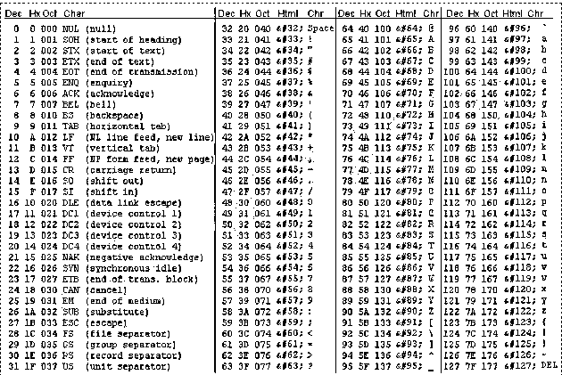
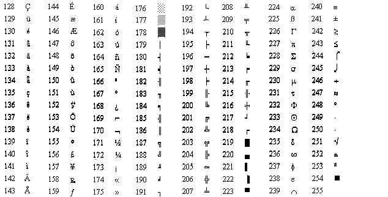
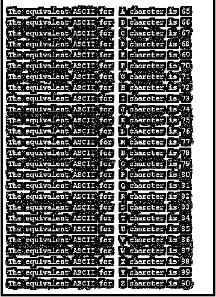
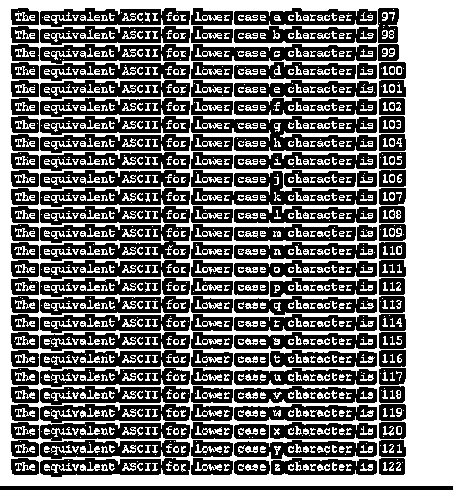
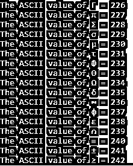
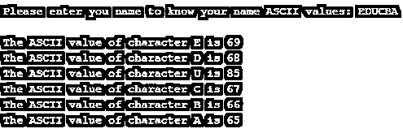

# C 语言中的 ASCII 值

> 原文：<https://www.educba.com/ascii-value-in-c/>


## C 语言中 ASCII 值的介绍

ASCII 是“美国信息交换标准代码”的缩写。因为我们是人类，我们有我们的语言理解同样的方式，机器也有同样的东西来理解字符，数字，特殊字符，这是字符的 ASCII 表示。这是一种用于电子通信的字符编码模式。ASCII 包含数字，每个字符都有自己的数字来表示。在 C 语言中，我们有 256 个字符来表示(0 到 255)，如字符(a-z，A-Z)，数字(0-9)和特殊字符，如！、@、#等。这每一个 ASCII 码在存储器中占用 7 位。假设字符‘C’的 ASCII 值是 67。当我们把输入作为“B”时，机器在内部把它当作 67，并存储它的地址。当我们返回原始数字时，编译器会给你 67，其他内部软件会将这些值转换成相应的字符。

### ASCII 值表




<small>网页开发、编程语言、软件测试&其他</small>




### ASCII 值在 C 内部是如何表示的？

**1。**让我们以“ABCDEFG·希克·LMNO”为例。

**2。**当我们将此指令传递给机器时，它不会将其存储为“ABCDEFG·希克·LMNO ”,而是会存储其等价的 ASCII 值。

**3。**因此现在机器存储的值是“65 66 67 68 69 70 71 32 72 73 74 75 32 76 77 78 79”。

**4。** ASCII 值为 65，B 为 66，C 为 67，以此类推。空间 ASCII 值为:

**语法:**

```
int p;
for(int p=0;p<255;p++)
{
Printf(“%c,%d”,p,p);//%c is for display character and %d is for ASCII value
}
```

### 用 C 语言实现 ASCII 值的例子

下面是一些例子。

#### 1.大写 A 到 Z ASCII 值。

**代码:**

```
//including basic C libraries
#include <stdio.h>
//main method for run C application
int main()
{
//declaration int variable
int capitalChars;
//iterating Capital ASCII values
for(capitalChars=65;capitalChars<91;capitalChars++)  // for loop from 65 to 90
{
//display ASCII values for its equivalent characters
printf("\n\tThe equivalent ASCII for  %c character is %d", capitalChars,capitalChars);
}
return 0;
}
```

**输出:**




#### 2.小型 A 到 Z ASCII 值

**代码:**

```
//including basic C libraries
#include <stdio.h>
//main method for run C application
int main()
{
//declaration int variable
int lowerChars;
//iterating lowe case characters ASCII values
for(lowerChars=97;lowerChars<123;lowerChars++)  // for loop from 97 to 122
{
//display ASCII values for its equivalent characters
printf("\n\tThe equivalent ASCII for lower case %c character is %d", lowerChars,lowerChars);
}
return 0;
}
```

**输出:**




#### 3.空格 ASCII 值

**代码:**

```
//including basic C libraries
#include <stdio.h>
//main method for run C application
int main()
{
//declaration int variable
int space;
//iterating lowe case characters ASCII values
for(space=32;space<33;space++)  // for loop 32
{
//display ASCII values for its equivalent characters
printf("\n\tThe equivalent ASCII for space %c is %d", space,space);
}
return 0;
}
```

**输出:**


#### 4.特殊字符 ASCII 值

**代码:**

```
//including basic C libraries
#include <stdio.h>
//main method for run C application
int main()
{
//declaration int variable
int specialChars;
//iterating lowe case characters ASCII values
for(specialChars=33;specialChars<48;specialChars++)  // for loop from 32 to 47
{
//display ASCII values for its equivalent characters
printf("\n\tThe equivalent ASCII for %c special character is %d", specialChars,specialChars);
}
for(specialChars=58;specialChars<65;specialChars++)  // for loop from 58 to 64
{
//display ASCII values for its equivalent characters
printf("\n\tThe equivalent ASCII for %c special character is %d", specialChars,specialChars);
}
for(specialChars=123;specialChars<127;specialChars++)  // for loop from 123 to 126
{
//display ASCII values for its equivalent characters
printf("\n\tThe equivalent ASCII for %c special character is %d", specialChars,specialChars);
}
return 0;
}
```

**输出:**

**T2】**


 **#### 5.所有 ASCII 值都在一个地方

**代码:**

```
//including basic C libraries
#include <stdio.h>
//main method for run C application
int main()
{
//declaration int variable
int allChars;
//iterating lowe case characters ASCII values
for(allChars=0;allChars<256;allChars++)  // for loop from 0 to 255
{
//display ASCII values for its equivalent characters
printf("\n\tThe ASCII value of %c is %d", allChars,allChars);
}
return 0;
}
```

**输出:**




#### 6.给定名称 ASCII 值

**代码:**

```
//including basic C libraries
#include <stdio.h>
//main method for run C application
int main()
{
// declaring char array variable
char charArray[20];
// declaring int variable
int var=0;
//Asking user to enter any name
printf("\n\tPlease enter you name to know your name ASCII values: ");
scanf("%s", charArray);
while(charArray[var]!='\0')  // iterating array characters sequentially
{
//display the your name character ASCII values
printf("\n\tThe ASCII value of character %c is %d", charArray[var],charArray[var]);
var++;
}
return 0;
}
```

**输出:**




### 结论

C 中的 ASCII 用于表示每个字符的数值。这每个字符内部存储为 ASCII 值，但不是我们给定的相同字符。我们可以显示小写，大写字母，特殊字符等。ASCII 值通过使用它们相应的顺序。目前 c 语言中有 255 个 ASCII 字符。

### 推荐文章

这是一个关于 C 语言中 ASCII 值的指南。在这里，我们讨论 C 语言中 ASCII 值的介绍和它的表格，以及不同的例子和代码实现。您也可以浏览我们推荐的其他文章，了解更多信息——

1.  [C 语言中的表达式](https://www.educba.com/expression-in-c/)
2.  [易挥发碳](https://www.educba.com/volatile-in-c/)
3.  [C 语言中的内嵌函数](https://www.educba.com/inline-function-in-c/)
4.  [C 语言中的地址运算符](https://www.educba.com/address-operator-in-c/)


**