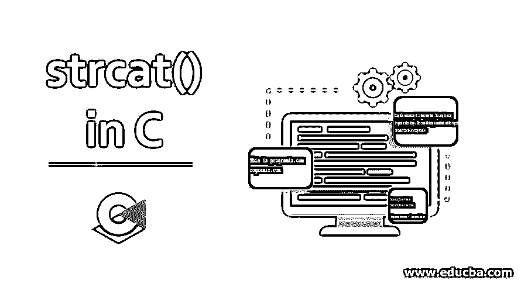
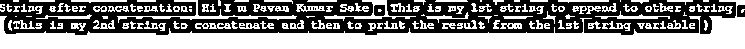
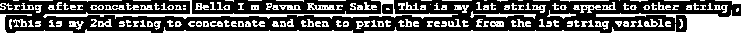

# C 语言中的 strcat()

> 原文：<https://www.educba.com/strcat-in-c/>




## C 语言中 strcat()的介绍

c 中的 strcat()函数通常用于编程过程中的字符串连接。strcat()将一个特定的字符串与另一个字符串连接起来。这是一个内置函数。只有在项目/程序的头文件/位置定义了<string.h>，c 中的 Strcat()内置函数才会正常工作。</string.h>

**语法:**

<small>网页开发、编程语言、软件测试&其他</small>

```
Char *strcat(char *str1, const char *str2)
```

**参数:**

上面的内置函数(strcat())只有两个参数，可能是两个字符串/字符数组。连接在一起的字符串将存储在参数中的第一个字符串中。

*   **Str1:** 目标字符串的指针。
*   **Str2:** 源字符串的指针，可以追加/添加到目的字符串。

### 用 C 语言实现 strcat()的示例

以下是不同的例子:

#### 示例#1

连接字符串的程序。这里，stra1、stra2 已经通过赋值被赋予了字符串值。

**代码:**

```
#include <stdio.h>
#include <string.h>
int main()
{
char stra1[] = "This is ", stra2[] = "programiz.com";
//concatenates stra1 and stra2 and resultant string is stored in str1.
strcat(stra1,stra2);
puts(stra1);
puts(stra2);
return 0;
}
```

**输出:**


#### 实施例 2

程序连接 stra1 和 stra2 字符串的变量值。

**代码:**

```
#include <stdio.h>
#include <string.h>
int main () {
char stra1[1000], stra2[1000];
//stra1 destination string
strcpy(stra1, "Hi I m Pavan Kumar Sake . This is my 1st string to append to other string , \n");
//stra2 source string
strcpy(stra2, " (This is my 2nd string to concatenate and then to print the result from the 1st string variable )\n" );
//concatenating the string stra2 to the string stra1
strcat(stra1, stra2);
//stra1 : displaying destination string
printf("String after concatenation: %s", stra1);
return(0);
}
```

**输出:**




#### 实施例 3

将特定字符串复制到 stra1、stra2 后的拼接程序。

**代码:**

```
#include <stdio.h>
#include <string.h>
int main () {
char stra1[1000], stra2[1000];
//stra1 destination string
strcpy(stra1, "Hi I m Pavan Kumar Sake . This is my 1st string \n to append to other string , ");
//stra2 source string
strcpy(stra2, "(This is my 2nd string to concatenate and then to print \n the result from the 1st string variable )" );
//concatenating the string stra2 to the string stra1 in the printf statement itself
printf("String after concatenation: %s", strcat(stra1, stra2));
//The resultant of the concatenated string usually stores in stra1 but here strcat() used in the print statement itself
//so no need to declare stra1 again
return(0);
}
```

**输出:**


除了声明 strcat()位置之外，由于相同的编程逻辑，输出与上面示例的输出相同。和上面一样使用相同的字符串。

#### 实施例 4

C 语言中打印语句本身的连接程序。

**代码:**

```
#include <stdio.h>
#include <string.h>
int main () {
//Assigning strings to the variables
char stra1[1000] = "Hello I m Pavan Kumar Sake . This is my 1st string to append to other string , \n";
char stra2[1000] = " (This is my 2nd string to concatenate and then to print the result from the 1st string variable )";
//concatenating the string stra2 to the string stra1 in the printf statement itself
printf("String after concatenation: %s", strcat(stra1, stra2));
//The resultant of the concatenated string usually stores in stra1 but here strcat() used in the print statement itself
//so no need to declare stra1 again
return(0);
}
```

**输出:**




#### 实施例 5

c 程序使用两种不同的类型显示两个字符串的连接，即 normal &也可以通过移动源字符串和目标字符串来显示。查一下下面的 c 程序，你就知道了。

**代码:**

```
#include <stdio.h>
#include <string.h>
int main( )
{
char source1[ ] = " Best one" ;
//assigning the string to the source1 string
char target1[ ]= " Java tutorial" ;
//assigning the string to the target1 string
printf ( "\nSource string 1st one = %s ", source1 ) ;
//printing the source1 value
printf ( "\nTarget string 2nd one = %s \n", target1 ) ;
//printing the target value
strcat ( target1, source1 ) ;
//concatenating the target1 and the source1 values/strings
printf ( "\n Target string after strcat( ) = %s \n ", target1 ) ;
//target1 will now have the concatenated and then it will be printed
printf ( "\n Source string after strcat( ) = %s \n ", strcat(source1, target1) ) ;
//source 1 doesnot have any value because already string appended and the resultant stored in the target string/chars
}
```

**输出:**


#### 实施例 6

使用定义变量和空字符的连接程序。

**代码:**

```
#include <stdio.h>
#include <string.h>
//Program to Concatenate the NULL STRING
#define DEST_SIZE1 40
// defining the dest_size1 of 40
char dest1[DEST_SIZE1];
//assigning the dest with dest size
int main()
{
strcat(dest1, "Look Here");
//concatenating the null string/character
printf(dest1);
//Printing the dest1 value
return 0;
}
```

**输出:**


#### 实施例 7

使用指针的连接程序。

**代码:**

```
#include <stdio.h>
#include <string.h>
//String Character Program with the pointers used
#define DEST_SIZE1 40
int main()
{
char src1[] = "Look Here";
//assigning string to the src1 variable
char dest1[DEST_SIZE1] = "Unimaginable";
//assigning string to the dest1 variable
char *ps1 = src1 + 4;
//assigning src1 string variables value to the pointer ps1
char *pd1 = dest1 + 6;
//assigning dest1 string variables value to the pointer pd1
strcat(pd1, ps1);
//concatenating the pointers
printf(dest1);
//printing dest1 value
strcat(src1, dest1);
//concatenating the src1 value by concatenating the src1 and dest1
printf("\n\n");
//line breaks
printf(src1);
//printing src1 value - it is the concatenation value
return 0;
}
```

**输出:**


#### 实施例 8

这是 strcat()的类似函数 strncat()的程序。仅连接字符串中特定长度的字符非常有用。

**代码:**

```
#include <stdio.h>
#include <string.h>
//This is a program of strncat() function to concatenate only first 4 characters of the string.
#define DEST_SIZE1 40
//defining the dest_size1 with 40 value
int main()
{
char src1[] = " Hey Buddy!!! ";
//assigning the string to the src character's string - 1st string
char dest1[DEST_SIZE1] = "How are you";
//assigning the string value to the dest[40] because dest_size1 already assigned - 2nd string
strncat(dest1, src1, 4);
//concatenating the dest, src with the condition of concatenating only 4 strings of src1
printf(dest1);
//printing the dest1 value because now the dest1 now has concatenated string
return 0;
}
```

**输出:**


### 结论

这是关于 C 编程语言中 strcat()的概念，以及如何声明 strcat()函数，strcat()在 C 中如何工作，即 strcat()函数如何追加/连接 2 个字符串。上面列出了所有带有 strcat 示例的输出。

### 推荐文章

这是一个 C 语言中 strcat()的指南。这里我们讨论 C 语言中 strcat()的语法、参数和主要示例，以及代码实现。你也可以看看下面的文章来了解更多-

1.  [C 并集的例子](https://www.educba.com/c-union/)
2.  [C 语言中的二维数组](https://www.educba.com/2-d-arrays-in-c/)
3.  [C 语言中的十进制到八进制](https://www.educba.com/decimal-to-octal-in-c/)
4.  [C 语言中的函数原型](https://www.educba.com/function-prototype-in-c/)


