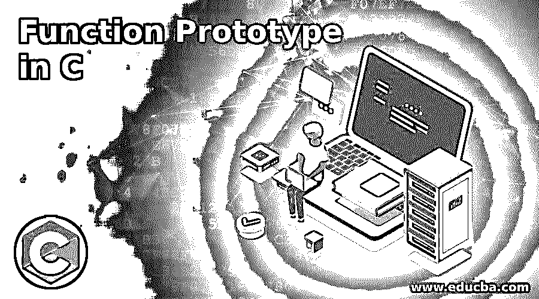
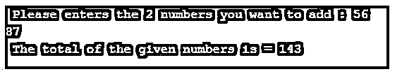

# C 语言中的函数原型

> 原文：<https://www.educba.com/function-prototype-in-c/>




## C 语言中的函数原型介绍

函数原型是起源于 C++的 C 程序设计的重要特征之一。函数原型是代码中的声明，它指示编译器函数的数据类型、参数和形参列表。众所周知，执行特定任务的代码块被称为函数。同样，函数原型是一个函数，它为编译器指定返回类型、函数名及其参数，以便在需要时可以与给定的函数调用相匹配。

**语法:**

<small>网页开发、编程语言、软件测试&其他</small>

```
returntypefunctionname( datatype paramter1 , datatype paramter2 , datatype paramter3..);
```

**举例:**

**代码:**

```
intaddition(int a, int b);
```

在上面的例子中，加法是整型数据类型的函数名，是返回类型，a 和 b 是传递给函数的两个 int 类型的参数。请注意，我们可以根据需要在函数中传递任意数量的参数。同样在同一个程序中，我们可以定义尽可能多的原型，但它们应该在名称或参数列表上有所不同。你所要做的就是在代码中定义一个原型，然后通过使用函数名随时调用它。

### C 语言中函数原型的例子

下面是提到的例子:

#### 示例#1

**代码:**

```
#include <stdio.h>
int Num_addition( int i , int j );// prototype for the function
int main()
{
int num1,num2,total;
printf( " Please enters the 2 numbers you want to add : " ) ;
scanf( "%d %d" , &num1 , &num2 ) ;
total = Num_addition( num1 , num2 ) ;        // calling the function
printf( " The total of the given numbers is = %d " , total ) ;
return 0 ;
}
int Num_addition( int i , int j )         // function definition  for prototype
{
int results;
results = i + j ;
return results ;
}
```

**输出:**




正如您在上面的代码中所看到的，最初我们声明了将两个名为“Num_addition”的整数返回类型的数字与两个名为 I 和 j 的整数参数相加到函数中的函数原型。在主类中，我们定义了三个整数 num1、num2 和 total。之后，我们接受用户的输入，然后存储两个给定数字的相加结果。要调用函数“Num_addition ”,再次使用函数。最后，在函数定义中，您可以看到我们给出了执行加法的逻辑，并将其存储在结果中。

#### 实施例 2

**代码:**

```
#include <stdio.h>
intNum_subtraction( inti , int j ); // prototype for the function
intmain()
{
int num1 , num2 , output ;
printf( " Please enters the 2 numbers you want to subtract : " ) ;
scanf( "%d %d" , &num1 , &num2 ) ;
output = Num_subtraction( num1 , num2 ) ;
printf( " The subtraction of the given numbers is = %d " , output ) ;
return 0 ;
}
intNum_subtraction( inti , int j )// function definition
{
intresults ;
results = i - j ;
return results ;
}
```

**输出:**


正如您在上面的代码中所看到的，最初我们声明了两个数相减的函数原型，这两个数的返回类型为整数，带有两个整型参数 I 和 j。在主类中，我们定义了三个整数 num1、num2 和 output。之后，我们从用户那里获取输入，然后在输出中存储两个给定数字的减法结果。为了调用这个函数，Num_subtraction 函数被再次使用。最后，在函数定义中，你可以看到我们给出了执行减法的逻辑，并将其存储在结果中。

#### 实施例 3

**代码:**

```
#include <stdio.h>
intNum_multiplication( inti , int j );// prototype for the function
intmain()
{
int num1 , num2 , output ;
printf( " Please enters the 2 numbers you want to multiply : " );
scanf( "%d %d" , &num1 , &num2 ) ;
output = Num_multiplication( num1 , num2 );// calling the function
printf( " The multiplication of the given numbers is = %d " , output );
return 0 ;
}
intNum_multiplication( inti , int j )// function definition
{
intresults ;
results = i * j ;
return results ;// return statement to return results to user
}
```

**输出:**


正如您在上面的代码中所看到的，最初，我们在函数中声明了两个整数相乘的函数原型，其返回类型为“Num_multiplication ”,带有两个名为 I 和 j 的整数参数。在主类中，我们定义了三个整数 num1、num2 和 output。之后，我们从用户那里获取输入，然后在输出中存储两个给定数字的乘法结果。为了调用函数 Num_multiplication，再次使用了函数。最后，在函数定义中，你可以看到我们给出了执行乘法的逻辑，并将它存储在结果中。

### 结论

在 C 中定义一个函数原型有助于节省大量的调试时间，当涉及到函数重载时，原型有助于确定在给定代码中调用哪个函数，这对于避免歧义和其他编程问题非常有帮助。

### 推荐文章

这是一个 C 语言中函数原型的指南。这里我们讨论 C 语言中函数原型的介绍以及相应的例子，以便更好地理解。您也可以看看以下文章，了解更多信息–

1.  [C 文字量](https://www.educba.com/c-literals/)
2.  [C 中的内存分配](https://www.educba.com/memory-allocation-in-c/)
3.  [C 语言中的文件处理](https://www.educba.com/file-handling-in-c/)
4.  [C 中的常数](https://www.educba.com/constants-in-c/)


