# C 编程中的数组

> 原文：<https://www.educba.com/arrays-in-c-programming/>

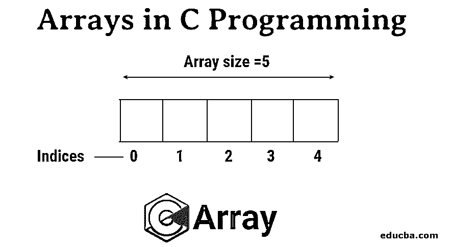


## C 编程中的数组介绍

数组是一种数据结构，用于在连续的内存位置存储同类数据。以下是 C 编程中的数组。 **T2】**

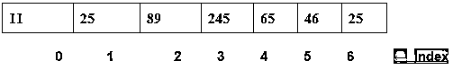


<small>网页开发、编程语言、软件测试&其他</small>

这里的 index 指的是元素在数组中的位置。假设 A[L]是数组的名称，其中“A”是变量名，“L”是数组的长度，即数组中元素的数量。

则 A[i]表示数组中第“i+1”个位置的元素。例如:

A[6]= 72 表示数组第 6+1 个位置的元素。

**对阵列的需求**

它有助于使用单个变量表示大量元素。它还使得访问元素更快，更容易存储在内存位置，使用数组的索引来表示元素在数组中的位置…

### 访问数组中的元素

访问数组中的任何元素要容易得多，并且复杂度可以达到 O(1)。

数组的索引从 0 开始，直到-1.0 表示数组的第一个元素，-1 表示数组的最后一个元素。同样，-2 表示数组的倒数第二个元素。

**例如:**

设 A 是一个长度为 7 的数组，一个人需要访问值为 94 的元素，那么他必须使用 A[3]。

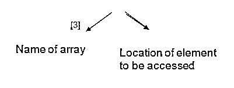


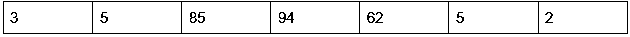


**语法**

printf("%d "，A[3])–这将打印 94，其中 3 是我们需要访问的索引，A 是数组的变量。

### C 程序设计中数组的声明

在 C 中，在使用数组之前，必须正确声明数组的名称和长度。在 c 程序中，有三种语法可以用来声明数组

**语法 1**

int A[7] = {21，56，32，52，63，12，48 }-声明数组的长度和元素

**C 程序**

```
#include<stdio.h>
int main{
int a[7] = {21,56,32,52,63,12,48};
int i;
for(i=0;i<7;i++){
printf(“%d\n”,a[i]);
}
return 0;
}
```

**输出:**

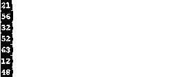


**语法 2**

int A[]={21，56，32，52，63，12，48 }-声明数组元素的长度

**C 程序**

```
#include<stdio.h>
int main{
int a[] = {21,56,32,52,63,12,48};
int i;
for(i=0;i<7;i++){
printf(“%d\n”,a[i]);
}
return 0;
}
```

**输出:**

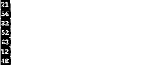


**语法 3**

int A[7]；–仅声明数组的长度。

**C 程序**

```
#include<stdio.h>
int main{
int a[7] ;
int i;
printf(“Please enter the array elements”);
for(i=0;i<7;i++){
scanf(“%d\n”,&a[i]);
}
printf(“Elements of array are”);
for(i=0;i<7;i++){
printf(“%d\n”,a[i]);
}
return  0;
}
```

**输出:**

**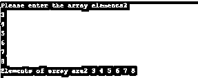

** 

**语法 4**

int A[7]= { 0 }；-当元素在所有位置都相同时，声明数组和元素的长度。

**C 程序**

```
#include<stdio.h>
int main{
int a[7]={0} ;
int i;
printf(“Elements of array are”);
for(i=0;i<7;i++){
printf(“%d\n”,a[i]);
}
return  0;
}
```

**输出:**


**语法 5**

声明数组的长度以及所有值都相同的元素的值

**案例 1-**int a[3]= {[0..1]=3} –

**案例 2—**int a[3]= { 0 }；-

**语法 6**

int * a；-将数组声明为指向元素位置的指针。

### 没有超出检查范围的索引

如果有人试图访问数组边界之外的元素，编译器不会显示错误；相反，它会生成一个警告。并且还会给出意外的输出。

**例子**

a[4] ={2，3，4，5 }；

如果我们写 printf(a[4])；

输出将是 225263545——出乎意料

此外，在 C #中，用多于声明中指定长度的数字元素初始化数组时，编译器不会出错。例如，下面的程序没有显示错误。

**C 程序**

```
#include<stdio.h>
int main{
int arr[2]={10,22,56,32,45,89} ;
int i;
printf(“Elements of array are”);
for(i=0;i<2;i++){
printf(“%d\n”,arr[i]);
}
return  0;
}
```

**输出:**

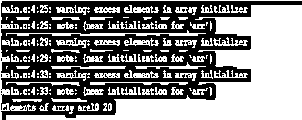


### 检索数组中的元素

检索数组元素并打印出来是一件非常简单的事情。它只需要一个循环来打印一个数组的 n 个元素。因此这样一个程序的复杂度是 O(n)。

For eg- let int a[7] ={23，56，8，944，58，24，5 }；

打印数组元素的程序是

**C 程序**

```
#include<stdio.h>
int main{
int arr[7]={23,56,8,944,58,24,5} ;
int i;
printf(“Elements of array are”);
for(i=0;i<7;i++){
printf(“%d\n”,arr[i]);
}
return  0;
}
```

**输出:**

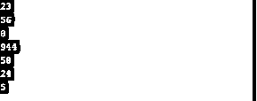


### 多维数组

c 语言还允许多维数组，也就是既可以保存行元素也可以保存列元素的数组。

**申报**

在声明多维数组时，必须指定除左侧维度之外的所有维度的长度，因为这是可选的。

**例子**

以下面的方式声明数组将导致错误，因为没有指定除最左侧以外的维度。

Int a[][][2]={

{{1, 2}, {3, 4}},

{{5, 6}, {7, 8}}

}

**例子**

下面是用 c 语言声明多维数组的正确语法之一。

Int a[][3]={

{52,56,86},{44,6,21}

}

### 将数组作为参数传递到函数中

有时在构造函数时，我们需要函数使用一些变量，这些变量需要从不同的函数中获取。此时，这些变量必须作为该函数调用的参数传递给。但最终，随着变量数量的增加，我们必须使用数组来传递变量，或者如果需要对数组执行一些操作，那么就需要将完整的数组作为参数传递到函数中。要将数组作为变量传递给函数:

#### 1.按值调用

在这种类型的方法调用中，数组的实际值被复制到形参中，两者都存储在不同的位置；因此，对值所做的任何更改都不会反映在函数中。

**C 程序**

```
#include <stdio.h>
Void show( char ch)
{
printf("%c ", ch);
}
int main()
{
char arr[] = {'a', 'b', 'c', 'd', 'e', 'f', 'g', 'h', 'i', 'j'};
for (int x=0; x<10; x++)
{
show(arr[x]);//value of array //elements are passed as an argument
}
return 0;
}
```

**输出:**


#### 2.引用调用

在调用函数时，如果不是传递数组的实际值，而是将对变量的引用作为参数传递，则称为通过引用调用。

**C 程序**

```
#include <stdio.h>
Void show( char ch)
{
printf("%c ", ch);
}
int main()
{
char arr[] = {1,2,3,4,5,6,7,8,9,0};
for (int x=0; x<10; x++)
{
show(&arr[x]);//reference of array //elements are passed as an argument
}
return 0;
}
```

**输出:**

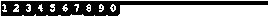


#### 3.将整个数组作为参数传递

例如，假设 arr 是一个 7 个元素的数组。disp 是一个显示数组元素的函数，它有两个参数，第一个指向数组的第一个位置，另一个指向数组的长度(var2)。调用函数 arr 时，变量 arr 指向数组第一个元素的位置和长度，即传递 7。

**C 程序**

```
#include <stdio.h>
void disp( int *var1, int var2)
{
for(int x=0; x<var2; x++)
{
printf("Value of var_arr[%d] is: %d \n", x, *var1);
/*increment pointer for next element fetch*/
var1++;
}
}
int main()
{
int var_arr[] = {12, 22, 38,85, 65, 66, 77};
disp(var_arr, 7);
return 0;
}
```

**输出:**

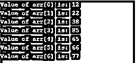


### 数组的内存分配

C 语言中的内存表示被分为 5 个部分，如下所示

1.  正文段
2.  初始化数据段
3.  未初始化的数据段
4.  堆
5.  许多

与其他变量一样，数据、堆和堆栈是可以为数组分配内存来存储其元素的三个部分。

1.  **动态数组:** [动态数组是数组](https://www.educba.com/dynamic-array-in-java/)，运行时需要分配内存位置。对于这些类型的数组，内存分配在[堆内存](https://www.educba.com/what-is-heap-memory/)位置。
2.  **全局或静态数组:**这些是在编译时分配的数组类型。因此，数据段内存总是分配给这些类型的数组。
3.  **局部数组:**在函数或块中初始化的数组称为局部数组。这些类型的数组在堆栈段上分配内存。

### 字符数组

在 C #中，字符串被视为一维字符数组，在最后一个位置有空字符' \0 '，编译器会自动添加到该数组中。

例如，“我爱编码”被认为是一个长度为 14 的 c 语言一维数组，末尾包含“\0”字符。

**声明:**有两种方法声明和初始化字符数组-

1.  char str[12] =“我爱代码”；
2.  char str[12] = {'I '，' '，' l '，' o '，' v '，' '，' c '，' o '，' d '，' e '，\ 0 ' ' }；–此处我们必须以' \0 '字符结尾。
3.  char ch[3]= ' modi '–非法声明

### 接受输入和输出

在 C 中为 char 数组“%c”获取输入和显示输出时，可以分别使用 scanf()和 printf()函数。

在对字符串执行相同的操作时，可以使用“%s ”,但会在出现第一个空白字符时停止扫描。

**C 程序:**

```
#include <stdio.h>
#include<string.h>
int main()
{
char str[20];
printf(“Enter a string”);
scanf(“%[^\n]”,&str);
printf(“%s”,str);
return 0;
}
```

**输出:**

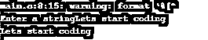


除了 printf 和 scanf 函数，C 还提供了 gets()和 [puts()等字符串函数，用于在扫描和打印时忽略字符串的](https://www.educba.com/c-puts-function/)空格。

### 结论

数组是一种数据结构，用于在连续的内存位置存储同类数据。编程中的数组被用来表示不同的复杂数据结构，如树、堆等。c 语言[允许多维数组](https://www.educba.com/multidimensional-array-in-python/)用于所有原始数据类型。字符串也表示为一个字符数组，以空字符' \0 '作为最后一个字符。编程中的数组允许使用存储元素的索引来快速检索和直接访问数组元素。

### 推荐文章

这是一个 C 语言编程中的数组指南。在这里，我们讨论了简介、数组的需求和传递数组函数，包括通过值调用、通过引用调用和将整个数组作为参数传递。您也可以阅读以下文章，了解更多信息——

1.  [C 中的 3D 数组](https://www.educba.com/3d-arrays-in-c/)
2.  [C 编程中的模式](https://www.educba.com/patterns-in-c-programming/)
3.  [c++中的 3D 数组](https://www.educba.com/3d-arrays-in-c-plus-plus/)
4.  PHP 中的[数组](https://www.educba.com/arrays-in-php/)


