# C #中的二维数组

> 原文：<https://www.educba.com/2-d-arrays-in-c/>

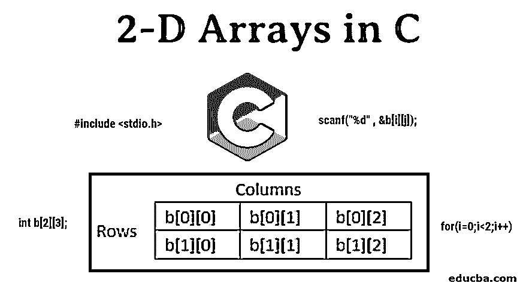


## C 语言中的二维数组介绍

数组可被定义为相似或不同数据类型的元素或数据的集合，其根据提供给程序开发者的要求在一维或多维中实现。2-D 或二维数组表示为“数据类型变量[n][n]”，其中数据类型可以是 int、char 等，而[n][n]是 n*n，表示变量值在数组中的位置。所有二维数组所必需的一些基本操作是“初始化数组”、“在数组中插入值”、“更新数组中的值”和“从数组中删除值”。在本文中，我们将会看到 c #中的二维数组。

### C 语言中二维数组的概念

我们可以在

<small>网页开发、编程语言、软件测试&其他</small>

*   一维的
*   二维的

依此类推，直到 N 维。但是这里我们要处理二维数组。顾名思义，二维数组可以是数据的矩阵表示，创建二维数组是为了实现类似关系数据库的数据结构，并可以以表格形式存储。它提供了保存大量数据的便利，可以根据需要将这些数据传递给任意数量的函数。这些数组中的数据可以通过行和列 id 来访问。

我们如何定义和实现它们？我们可以在哪里使用它们？更进一步，让我们来理解那些概念。

在 C #中，维度数组可以声明如下:

**语法**

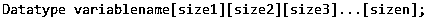


因此，以同样的方式，我们可以将二维数组声明为:

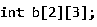


上述表述的含义可以理解为:

1.  分配给变量 b 的内存的数据类型是 int。
2.  数据以 2 行 3 列的形式表示。

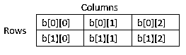


The data inside the array can be accessed through the above representation. In 2-D arrays representation, the first square bracket represents the number of rows, and the second one is for the number of columns. The index representation of the array for the first element always starts with zero and ends with size-1\. Array variable (here b) always holds the base address of the memory block and is called an internal pointer variable.

因此，例如，如果行数为 3，那么访问行中数据的索引表示将为 0、1 和 2。同样的逻辑也适用于列索引。对于上面的表示，要得到第 2 <sup>和第</sup>行第 3 <sup>和第</sup>列的数据，我们可以通过 b[1][2]进行访问。

### 初始化数组

我们有两种不同的方法来初始化 c 中的值。这两种方法只是在语法上不同。

下面是其中之一。

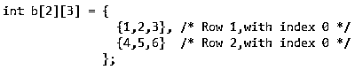


另一种初始化方式如下:

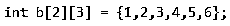


通常，第一种初始化方法是首选的，因为我们可以清楚地理解和可视化 c 中的二维数组的行和列。

下面是数组 b 中元素及其地址的图形表示示例。

基于元素的数据类型，数组的元素通常存储在连续的存储位置。
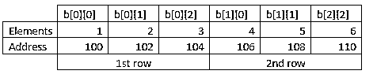


### 在二维数组中插入元素

为了在二维数组中插入元素，我们需要在行和列中插入数据。为此，我们使用循环的概念。在上面初始化数组中数据的过程中，我们已经预定义了值。

在这里，用户可以根据需要动态地插入元素。下面是插入元素的示例代码。

```
#include <stdio.h>
int main()
{
int b[2][3];
int i,j,num;
printf("Enter elements into 2-D array: ");
for(i=0;i<2;i++)
{
for(j=0;j<3;j++)
{
scanf("%d" , &b[i][j]);
}
}
}
```

如代码所示:

1.  首先，我们用行数和列数声明数组变量和数组的维数。
2.  然后我们声明两个变量来迭代数组中的元素。
3.  然后，使用 for 循环。外部 for 循环用于行迭代，内部循环用于列迭代。
4.  Scanf 函数用于读取我们输入的数据，然后将值插入 I 和 j 的位置。

在上面的例子中，我们将数据插入一个 2 行 3 列的矩阵中。可以获得如下输出:

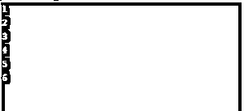


因为我们没有使用 printf 函数来显示输出，所以编写的程序只读取了用户输入的值。编写打印函数(使用 for 循环)后，输出将显示为:

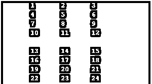


### 更新二维数组中的元素

数组中元素的更新可以通过指定要替换的特定元素或者通过标识必须进行替换的位置来完成。为了更新，我们通常需要以下细节。

1.  数组的元素
2.  必须插入的位置/元素
3.  要插入的值。

为了通过元素细节更新数组中的数据，首先，我们需要在数组中搜索该元素，了解它的位置，然后用新元素替换旧元素。

这里，我们在下面给出了两个更新二维数组元素的例子。

首先，让我们看一个例子，其中要更新的元素的位置是已知的。

```
#include <stdio.h>
int main()
{
int b[2][3];
int i,j,num;
printf("Enter elements into 2-D array: ");
for(i=0;i<2;i++)
{
for(j=0;j<3;j++)
{
scanf("%d" , &b[i][j]);
}
}
b[0][2]=10;
for(i=0;i<2;i++)
{
for(j=0;j<3;j++)
{
printf("\t%d" , b[i][j]);
}
printf("\n");
}
return 0;
}
```

在上面的程序中，第 1 <sup>行</sup>和第 3 <sup>行</sup>的元素被选中，该位置的数据值被更新。

**以上输出如下:**

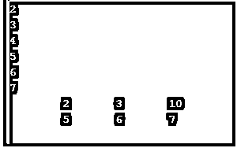


在第二个示例中，我们将展示如何动态地将元素的位置作为用户输入的值，并在该特定位置更新元素的值。

```
#include <stdio.h>
int main()
{
int b[2][3];
int i,j,num;
printf("Enter elements into 2-D array: ");
for(i=0;i<2;i++)
{
for(j=0;j<3;j++)
{
scanf("%d" , &b[i][j]);
}
}
printf("Enter the value of row and coulmn number :");
scanf("%d  %d", &i,&j);
printf("Enter the number you want to update with: ");
scanf("%d" , &num);
b[i][j]=num;
for(i=0;i<2;i++)
{
for(j=0;j<3;j++)
{
printf("\t%d" , b[i][j]);
}
printf("\n");
}
return 0;
}
```

这里，我们使用 scanf 函数读取用户根据行号和列号选择的元素位置给出的值。

**输出如下:**


作为一个练习，你能试着写一个程序用用户输入的值更新矩阵的整行吗？

现在，我们知道，在二维数组中，我们在数组的开头声明数组的大小。我们知道数组的大小，但是如果用户在我们的数组大小之外给出一个随机的行号和列号呢？

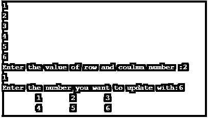


请注意，由于我们没有编写任何 if/else 条件或 try/catch 块，矩阵的输出没有变化。但是，我们可以使用上述条件编写代码来显示这种情况下的错误。

### 删除二维数组中的元素

在了解了在数组中插入和更新数据的概念之后，现在让我们看看如何从数组中删除一整行。

我们用简单的格式写了一个程序，这样二维数组中不同运算的概念就可以很容易理解了。

```
#include <stdio.h>
int main()
{
int b[2][3],i,j,num,x;
printf("Enter elements into 2-D array: ");
for(i=0;i<2;i++)
{
for(j=0;j<3;j++)
{
scanf("%d" , &b[i][j]);
}
}
printf("Enter the value of row number :");
scanf("%d", &x);
for(i=0;i<2;i++)
{
if(i==x)
{
for(j=0;j<3;j++)
{
if((i+1)<2)
{
printf("\t%d" , b[i+1][j]);
}
}
i++;}
else
{
for(j=0;j<3;j++)
{
printf("\t%d" , b[i][j]);
}
}
printf("\n");
}
}
```

接下来的步骤是:

1.  动态获取数组的值
2.  要求用户输入要删除的行的编号(索引)。
3.  使用 for 循环迭代，我们比较行号和用户输入号是否匹配。
4.  如果它们匹配，并且行数小于数组的大小，我们将打印下一行。否则，我们将按原样打印该行。

**输出如下:**

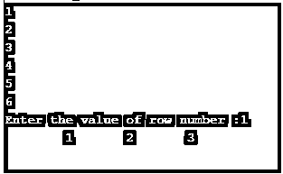


如果，我给出数组边界外的行号呢？

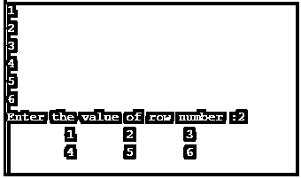


它不会找到要删除的行，并通过打印整个数组来退出程序。

众所周知，我们甚至可以动态声明行号和列号的值，并相应地编写程序。

这看起来是不是简单易学？

作为一个练习，你现在能试着删除二维数组中的一个特定元素吗？

### 结论

在这一节中，我们已经学习了二维数组的基本运算。这些二维阵列在矩阵运算和许多数学计算的实时应用中非常有用。

数组甚至可以用于显示日历，停车场的位置，我们甚至可以下象棋。

许多其他数据结构，如链表、队列、图、树，都必须使用二维数组的概念作为存储和访问不同元素位置的基本要求。尝试解决二维数组的基本操作，并享受学习 c 语言的乐趣。

### 推荐文章

这是一个用 c 语言编写的二维数组的指南。在这里我们讨论二维数组的介绍，初始化数组，插入，更新，删除元素。您也可以阅读以下文章，了解更多信息——

1.  [c++中的数组](https://www.educba.com/arrays-in-c-plus-plus/)
2.  [JavaScript 中的数组](https://www.educba.com/arrays-in-javascript/)
3.  [c#中的数组](https://www.educba.com/arrays-in-c-sharp/)
4.  PHP 中的[数组](https://www.educba.com/arrays-in-php/)


