# C 语言中的 3D 数组

> 原文：<https://www.educba.com/3d-arrays-in-c/>

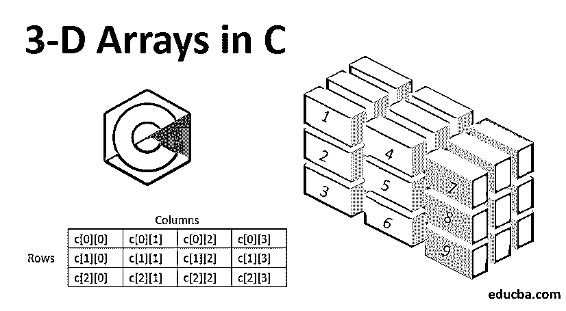


## C 语言中的 3D 数组简介

数组是一组具有相同(同类)数据类型的元素。它也称为派生数据类型。正如已经注意到的，3D 数组以指数方式增加了空间，并且增加了一个额外的位置来定位数组中的元素。在这个主题中，我们将学习 c 语言中的 3D 数组。

例如，考虑一个有许多自行车停车位的 4 层建筑。因此，为了获得停放的自行车的最佳位置方向，我们需要用行号和列号来表示级别号。当你只是告诉数组，第 7 行第 4 列，它搜索的是哪一级？这个 3D 数组只是为了存储更多的数据和表示位置。

<small>网页开发、编程语言、软件测试&其他</small>

我们如何定义和实现它们？更进一步，让我们来理解那些概念。

**语法:**

在 C #中，维度数组可以声明如下:

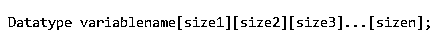


因此，以同样的方式，我们可以将三维数组声明为:

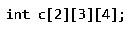


上述表述的含义可以理解为:

1.  分配给变量 c 的内存的数据类型是 int。
2.  这个数组可以容纳的总容量是 2*3*4，等于 24 个元素。
3.  数据以 2 个数组的形式表示，每个数组有 3 行 4 列。

|  |  | 列 |
| c[0]数组 | 行 | c[0][0] | c[0][1] | c[0][2] | c[0][3] |
| c[1][0] | c[1][1] | c[1][2] | c[1][3] |
| c[2][0] | c[2][1] | c[2][2] | c[2][3] |
|  |  |  |  |  |  |
|  |  | 列 |
| c[1]数组 | 行 | c[0][0] | c[0][1] | c[0][2] | c[0][3] |
| c[1][0] | c[1][1] | c[1][2] | c[1][3] |
| c[2][0] | c[2][1] | c[2][2] | c[2][3] |

数组内部的数据可以通过上面的表示来访问。在 [3D 数组表示法](https://www.educba.com/3d-arrays-in-c-plus-plus/)中，第一个方括号表示必须考虑的数组级别，第二个是行数，第三个是列数。

第一个元素的数组的索引表示总是从零开始，以大小-1 结束。因此，例如，如果行数为 3，那么访问行中数据的索引表示将为 0、1 和 2。同样的逻辑也适用于数组级别和列索引。对于上面的表示，要得到第 2 <sup>第</sup>行第 3 <sup>第</sup>列的数组的第 1 <sup>第</sup>级的数据，我们可以通过 c[0][1][2]来访问。

### 在 C #中初始化 3D 数组

我们可以初始化一个类似于二维数组的三维数组。


如上所述，可以放入数组的元素总数是 array size 1 * array size 2 * array size 3。这里是 2*4*3，也就是 24。

#### 插入元素

类似于 2D 数组，为了在三维数组中插入元素，我们需要在级别、行和列中插入数据。为此，我们使用循环的概念。在上面初始化数组中数据的过程中，我们已经预定义了值。

在这里，用户可以根据需要动态地插入元素。下面是插入元素的示例代码。

**代码:**

```
#include <stdio.h>
int main()
{
int c[2][4][3];
int i,j,k;
printf("Enter elements into 3-D array: ");
for(i=0;i<2;i++)
{
for(j=0;j<4;j++)
{
for(k=0;k<3;k++)
{
scanf("%d",&c[i][j][k]);
}
}
}
}
```

如代码所示:

1.  首先，我们用数组的层数、行数和列数来声明数组变量和数组的维数。
2.  然后我们声明三个变量来迭代数组中的元素。
3.  然后，使用 for 循环。第一个循环用于级别迭代，第二个循环用于行，第三个循环用于列。
4.  Scanf 函数用于读取我们输入的数据，然后将值插入 I、j 和 k 的位置。

在上面的例子中，我们将数据插入到一个具有 2 级、4 行和 3 列的矩阵中。可以获得如下输出:

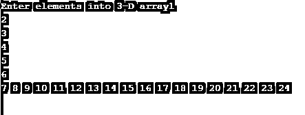


因为我们没有使用 printf 函数来显示输出，所以编写的程序只读取了用户输入的值。编写打印函数(使用 for 循环)后，输出将显示为:

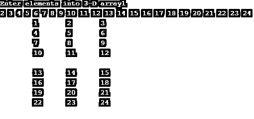


#### 更新元素

可以通过指定要替换的特定元素或者通过识别必须进行替换的位置来更新数组中的元素。为了更新，我们通常需要以下细节。

1.  数组的元素
2.  必须插入的位置/元素
3.  要插入的值。

为了通过元素细节更新数组中的数据，首先，我们需要在数组中搜索该元素，了解它的位置，然后用新元素替换旧元素。

这里，我们在下面给出了两个更新 3D 数组元素的例子。

首先，让我们看一个例子，其中要更新的元素的位置是已知的。

**代码**

```
#include <stdio.h>
int main()
{
int c[2][4][3];
int i,j,k,num;
printf("Enter elements into 3-D array: ");
for(i=0;i<2;i++)
{
for(j=0;j<4;j++)
{
for(k=0;k<3;k++)
{
scanf("%d",&c[i][j][k]);
}
}
}
c[1][1][1] = 85;
for(i=0;i<2;i++)
{
for(j=0;j<4;j++)
{
for(k=0;k<3;k++)
{
printf("\t%d",c[i][j][k]);
}
printf("\n");
}
printf("\n");
}
return 0;
}
```

在上面的程序中，第 1 个 <sup>st</sup> 级别、第 1 个 <sup>st</sup> 行和第 1 个 <sup>st</sup> 列的元素被选中，该位置的数据值已被更新。

上面的输出如下所示:

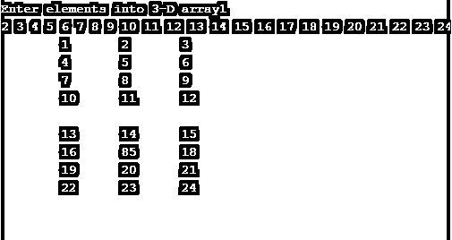


在第二个示例中，我们将展示如何动态地将元素的位置作为用户输入的值，并在该特定位置更新元素的值。

**代码:**

```
#include <stdio.h>
int main()
{
int c[2][4][3];
int i,j,k,num;
printf("Enter elements into 3-D array: ");
for(i=0;i<2;i++)
{
for(j=0;j<4;j++)
{
for(k=0;k<3;k++)
{
scanf("%d",&c[i][j][k]);
}
}
}
printf("Enter the level , row and column number: ");
scanf("%d %d %d", &i,&j,&k);
printf("Enter the new number you want to update with: ");
scanf("%d" , &num);
c[i][j][k] = num;
for(i=0;i<2;i++)
{
for(j=0;j<4;j++)
{
for(k=0;k<3;k++)
{
printf("\t%d",c[i][j][k]);
}
printf("\n");
}
printf("\n");
}
return 0;
}
```

输出如下。这里，我们使用 scanf 函数来读取用户根据数组级别、行数和列数为元素位置选择的值。

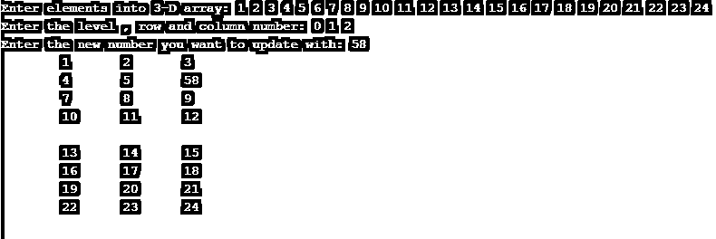


作为一个练习，你能试着写一个程序用用户输入的值更新矩阵的整个列吗？

现在，正如我们所知，在 3D 数组中，我们在开头声明数组的大小。我们知道数组的大小，但是如果用户给出一个超出我们的数组大小的随机的行号和列号呢？


如果我们在数组中输入了比所需更多的元素会怎么样？

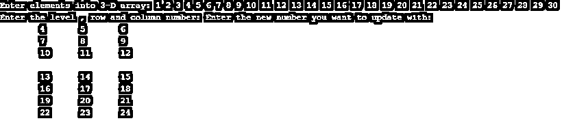


请注意，由于我们没有编写任何 if/else 条件或 try/catch 块，矩阵的输出没有变化。但是，我们可以使用上述条件编写代码来显示这种情况下的错误。

作为最后一个例子，你不好奇，如果我们跳过中间的一些元素会发生什么吗？我的程序是做什么的？

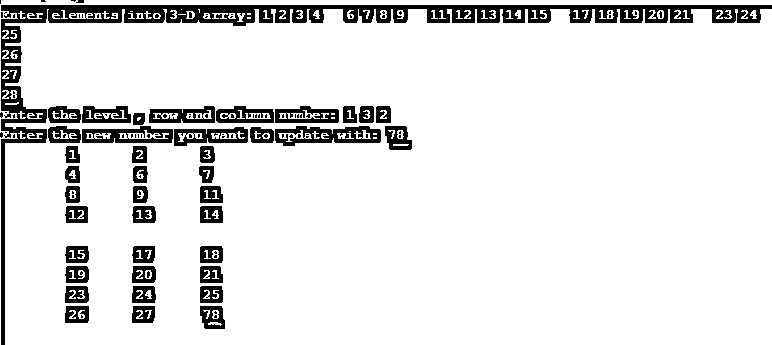


如上面的输出所示:

1.  我们在输入中错过了 4 个值，只不过是通过给空格和按回车键
2.  但是我们有足够的空间来输入剩下的 4 个元素。
3.  然后，我们指定将最后一级、最后一行和最后一列元素更改为 78。产量和预期的一样，不是吗？

#### 删除元素

在 3D 数组中插入和更新数据的概念之后，现在让我们看看如何从数组中删除一整行。

我们用简单的格式编写了一个程序，这样不同操作的概念就容易理解了。

**代码:**

```
#include <stdio.h>
int main()
{
int c[2][4][3],i,j,k,num,x;
printf("Enter elements into 3-D array: ");
for(i=0;i<2;i++)
{
for(j=0;j<4;j++)
{
for(k=0;k<3;k++)
{
scanf("%d",&c[i][j][k]);
}
}
}
printf("Enter the value of row number to delete: ");
scanf("%d", &x);
for(i=0;i<2;i++)
{
for(j=0;j<4;j++)
{
if(j==x)
{
for(k=0;k<3;k++)
{
if((j+1)<4)
{
printf("\t%d" , c[i][j+1][k]);
}
}
j++;
}
else
{
for(k=0;k<3;k++)
{
printf("\t%d" , c[i][j][k]);
}
}
printf("\n");
}
printf("\n");
}
}
```

动态获取数组的值。接下来的步骤是:

1.  要求用户输入要删除的行的编号(索引)。
2.  使用 for 循环迭代数组级别、行和列。我们正在比较行号和用户输入的编号是否匹配。
3.  如果它们匹配，并且行数小于数组的大小，我们将打印下一行。否则，我们将按原样打印该行。
4.  这里，因为我们在数组级别上没有任何条件，所以指定的行号从两个数组级别上都被删除了。

输出如下所示:

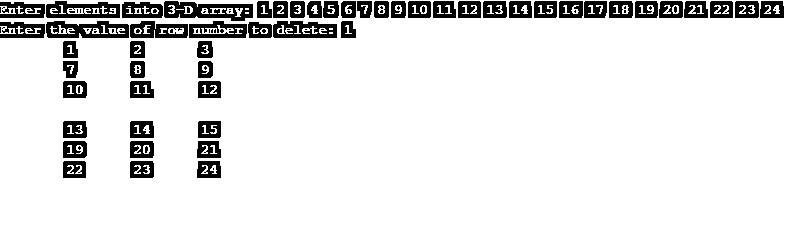


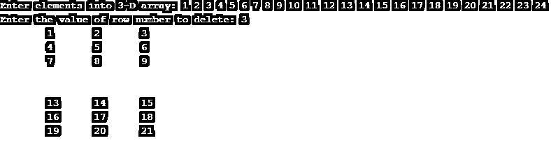


如果，我们给出数组边界外的行号呢？

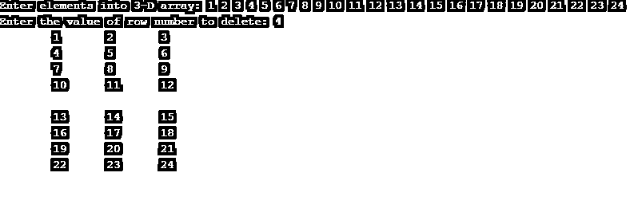


它不会找到要删除的行，并通过打印整个数组来退出程序。

众所周知，我们甚至可以动态声明行数和列数的值，并相应地编写程序。

这看起来是不是简单易学？

作为练习，您现在可以尝试删除 3d 数组的特定元素吗？

### 结论

在这一节中，我们学习了三维数组的基本运算。

3D 数组包含许多组 2d 数组。我们已经将棋盘视为 2D 阵列的一个示例，如果我们将许多棋盘放在一起，3D 阵列可以帮助我们首先选择您想要玩的棋盘，然后选择该棋盘的行和列。

尝试解决 3d 数组的基本操作，享受学习 c 的乐趣。

### 推荐文章

这是一个用 c 语言编写的 3D 数组的指南。这里我们讨论一个类似于 2D 数组的 3D 数组的初始化和数组的元素。您也可以阅读以下文章，了解更多信息——

1.  [R 中的数组](https://www.educba.com/arrays-in-r/)
2.  [c#中的数组](https://www.educba.com/arrays-in-c-sharp/)
3.  [Java 中的 3D 数组](https://www.educba.com/3d-arrays-in-java/)
4.  PHP 中的[数组](https://www.educba.com/arrays-in-php/)


