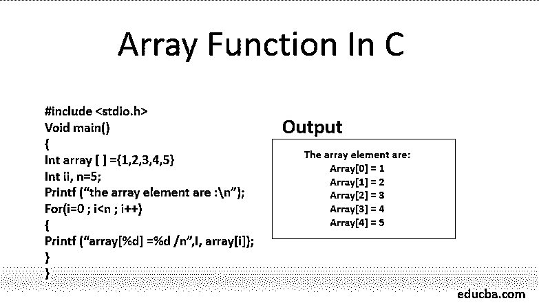
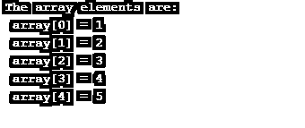
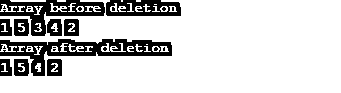
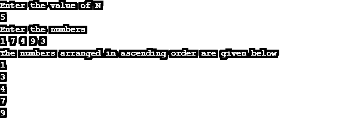

# C 语言中的数组函数

> 原文：<https://www.educba.com/array-functions-in-c/>




## C 语言中的数组函数介绍

C #中的数组函数是一种数据结构，它包含多个相同数据类型的元素。数组的大小是固定的，元素是按顺序收集的。数组可以有不同的维数，C 编程不限制数组的维数。

### C 语言中数组的不同功能

可以对阵列执行不同的功能。

<small>网页开发、编程语言、软件测试&其他</small>

#### 1)穿越

遍历数组意味着遍历数组的每个元素一次。我们从第一个元素开始，到最后一个元素。下面用 C 语言给出了一个在线性数组上执行遍历操作的程序的例子。

**代码:**

```
#include <stdio.h>
void main()
{
int array[] = {1,2,3,4,5};
int i, n = 5;
printf(" The array elements are: \n " );
for( i=0;i < n; i++)
{
printf(" array[%d] = %d \n " , i, array[i] );
}
}
```

**输出:**




#### 2)搜索

搜索操作用于查找数组中的特定数据项或元素。我们可以在遍历数组的帮助下，在一个无序的数组中进行搜索。从第一个元素到最后一个元素的线性遍历可以用来搜索给定的数字是否出现在数组中，如果出现，也可以用来找到它的位置。

这是通过将每个元素与给定元素(要搜索的元素)进行比较来完成的。一旦找到该元素，搜索操作就会停止。下面的例子展示了在 C 语言中对数组执行的搜索操作

**代码:**

```
#include<stdio.h>
int findElement(int arr[], int n,  int key)
{
int i;
for (i = 0; i < n; i++)
if (arr[i] == key
return i;
return -1;
}
int main()
{
int arr[] = {1, 4, 0, 6, 3};
int n = sizeof(arr) / sizeof(arr[0]);
int key = 4;
int position = findElement(arr, n, key);
if (position == - 1)
printf("Element not found");
else
printf("Element Found at Position: %d", position + 1 );
return 0;
}
```

**输出:**


#### 3)插入

插入操作用于在数组中添加一个新元素。当我们指定特定的元素和它在数组中的位置时，我们执行插入操作。但是，在执行此操作时，数组的大小不会受到影响。只有当数组中有足够的空间来添加元素时，元素才会被插入到数组中。如果数组的大小已经满了，就不能添加新元素。一个在 c 语言中显示未排序数组中插入操作的例子。

**代码:**

```
#include<stdio.h>
int insertSorted(int arr[], int n,  int key, int capacity)
{
if (n >= capacity)
return n;
arr[n] = key;
return (n + 1);
}
int main()
{
int arr[20] = {8, 5, 6, 9, 0, 7} ;
int capacity = sizeof(arr) / sizeof(arr[0]);
int n = 6;
int i, key = 2;
printf("\n Before Insertion: ");
for (i = 0; i < n; i++)
printf("%d  ", arr[i]);
n = insertSorted(arr, n, key, capacity);
printf("\n After Insertion: ");
for (i = 0; i < n; i++)
printf("%d  ",arr[i]);
return 0;
}
```

**输出:**


#### 4)删除

在删除操作中，搜索(使用线性搜索)并删除数组中已经存在的元素，然后移动元素。用户输入要从数组中删除的元素的位置。删除操作和插入操作一样，不影响数组的大小。此外，要删除的元素的位置应该在数组的大小之内，因为删除超出数组大小的元素是不可能的。c 程序显示了在一个未排序的数组中的删除操作。

**代码:**

```
#include<stdio.h>
int findElement(int arr[], int n, int key);
int deleteElement(int arr[], int n, int key)
{
int pos = findElement(arr, n, key);
if (pos == - 1)
{
printf("Element not found");
return n;}
int i;
for (i = pos; i < n - 1; i++)
arr[i] = arr[i + 1];
return n - 1;
}
int findElement(int arr[], int n, int key)
{
int i;
for (i = 0; i < n; i++)
if (arr[i] == key)
return i;return - 1;
}
int main()
{
int i;
int arr[] = {1, 5, 3, 4, 2};
int n = sizeof(arr) / sizeof(arr[0]);
int key = 3;
printf("Array before deletion\n");
for (i = 0; i < n; i++)
printf("%d  ", arr[i]);
n = deleteElement(arr, n, key);
printf("\nArray after deletion\n");
for (i = 0; i < n; i++)
printf("%d  ", arr[i]);
return 0;
}
```

**输出:**




#### 5)分类

执行此操作是为了将数组排序为固定的顺序，即升序或降序。下面是一个 C 语言中数组排序操作的例子

**代码:**

```
#include <stdio.h>
void main()
{
int i, j, a, n, number[30];
printf("Enter the value of N \n");
scanf("%d", &n);
printf("Enter the numbers \n");
for (i = 0; i < n; ++i)
scanf("%d", &number[i]);
for (i = 0; i < n; ++i)
{
for (j = i + 1; j < n; ++j)
{
if (number[i] > number[j])
{
a =  number[i];
number[i] = number[j];
number[j] = a;
}
}
}
printf("The numbers arranged in ascending order are given below \n");
for (i = 0; i < n; ++i)
printf("%d\n", number[i]);
}
```

**输出:**




### 对数组排序的不同方式

以下是数组的不同排序方法:

#### 1)冒泡排序

冒泡排序逐个比较所有元素，并根据它们的值对它们进行排序。它从比较第一个元素和第二个元素开始，如果第一个元素大于第二个元素，它将交换两个元素，并继续比较第二个和第三个元素，依此类推。

#### 2)选择排序

选择排序背后的基本思想是找到未排序数组中最少的元素，用第一个元素替换它。然后对未排序数组的其余部分继续相同的过程，即从第二个位置开始，然后从第三个位置开始，依此类推。

#### 3)合并排序

这种排序方法基于分治技术。它将数组分成两个相等的子数组，并继续下去，直到每个子数组包含一个元素，然后以排序的方式将它们合并，得到一个排序的数组。

#### 4)插入排序

在插入排序中，我们从第二个元素开始。阵列元素以连续的方式相互比较。将当前元素(要排序的值)与已排序子数组中的所有元素进行比较。已排序子数组中大于当前元素的所有元素都被移位，并插入当前值。重复这个过程，直到整个数组被排序。

#### 5)快速排序

快速排序和合并排序一样，也是基于分治算法。在这种方法中，选择一个元素作为轴心(通常是第一个元素)。然后，围绕拾取的中枢对数组进行划分，即，小于中枢的所有元素将形成一个子数组，而大于中枢的所有元素将形成另一个子数组。对子数组也重复该过程，直到整个数组被排序。

#### 6)堆排序

堆排序的[算法就是基于比较。最大元素被选择并放置在结束位置。然后找到第二大的元素，并放在倒数第二个位置。对所有元素重复这一过程。](https://www.educba.com/heap-sort-in-c/)

### 推荐文章

这是一个 c 语言中数组函数的指南。这里我们分别讨论数组排序的基本概念和不同的函数和方法。您也可以浏览我们的其他相关文章，了解更多信息——

1.  [c++中的数组](https://www.educba.com/arrays-in-c-plus-plus/)
2.  [R 中的数组](https://www.educba.com/arrays-in-r/)
3.  [R 中的函数](https://www.educba.com/functions-in-r/)
4.  [阵列的优势](https://www.educba.com/advantages-of-array/)


