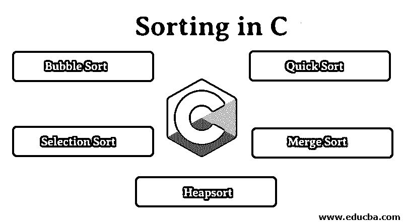
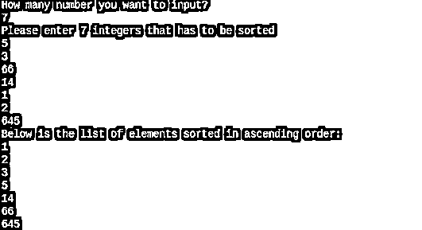
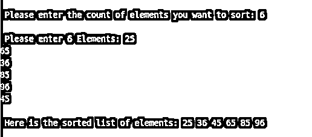
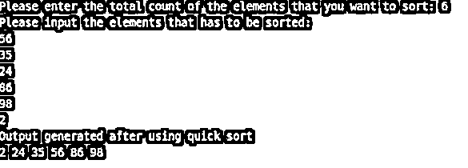
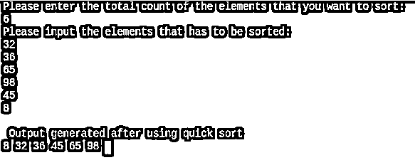
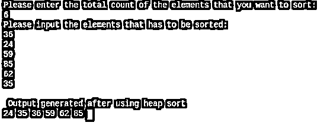
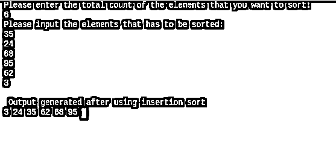

# C 语言中的排序

> 原文：<https://www.educba.com/sorting-in-c/>




## C 语言中的排序介绍

排序的过程可以被解释为以任何特定顺序重新排列元素的技术，这可以被设置为由程序逻辑进一步处理。在 C 编程语言中，有多种可用的排序算法，它们可以包含在代码中。C 语言中各种可能的排序方法有冒泡排序、选择排序、快速排序、合并排序、堆排序和插入排序。

### C 中排序是如何进行的？

让我们学习一下在 C 语言中排序是如何进行的:

<small>网页开发、编程语言、软件测试&其他</small>

*   基于排序算法，可以以各种方式执行排序。在 C 编程语言中，我们有几种方法来排序列表。排序这个术语指的是以一种特殊的方式，通常是以升序排列数据。尽管在所有的[排序算法](https://www.educba.com/sorting-algorithms-in-javascript/)中，对数据进行排序的方式是不同的，但是它们的结果是相同的。
*   通常，在排序中，程序搜索最小的数字，并将该数字移到列表的开头，并重复相同的搜索。再次，一旦遇到另一个小数字，它就被移动到列表中紧接在第一个索引之后的下一个空格，并且这个过程继续重复，直到获得排序列表。这是 C 编程语言中排序的方式。
*   在所有对列表进行排序的方法中，数组在 C 编程语言中起着非常重要的作用。在每个算法中，数组都被用来存储需要排序的元素列表。例如，在冒泡排序中，元素存储在单个数组中，数组中的值经过处理后转换成排序数据列表。
*   在选择排序中，相同的数组被视为两个数组，其中第一个数组被认为是空的，以便告诉排序的值，而第二个数组保存未排序的列表。为了达到排序的目的，经常使用数组，而不是将值保存在单个变量中。在所有的算法中，快速排序非常快，因此被命名为快速排序。与其他排序算法相比，它花费的时间要少得多。

### C #中的排序类型

下面列出了 C #中的排序类型。

#### 1.冒泡排序

*   冒泡排序可以定义为这样一种排序算法，它遵循用数组中的最小值替换第一个索引中的值并保持重复直到列表被排序的方法。这是一种非常简单的排序方式。以这种方式对数组进行排序，在开始排序之前，必须先将值赋给数组。
*   下面是使用冒泡排序对数组进行排序的程序，其中的值取自用户。一旦程序被编译并运行，它将询问用户想要排序的元素的数量。一旦提供了数字，程序将要求用户提供与他们提供的计数相等的值。这些值将存储在数组中，并使用嵌套的 for 循环和使用“if”的决策进一步处理，以便对数组进行排序。
*   在数组中找到的第一个最小值已被移动到数组的第一个索引处，然后再次开始搜索以找到另一个最小的数字。一旦找到下一个最小的数字，它就替换第二个索引中的值，并且该过程继续重复，直到该数组由值的排序列表组成。

**代码:**

```
#include <stdio.h>
int main()
{
int total_count, counter, counter1, swap_var;
int array[20];
printf("How many number you want to input?\n");
scanf("%d", &total_count);
printf("Please enter %d integers that has to be sorted\n", total_count);
for (counter = 0; counter < total_count; counter++)
scanf("%d", &array[counter]);
for (counter = 0 ; counter < total_count - 1; counter++)
{
for (counter1 = 0 ; counter1 < total_count - counter - 1; counter1++)
{
if (array[counter1] > array[counter1+1]) /* For decreasing order use < */
{
swap_var        = array[counter1];
array[counter1]   = array[counter1+1];
array[counter1+1] = swap_var;
}
}
}
printf("Below is the list of elements sorted in ascending order:\n");
for (counter = 0; counter < total_count; counter++)
printf("%d\n", array[counter]);
return 0;
}
```

用户已经提交了输入 5 3 60 14 1 2 645。该算法已经按照用户提供的方式应用于由值组成的数组，并且在处理它之后，我们接收到的输出是 1 2 3 5 14 60 645。

**输出:**




#### 2.选择排序

*   选择排序可以被定义为用于排序列表的另一种算法，其中数组被分成两个数组，其中第一个数组被认为是空的，而第二个数组由未排序的值列表组成。该程序在第二个数组中搜索最小值，当找到该值时，它已被移动到第一个空数组的开头。再次重复该方法，并且下一个最小值将被移位到第一个数组的第二个索引。这些过程将继续重复，直到第二个数组变空。
*   下面的程序是选择排序算法的编码实现。一旦程序成功运行，它将要求用户输入他们愿意排序的值的计数。一旦获得计数，程序将要求用户输入要排序的数组的值。然后使用嵌套的 for 循环处理该值，以便对数字进行排序。这里还涉及 if 条件检查，以检查最小的数。
*   该过程将被重复，直到第一个列表充满排序列表。同时，程序保持它的主要焦点来检查第二个数组是否有值，如果发现它是正数，程序再次运行排序算法。虽然它以简单的方式对列表进行排序，但与其他算法相比，它可能会花费更多的时间。但是最终，它生成的结果将与其他排序算法相同。

**代号:**

```
#include<stdio.h>
#include<conio.h>
void main()
{
int total_count,counter1,counter2,minimum,temp_value;
int a[20];
printf("\n Enter the Number of Elements: ");
scanf("%d",&total_count);
printf("\n Enter %d Elements: ",total_count);
for(counter1=0;counter1<total_count;counter1++)
{
scanf("%d",&a[counter1]);
}
for(counter1=0;counter1<total_count-1;counter1++)
{
minimum=counter1;
for(counter2=counter1+1;counter2<total_count;counter2++)
{
if(a[minimum]>a[counter2])
minimum=counter2;
}
if(minimum!=counter1)
{
temp_value=a[counter1];
a[counter1]=a[minimum];
a[minimum]=temp_value;
}
}
printf("\n The Sorted array in ascending order: ");
for(counter1=0;counter1<total_count;counter1++)
{
printf("%d ",a[counter1]);
}
getch();
}
```

在询问需要排序的元素数量时，用户在下面的输出中提供了 6。后来输入的值是 25 65 36 86 96 45。这些值存储在该数组中，该数组被分为两个数组，其中一个数组为空，用于存储排序列表，另一个数组包含未排序列表。处理输入后，结果是 25 36 45 65 86 96。此丢失已使用选择排序进行了排序。一旦所有六个值都被移动到排序后的第一个数组中，第二个数组将变为空，算法将终止。

**输出:**




#### 3.快速排序

*   Quicksort 可以定义为另一种对列表进行排序的算法，其方法是根据大于和小于的值来划分数组，直到所有的值都被划分为单个的形式。在该算法中，数组的最后一个索引的值已经被选择作为中枢，并且所有小于中枢的值已经被移位到期望出现在该值左侧的数组，并且具有比中枢更高的值的元素被移位到右侧数组。再次从新形成的数组中选择一个值小于上一个枢轴值的枢轴。类似地，小于新轴心的值将被移动到左边的数组，大于新轴心的值将被移动到右边的数组。
*   下面的程序是使用 C 编程语言实现的快速排序。一旦程序运行，它将询问用户想要排序的元素的数量。根据计数，for 循环将迭代估计的时间，以获取用户的输入。将使用 if 条件和 for 循环来处理输入，以便生成一个排序列表。该数组将继续使用透视值排列这些值，直到所有值都被检查出最小值。
*   与其他排序算法相比，使用完成的[排序算法速度太快了，这也是它被命名为快速排序的原因。Quicksort 是唯一一种分割数组的算法，直到所有的值都被分割成单独的数组。然后，它们将被添加或聚合到一个数组中，该数组被视为排序列表。](https://www.educba.com/sorting-in-c-sharp/)

****代号:****

```
#include <stdio.h>
void quicksort_method (int [], int, int);
int main()
{
int element_list[50],count, counter;
printf("Please enter the total count of the elements that you want to sort: ");
scanf("%d", &count);
printf("Please input the elements that has to be sorted:\n");
for (counter = 0; counter < count; counter++)
{
scanf("%d", &element_list[counter]);
}
quicksort_method(element_list, 0, count - 1);
printf("Output generated after using quick sort\n");
for (counter = 0; counter < count; counter++)
{
printf("%d ", element_list[counter]);
}
printf("\n");
return 0;
}
void quicksort_method(int element_list[], int low, int high)
{
int pivot, value1, value2, temp;
if (low < high)
{
pivot = low;
value1 = low;
value2 = high;
while (value1 < value2)
{
while (element_list[value1] <= element_list[pivot] && value1 <= high)
{
value1++;
}
while (element_list[value2] > element_list[pivot] && value2 >= low)
{
value2--;
}
if (value1 < value2)
{
temp = element_list[value1];
element_list[value1] = element_list[value2];
element_list[value2] = temp;
}
}
temp = element_list[value2];
element_list[value2] = element_list[pivot];
element_list[pivot] = temp;
quicksort_method(element_list, low, value2 - 1);
quicksort_method(element_list, value2 + 1, high);
}
}
```

在下面的输出中，用户确认他们将提交 6 个值，并形成一个排序数据列表。提供计数后，用户提供的值是 56、35、24、86、98、2。已经对这些值应用了快速排序，并且已经生成了具有值 2，24，35，56，86，98 的排序列表。

**输出:**




#### 4.合并排序

*   合并排序可以被定义为另一种排序算法，该算法通过隔离数组直到最后它变成单个值，然后以某种方式聚合它们，以便它可以变成排序的数组来执行排序。
*   与其他竞争对手的算法相比，这个过程消耗了更多的时间，但与其他算法相比，它被认为是非常有效的。在对大型列表进行排序时，这种算法非常有效，因此在开发必须处理大型列表的应用程序时更受青睐。

**代号:**

```
#include<stdio.h>
void algo_merge_sort(int val[],int counter1,int counter2);
void perfrom_merge(int val[],int counter11,int counter12,int counter22,int counter21);
int main()
{
int val[100],chk,counter1;
printf("Please enter the total count of the elements that you want to sort: \n");
scanf("%d",&chk);
printf("Please input the elements that has to be sorted:\n");
for(counter1=0;counter1<chk;counter1++)
scanf("%d",&val[counter1]);
algo_merge_sort(val,0,chk-1);
printf("\n Output generated after using quick sort \n");
for(counter1=0;counter1<chk;counter1++)
printf("%d ",val[counter1]);
return 0;
}
void algo_merge_sort(int val[],int counter1,int counter2)
{
int mid;
if(counter1<counter2)
{
mid=(counter1+counter2)/2;
algo_merge_sort(val,counter1,mid);
algo_merge_sort(val,mid+1,counter2);
perfrom_merge(val,counter1,mid,mid+1,counter2);
}
}
void perfrom_merge(int val[],int counter11,int counter12,int counter22,int counter21)
{
int temp_val[50];
int c1,c2,c3;
c1=counter11;
c2=counter22;
c3=0;
while(c1<=counter12 && c2<=counter21)
{
if(val[c1]<val[c2])
temp_val[c3++]=val[c1++];
else
temp_val[c3++]=val[c2++];
}
while(c1<=counter12)
temp_val[c3++]=val[c1++];
while(c2<=counter21)
temp_val[c3++]=val[c2++];
for(c1=counter11,c2=0;c1<=counter21;c1++,c2++)
val[c1]=temp_val[c2];
}
When the above code runs, it first asks the user to provide the number of elements that they want to sort. Once the number has been submitted, they will need to provide the values of equal count that they have provided initially. Once the values have been submitted, the algorithm will hold those values in the array and will process it to transform the array into the sorted array. After the array is sorted in ascending order, the output will be displayed to the user.
```

**输出:**




#### 5.堆排序

*   [堆排序](https://www.educba.com/heap-sort-in-c/)可以定义为通过搜索列表中的最大元素并将其放在最后来工作的排序算法。该算法递归地执行该操作，直到该数组按照升序排序。
*   选择最大值并将其移动到最后非常耗时，因此在对大型列表进行排序时，这被认为是效率较低的排序方法。但是，它适用于值数量有限的列表。下面是这个算法在 C 编程语言中的实现以及输出。

**代号:**

```
#include<stdio.h>
void form(int []);
void set_down(int [],int);
int main()
{
int val[100],chk,counter,end,temp_val;
printf("Please enter the total count of the elements that you want to sort: \n");
scanf("%d",&chk);
printf("Please input the elements that has to be sorted:\n");
for(counter=1;counter<=chk;counter++)
scanf("%d",&val[counter]);
val[0]=chk;
form(val);
while(val[0] > 1)
{
end=val[0];
temp_val=val[1];
val[1]=val[end];
val[end]=temp_val;
val[0]--;
set_down(val,1);
}
printf("\n Output generated after using heap sort \n");
for(counter=1;counter<=chk;counter++)
printf("%d ",val[counter]);
}
void form(int val[])
{
int counter,chk;
chk=val[0];
for(counter=chk/2;counter>=1;counter--)
set_down(val,counter);
}
void set_down(int val[],int counter)
{
int counter2,temp_val,chk,flag=1;
chk=val[0];
while(2*counter<=chk && flag==1)
{
counter2=2*counter;
if(counter2+1<=chk && val[counter2+1] > val[counter2])
counter2=counter2+1;
if(val[counter] > val[counter2])
flag=0;
else
{
temp_val=val[counter];
val[counter]=val[counter2];
val[counter2]=temp_val;
counter=counter2;
}
}
}
The working of this algorithm is the same as that of other sorting algorithms as it also sorts the list in ascending order. When the above-written code runs, the user has to submit the count of values that they will be sorting. Once the values are submitted, the code will process them in order to turn the array into the sorted one. The output will be shown eventually and it can be observed that the values that have been submitted by the user has sorted in ascending order.
```

**输出:**




#### 6.插入排序

*   [插入排序](https://www.educba.com/insertion-sort-in-javascript/)可以定义为排序算法，通过一次一个地移动列表开头的最小值来工作。这是一种非常低效的排序算法，并且不适合处理大型列表。
*   这种对算法进行排序的方法非常慢，并且通常在任何应用中都不是优选的。它可以很好地处理元素数量很少的列表。对于需要处理少量值的应用程序，可以利用这种算法。

**代号:**

```
#include<stdio.h>
int main()
{
int counter1,counter2,chk,temp_val,val[100];
printf("Please enter the total count of the elements that you want to sort: \n");
scanf("%d",&chk);
printf("Please input the elements that has to be sorted:\n");
for(counter1=0;counter1<chk;counter1++)
{
scanf("%d",&val[counter1]);
}
for(counter1=1;counter1<=chk-1;counter1++)
{
temp_val=val[counter1];
counter2=counter1-1;
while((temp_val<val[counter2])&&(counter2>=0))
{
val[counter2+1]=val[counter2];
counter2=counter2-1;
}
val[counter2+1]=temp_val;
}
printf("\n Output generated after using insertion sort \n");
for(counter1=0;counter1<chk;counter1++)
{
printf("%d ",val[counter1]);
}
return 0;
}
```

当程序运行时，用户必须输入他们需要排序的值的数量。之后，用户输入的值将被存储到数组中。然后，将对它们进行处理，通过使用 for 循环和条件检查，最小值将被移动到每次递归的开头，并以生成一个排序数组结束。这些值将在程序结束时显示给用户。

**输出:****T3】**




### 结论

排序算法用于生成一个排序列表，它是一个普通的列表，其中所有的值都以特定的方式排序。该列表在实际应用中经常使用，以提供一些功能。在本文中，我们介绍了冒泡排序、选择排序和快速排序，同时还有其他几种算法，如合并排序，也可以用来生成一个排序列表。在所有的排序算法中，quicksort 的速度非常快，有助于快速对列表进行排序。这里写的程序基本上是用 C 编程语言实现这些排序算法。如果您愿意用其他编程语言实现相同的功能，您可以使用相同的逻辑，唯一可能不同的是语法和关键字。

### 推荐文章

这是 c 语言中排序的指南，在这里我们讨论不同类型排序的基本概念以及示例代码。您也可以浏览我们推荐的其他文章，了解更多信息——

1.  [C 编程中的模式](https://www.educba.com/patterns-in-c-programming/)
2.  [C 程序中的回文](https://www.educba.com/palindrome-in-c-program/)
3.  [Java 中的合并排序](https://www.educba.com/merge-sort-in-java/)
4.  [在 C++中排序](https://www.educba.com/sorting-in-c-plus-plus/)


