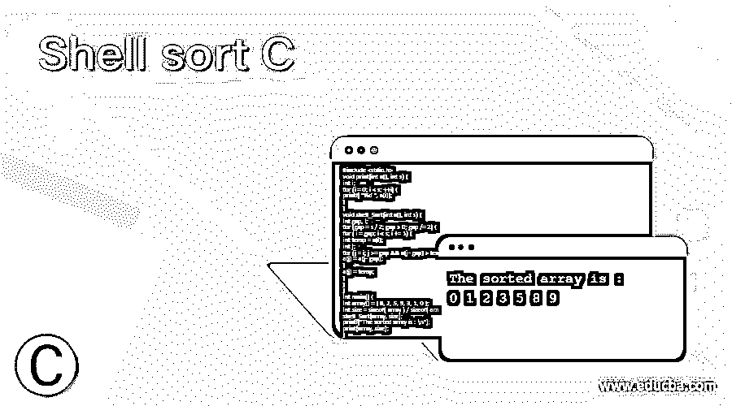
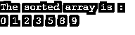
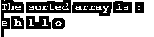

# 外壳排序 C

> 原文：<https://www.educba.com/shell-sort-c/>




## 外壳排序 C 的定义

C #中的 Shell 排序用于对数组进行排序，先对相距较远的元素进行排序，然后依次缩小要排序的元素之间的间距。外壳排序是插入排序算法的版本。在插入排序中，元素向前移动一个位置，在正确的位置插入一个元素，而 shell 排序交换远处的元素。如果一个元素必须向前移动很远，就需要多次移动。shell 排序从对彼此相距很远的元素对进行排序开始，并依次对它们进行间隔排序。如果从相距很远的元素开始，它可以比简单的最近邻交换更快地将一些不合适的元素转移到正确的位置。Shell 排序不是一种稳定的排序算法，因为它忽略了介于区间之间的项目。shell 排序的最坏情况运行时间复杂度是 O(n2)，最好情况运行时间复杂度是 O(nlog(n))。

外壳排序的算法–

<small>网页开发、编程语言、软件测试&其他</small>

```
Shell_Sort( a, length)
for interval x <- length / 2n down to 1
for each interval "x" in a
sort all the elements at interval "x"
end shell_Sort
```

返回值–该方法的返回值是排序后的数组。

### C 语言中 shell 排序的实现

C 中 shell 排序的工作方式如下:

1.让指定的数组为:

```
Given array: [8, 7, 2, 6, 4, 5, 4, 0]
```

2.在我们的算法中，我们使用 shell 的原始序列(N/2，N/4，…1)作为区间。如果数组大小为 N = 8，则比较 N/2 = 4 区间中的元素，如果它们在第一次循环中顺序错误，则进行交换。
比较第 0 个元素和第 4 个元素。

如果第 0 个元素大于第 4 个元素，则第 4 个元素首先存储在 temp 变量中，然后是第 4 个位置的第 0 个元素(即较大的元素)，第 0 个位置的元素存储在 temp 中，并以 n/2 的间隔重新排列这些元素。

```
array: [4, 7, 2, 6, 8, 5, 3, 0], temp = 4
```

对所有剩余的元素重复这一过程，并以 n/2 的间隔重新排列这些元素。我们得到了数组:

```
array: [4, 5, 2, 0, 8, 7, 3, 6]
```

3.在第二个循环中，选择 N/4 = 8/4 = 2 的间隔，并且落入该范围内的元素被再次排序，并且在 N/4 间隔中重新排列这些元素。

```
array: [2, 5, 4, 0, 8, 7, 3, 6]
```

4.比较第 4 位和第 2 位元素。还对比了第 2 和第 0 位置的元素。当前间隔用于比较序列中的所有元素。

```
array: [2, 5, 4, 0, 8, 7, 3, 6]
```

对所有剩余的元素重复这一过程，并以 n/2 的间隔重新排列这些元素。我们得到了数组:

```
array: [2, 0, 3, 5, 4, 7, 8, 6]
```

5.接下来，当区间为 N/8 = 8/8 =1 时，对区间为 1 的数组元素进行排序。该数组现在已经完全排序，并以 n/8 的间隔重新排列元素。

```
array: [2, 0, 3, 5, 4, 7, 8, 6]
array: [0, 2, 3, 5, 4, 7, 8, 6]
array: [0, 2, 3, 5, 4, 7, 8, 6]
array: [0, 2, 3, 4, 5, 7, 8, 6]
array: [0, 2, 3, 4, 5, 7, 8, 6]
array: [0, 2, 3, 4, 5, 7, 8, 6]
array: [0, 2, 3, 4, 5, 7, 8, 6]
array: [0, 2, 3, 4, 5, 6, 7, 8]
```

### C #中 shell 排序的例子

C #中 shell sort 对数字数组进行排序的示例。

#### 示例#1

**代码:**

```
#include <stdio.h>
void print(int a[], int s) {
int i;
for (i = 0; i < s; ++i) {
printf( "%d ", a[i]);
}
}
void shell_Sort(int a[], int s) {
int gap, i;
for (gap = s / 2; gap > 0; gap /= 2) {
for ( i = gap; i < s; i += 1) {
int temp = a[i];
int j;
for (j = i; j >= gap && a[j - gap] > temp; j -= gap) {
a[j] = a[j - gap];
}
a[j] = temp;
}
}
}
int main() {
int array[] = { 8, 2, 5, 9, 3, 1, 0 };
int size = sizeof( array ) / sizeof( array[0] );
shell_Sort(array, size);
printf("The sorted array is : \n");
print(array, size);
}
```

上述代码的输出是–




与上面的程序一样，创建 shell_Sort()函数是为了对数字数组进行排序。在函数内部，第一个 for 循环创建一半的 gap，第二个循环执行有间隙的插入排序，如果第一个 gap 元素 a[0..gap-1]已经进行了间距排序，然后在对整个数组进行间距排序之前再添加一个元素，第三个 for 循环移动前面的间距排序元素，直到找到 a[i]的正确位置。最后，将 temp 复制到原始数组，并使用 print()函数打印所有排序后的数组，如上面的输出所示。
重写上面的程序，对字符数组进行排序。

#### 实施例 2

**代码:**

```
#include <stdio.h>
void print(char a[], int s) {
int i;
for (i = 0; i < s; ++i) {
printf( "%c ", a[i]);
}
}
void shell_Sort(char a[], int s) {
int gap,i;
for (gap = s / 2; gap > 0; gap /= 2) {
for ( i = gap; i < s; i += 1) {
char temp = a[i];
int j;
for (j = i; j >= gap && a[j - gap] > temp; j -= gap) {
a[j] = a[j - gap];
}
a[j] = temp;
}
}
}
int main() {
char array[] = { 'h', 'e', 'l', 'l', 'o' };
int size = sizeof( array ) / sizeof( array[0] );
shell_Sort(array, size);
printf("The sorted array is : \n");
print(array, size);
}
```

上述代码的输出是–




与上面的程序一样，创建 shell_Sort()函数是为了对字符数组进行排序。在函数内部，第一个 for 循环创建一半的 gap，第二个循环执行有间隙的插入排序，如果第一个 gap 元素 a[0..gap-1]已经进行了间距排序，然后在对整个数组进行间距排序之前再添加一个元素，第三个 for 循环移动前面的间距排序元素，直到找到 a[i]的正确位置。最后，将 temp 复制到原始数组，并使用 print()函数打印所有排序后的数组，如上面的输出所示。

### 结论

C #中的 shell 排序用于对数组进行排序，先对相距较远的元素进行排序，然后依次缩小要排序的元素之间的间距。

### 推荐文章

这是一个外壳排序 C 的指南。在这里，我们讨论定义，语法，参数，外壳排序在 C 的例子与代码实现工作。您也可以看看以下文章，了解更多信息–

1.  [Java 中的排序字符串](https://www.educba.com/sort-string-in-java/)
2.  [排序字符串 C++](https://www.educba.com/sort-string-c/)
3.  [C 中的冒泡排序](https://www.educba.com/bubble-sort-in-c/)
4.  [排序字符串 PHP](https://www.educba.com/sort-string-php/)


