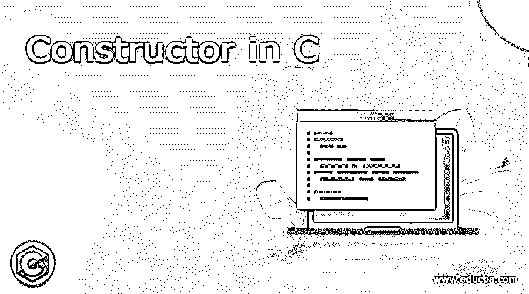

# C 语言中的构造函数

> 原文：<https://www.educba.com/constructor-in-c/>




## C 语言中的构造函数介绍

C 中的构造函数用于 c++编程的内存管理。它允许像 int、float 这样的内置数据类型和像 class 这样的用户定义的数据类型。面向对象编程中的构造函数初始化用户定义的数据类型的变量。构造函数帮助创建对象。构造函数的名称与对象的名称相同，但是它没有返回类型。创建对象或特殊成员时，会自动执行构造函数。它为新创建的对象分配内存，并且可以重载。

**代码:**

<small>网页开发、编程语言、软件测试&其他</small>

```
// class with Constructor
class integer
{
int a, b;
public:
integer (void);
*// *declaration of Constructor
};
integer :: integer (void)
*// *constructor defined
{
a = 0, b = 0;
}
```

### 构造函数的使用

下面是构造函数的一些用法。

*   这是一个特殊的方法，它拥有与类名相同的名称，并在创建对象时初始化该对象。所以简单易行。
*   它主要用于内存管理。当不再需要内存块时，通过程序员指定的新建和删除选项来初始化和删除内存块
*   每当创建对象时，编译器都会创建一个默认的构造函数。当你没有声明构造函数时，编译器会创建一个。它很有用，因为程序中的对象和函数知道对象的存在
*   当实例是声明的对象时，创建对象的构造函数。对于不同的情况，一个类可以有多个构造函数。构造函数重载通过在单个类中包含许多构造函数来增加类的通用性。

```
Overclass X's a, b value:: 0 , 0
Overclass X1's a, b value:: 4 ,5
Overclass X2's a, b value:: 6 , 12
```

因此，构造函数用不同的值重载。

### C 语言中构造函数的类型

构造函数的主要类型解释如下。

#### **1。默认构造函数**

默认构造函数没有参数，或者当前参数有默认值。如果类中没有用户定义的构造函数，编译器会在需要时创建一个新的，称为默认构造函数。这是类的内联公共成员。这个构造函数将有一个完整的主体，没有初始化式。默认的构造函数不提供任何特定的东西，它只是简单地给对象分配内存。如果下面所有的陈述都是真的，那么 X 类的构造函数就是肤浅的。它是隐式定义的。如果 X 没有虚基类和虚函数。X 的所有基类和非静态成员都有简单的构造函数。

#### 2.参数化构造函数

可以接受实参的构造函数叫做[参数化构造函数](https://www.educba.com/parameterized-constructor-in-c-plus-plus/)。它可以在任何需要的时候指定参数。

**代码:**

```
class X {
int i;
public:
void abc(void);
void xyz(void);
// member function definitions
}
X 0b 1;
// default constructor for creating 0b1\. hence user can use it,
// implicitly define default constructor is public
// member of the class
0b1\. abc();
0b1\. xyz();
```

#### 3.复制构造函数

它用于从一个对象初始化和声明另一个对象

```
integer 10(12);
```

将定义对象 10，同时将其初始化为值 12。这种说法的另一种形式是

```
integer 10 = 12;
```

这个过程称为拷贝初始化。每当创建临时对象时，都会使用复制构造函数。复制构造函数的应用如下:将对象作为函数值返回。由同一类的另一个对象初始化对象

**语法**

```
class_name :: class_name(class_name &ptr)
class <game>
{
//data
public: game(arguments); // parameterized constructor
.........
.........
};
```

**代码**

```
class school
{
char name[25];
int rno;
public: school(char,int); //parameterized constructor
};
school :: school (char n,int r)
{
name=n;
rno=r;
}
```

#### 4.构造函数重载

当在同一个类中使用多个构造函数时，这叫做构造函数重载。它给了我们多种方法来初始化类中的对象。它通过在一个类中拥有多个构造函数来增加灵活性。

**代码:**

```
#include<iostream>
#include<conio.h>
using namespace std;
class student
{
int score;
char name[30];
public:
student(int x, char y[])
// parameterized constructor
{
score =x;
strcpy(name,y);
}
student()
// normal constructor
{
score =100;
strcpy(name,"y");
}
void input_data()
{
cout<<"\n Enter score :"; cin>>score;
cout<<"\n Enter name :"; cin>>name;
}
void show_data()
{
cout<<"\n score :"<<score;
cout<<"\n Name :"<<name;
}
};
int main()
{
student s(10,"z");
s.show_data();
getch();
return 0;
}
```

#### 5.二维构造函数

它在结构上类似于一个数组，包含行和列。它保存一个字符串数组，其中一行代表一个字符串，一列代表一个字符串值。

**代码:**

```
// overloading class constructors
#include <iostream>
using namespace std;
class CRectangle
{
int width, height;
public:
CRectangle ();
CRectangle (int,int);
int area (void)
{
return (width*height);
}
};
CRectangle::CRectangle ()
{
width = 7;
height = 5;
}
CRectangle::CRectangle (int a, int b)
{
width = a;
height = b;
}
int main ()
{
CRectangle rect (7,5);
CRectangle rectb;
cout << "rect area: " << rect.area() << endl;
cout << "rectb area: " << rectb.area() << endl;
return 0;
}
```

**语法**

```
char arrayname[x][y];
```

其中“x”是行数,“y”是列数。

行数应该与该数组中的字符串数相同。列数应该大于或等于字符串的长度，或者可以加一

**例子**

如果数组中有 8 个字符串，最长字符串的长度为 10，则数组定义如下

```
Char days[8][11];
```

#### 6.私有构造函数

它用于一次性创建类的对象。定义了类没有该类的多个实例。它与其他构造函数相同，但被定义为 private。它只能访问定义的那个类的对象。

**代码:**

```
classroom()
{
private:
```

只有程序的这一部分，并且只能在私有部分中访问和定义

### 结论

构造函数可以接受空参数或多个参数。一个类可以定义一个或多个构造函数。通过设置构造函数参数的默认值，将适当的参数列表传递给构造函数，由我们来决定在对象创建期间执行哪个构造函数。指针不能用在构造函数上，因为不能考虑它们的地址。构造函数不能声明为 static、const 或 volatile。

### 推荐文章

这是一个 c 语言中构造函数的指南，在这里我们讨论了构造函数的基本概念，使用，构造函数的类型，例子，代码和输出。您也可以浏览我们的其他相关文章，了解更多信息——

1.  [复制 Java 中的构造函数](https://www.educba.com/copy-constructor-in-java/)
2.  [C 编程中的数组](https://www.educba.com/arrays-in-c-programming/)
3.  [Python 中的构造函数](https://www.educba.com/constructor-in-python/)
4.  [JavaScript 中的构造函数](https://www.educba.com/constructor-in-javascript/)


