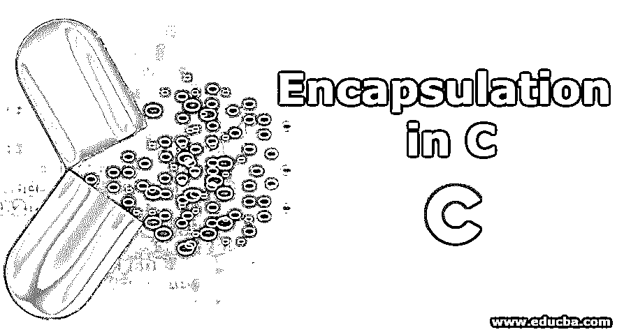
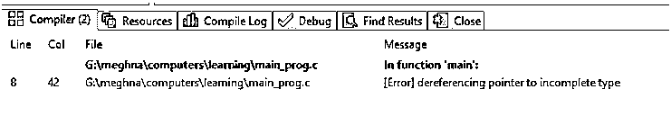

# C 中的封装

> 原文：<https://www.educba.com/encapsulation-in-c/>




## C 语言中的封装介绍

有些情况下，由于业务需求，我们需要编写复杂的代码。这段代码将不是用户友好的，看起来很难理解。为了使程序看起来更容易阅读，我们可以将复杂的代码片段包装在一个胶囊中并隐藏起来。这也将作为防止代码中任何恶意注入的附加保护层。然后，我们可以通过在主程序中调用它的实例来使用这段代码，而不是编写一大堆复杂的行。这个特性叫做封装。这是面向对象语言的核心特性之一。然而，它不仅仅限于 OOP 语言。在 C 语言中，尽管没有私有和公共关键字，封装仍然存在。封装也被各种其他编程语言使用，如 C#、C++、PHP、JAVA 等。

### C 语言中封装的工作原理

为了理解封装的工作原理，让我们考虑一个真实的例子。假设一家大公司拥有自己的内部图书生产部门，并通过与第三方供应商合作将图书交付给客户。为了让这种商业模式发挥作用，将会有不同的部门参与进来，比如采购部门、生产部门、销售部门和财务部门。采购部将负责所有与采购相关的活动，如采购墨水、纸张、纸封面、打印机等。销售部门将致力于市场营销，记录销售。

<small>网页开发、编程语言、软件测试&其他</small>

财务部负责进行财务审计、计算利润/损失并发布报告，在此基础上做出关键战略决策。以防销售额下降，从而影响企业的财务。那么财务部门将不被允许直接访问销售数据。财务部必须请求销售团队的一名成员获取相关数据。这就是封装。所有的财务活动都集中在一个叫做“财务部”的实体下。

这种封装的概念在 C 语言中用于数据隐藏和保护。它可以在主调用程序有一个对象时实现，该对象应该能够找到适用的函数，并以同样的方式找到数据。

### C 语言中封装的优势

1.  封装隐藏了程序的实现，因此将来根据业务需求易于阅读和修改。
2.  它允许我们在任何需要的地方部署更新的代码版本，而不需要重新构建整个程序。
3.  它通过提供数据隐藏功能来保护程序。
4.  封装促进了模块化的编程方式，使代码具有弹性。

### 为什么在 C 语言中我们需要封装？

我们需要在 C 中封装来操作 C 中的访问修饰符。[访问修饰符](https://www.educba.com/access-modifiers-in-php/)显式[出现在 C++](https://www.educba.com/constructor-in-c-plus-plus/) 中，例如 Public、private，但它们在 C 中并不显式出现。尽管我们可以通过实现封装来利用 C 中的这一属性。封装还提供了安全的代码，通过下一节提供的示例可以更好地理解这一点。这提高了对不断变化的需求的适应性，因为任何需要改变的代码都可以在一个单独的文件中进行修改，而无需改变主程序中的任何内容。这将在某种程度上给出简单且无错误的代码。

### C 语言中的封装示例

默认情况下，C 语言中的数据是公共的。尽管“Struct”变量可以通过与主类分开定义来声明为私有的。这可以通过拥有单独的头文件和 C 源文件来实现。头文件后跟“.”。h”扩展名，而 C 文件后跟“.c "扩展。在下面的例子中:有三个文件

1.  p_variable.h
2.  主程序 c
3.  Access_pfile.c

**p_variable.h:** 是一个头文件，要包含在 other”中。c "文件。该文件充当分散在多个文件中的数据之间的链接。

**main_prog.c:** 是主实现文件。当它被执行时，函数调用被定义在其他 C 文件和结构中的函数。

**Access_pfile.c:** 是一个包含结构的文件。因为“struct”需要分配和释放内存，所以使用了标准 C 库中的一些函数，如“malloc()”和“alloc()”。

#### **文件:p_variable.h**

```
#ifndef PRIVATE_VARIABLE
#define PRIVATE_VARIABLE
struct Con; // It is a variable to store contact
struct Con * create_contact(); // functional call to create function
void delete_contact( struct Con * some_contact ); // functional call to delete function
#endif //PRIVATE_VAR
```

#### 文件:Access_pfile.c

```
#include "p_variable.h" //we hav included header file in this file so as to access the structure members. This is //an indirect way of accessing structures and thus implementing encapsulation.
#include <stdio.h>
#include <stdlib.h>
struct Con //structure definition containing two members. Both the members are integer type
{
int mob_number;
int flat_number;
};
struct Con * create_contact() // structure declaration. In this code section we allocate memory for the data we //need to input in the above defined members. Malloc function allocates the memory.
{
struct Con * some_contact;
some_contact = malloc(sizeof(struct Con));
some_contact->mob_number = 1234567891;
some_contact->flat_number = 541;
return( some_contact );
}
void delete_contact( struct Con * some_contact )
{
free(some_contact); // this is tandard C function to de- allocate the memory. It frees up the memory so that //the same can be used by other programs.
}
```

#### 文件:主 _ 程序. c

```
#include "p_variable.h"
#include <stdio.h>
int main()
{
struct Con * Meghna;
Meghna = create_contact();
printf( "Mobile number: %d\n", Meghna->mob_number); // This should cause compile time error as we are //trying to access the private struct member
delete_contact( Meghna );
return 0;
}
```

**输出:**




### 结论

封装是面向对象编程的第一步[。本文给出了关于 C 语言中封装的信息。通过使用访问器和赋值器方法，访问修饰符，我们也可以利用 C#、C++、PHP 中的封装。属性的好处是用户可以使用定义了数据和功能的单个命名项从内部数据的角度来操作对象。](https://www.educba.com/object-oriented-programming-in-java/)

### 推荐文章

这是一个关于 C 封装的指南。这里我们讨论了 C 封装的介绍和需要，以及它的优点和例子。您也可以浏览我们推荐的其他文章，了解更多信息——

1.  [Python 中的封装](https://www.educba.com/encapsulation-in-python/)
2.  [Java 中的封装](https://www.educba.com/encapsulation-in-java/)
3.  [PHP 中的封装](https://www.educba.com/encapsulation-in-php/)
4.  [JavaScript 封装](https://www.educba.com/encapsulation-in-javascript/)


