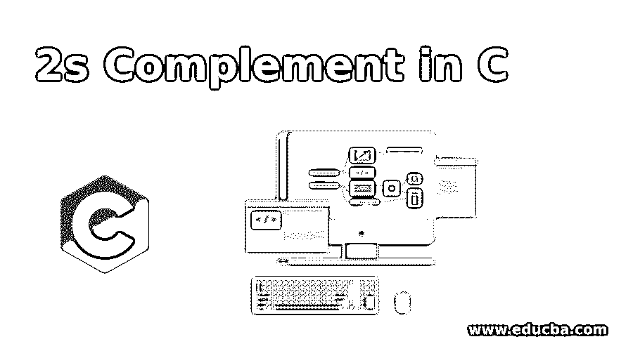
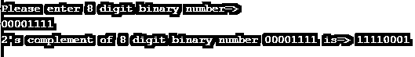
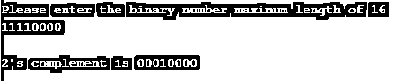
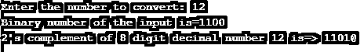

# C 中的 2s 补码

> 原文：<https://www.educba.com/2s-complement-in-c/>




## C 语言中的 2s 补码介绍

在进入二进制补码时，我们将首先理解什么是一进制补码。任何二进制数的 1 的补码将通过将所有位转换成它的等价补码形式来给你另一个二进制数，例如 0 将被转换成 1，1 将被转换成 0。同样，二进制补码的定义是，1 加到 1 的补码上，得到的结果就是二进制补码。在这个主题中，我们将学习 c 语言中的 2s 补码。

**实时使用:**日复一日的生活中，我们观察到了如此多的彩色闪烁灯，它们都有着确切的时间间隔。在这种情况下，我们使用这些 1 和 2 的补码。为什么？因为每个 1 代表打开，每个 0 代表关闭。最初的二进制数给出了“打开”和“关闭”的一种模式，1 和 2 的补码给出了完全相反的“打开”和“关闭”的行为模式。这导致我们所有的灯都在闪烁。

<small>网页开发、编程语言、软件测试&其他</small>

**优点:**

*   在安全编码中很有用。
*   适用于节日持续闪烁灯。

### C 语言中 2 的补码是如何工作的？

实现二进制补码的逻辑:

1.  向用户询问输入数字，并将其存储在任何变量中(假设为“input”)
2.  然后找到输入数字的 1 的补码。
3.  考虑两个变量，如两个补码和 carryDigit=1。
4.  从 0 到数字的实际大小迭代循环。
5.  在 for 循环中主要有 3 种情况。

*   如果 2 个变量 1 的补码和进位数字都是 1，那么我们可以在 2 的补码中插入 0。
*   如果 1 的补码是 0，carryDigit 位是 1，那么我们可以将 1 插入到 2 的补码中，并将 carry digit 值加到 0。
*   如果 carryDigit 为 0，则将 1 的补码值赋给 2 的补码。

**语法:**

```
int oneComplement, twoComplement, CarryDigit=1;
for(int p = length - 1; p >= 0; p--)
{
ifoneComplement[p] == '1' && carryDigit == 1)
{
oneComplement[p] = '0';
}
else if(oneComplement[p] == '0' && carryDigit == 1)
{
twoComplement[p] = '1';
carryDigit = 0;
}
else
{
twoComplement[p] = oneComplement[p];
}
}
```

### C 语言中的 2s 补码示例

下面是 C 语言中 2s 补码的例子:

#### 示例#1

8 位二进制数的二进制补码

**代码:**

```
#include<stdio.h>
#include<stdlib.h>
#define LENGTH 8
//main method for executing the code
int main()
{
//initialize carry variable
int carryDigit = 1;
//initialoze 1's and 2's complement variables
char input[LENGTH + 1], oneComplement[LENGTH + 1], twoComplement[LENGTH + 1];
//Ask user to enter 8 digit binary number
printf("Please enter 8 digit binary number=>\n");
gets(input);//equivalent to scanf method
//1's complement logic within for loop
for( int var= 0; var < LENGTH; var++)
{
if(input[var] == '0')
{
oneComplement[var] = '1';
}
else if(input[var] == '1')
{
oneComplement[var] = '0';
}
}
oneComplement[LENGTH] = '\0';
//2's complement logic within for loop
for(int var = LENGTH - 1; var >= 0; var--)
{
if(oneComplement[var] == '1' && carryDigit == 1)
{
twoComplement[var] = '0';
}
else if(oneComplement[var] == '0' && carryDigit == 1)
{
twoComplement[var] = '1';
carryDigit = 0;
}
else
{
twoComplement[var] = oneComplement[var];//say 1's and 2's complement are same
}
}
twoComplement[LENGTH] = '\0';
//printing 2's complement output
printf("2's complement of 8 digit binary number %s is=> %s\n",input, twoComplement);
return 0;
}
```

**输出:**




#### 实施例 2

进行二进制补码的另一种方法是使用方法，输入范围最多可达 16 位

**代码:**

```
#include<stdio.h>//Provide basic C libraries
#include<conio.h>
#include<string.h>//Provide String library for String operations
#define LENGTH 16// declaring constant for using in the entire application
main()
{
//declaring integer variables
int i,test;
//declaring character array variables
char binaryArray[LENGTH],tempArray[LENGTH],a[LENGTH];
//declaring userInput method
void userInput(char binaryArray[]);
//declaring validate method
int validate(char binaryArray[]);
//declaring twosComplement method
void twosComplement(char binaryArray[],char a[]);
//calling userInput method
userInput(binaryArray);
//copying one array to other array
strcpy(tempArray,binaryArray);
//calling validate method
test=validate(binaryArray);
//checking wheter given value is valid or not from user
if(test==0)
{
printf("\nPlease enter valid binary number");
exit(1);
}
//calling twosComplement method
twosComplement(binaryArray,a);
printf("\n2's complement is %s",a);
getch();
}
//logic for userInput method for asking user user input
void userInput(char binaryArray[])
{
printf("Please enter the binary number maximum length of 16 \n");
scanf("%s",binaryArray);
return;
}
//validate the user input
int validate(char binaryArray[])
{
int i,l,x=1;
l=strlen(binaryArray);
for(i=0; i<l; i++)
{
if(!((binaryArray[i]=='0')||(binaryArray[i]=='1')))
x=0;
break;
}
return(x);
}
//finding the 2's complement logic
void twosComplement(char binaryArray[],char a[])
{
int validate;
/*char a[LENGTH];*/
int l,i;
l=strlen(binaryArray);
for(i=l-1; i>=0; i--)
{
if(binaryArray[i]=='0')
a[i]='1';
else
a[i]='0';
}
for(i=l-1; i>=0; i--)
{
if(i==l-1)
{
if(a[i]=='0')
a[i]='1';
else
{
a[i]='0';
validate=1;
}
}
else
{
if((validate==1)&&(a[i]=='0'))
{
a[i]='1';
validate=0;
}
else if((validate==1)&&(a[i]=='1'))
{
a[i]='0';
validate=1;
}
}
}
a[l]='\0';
return;
}
```

**输出:**




#### 实施例 3

十进制数 2 的补码

**代码:**

```
#include<stdio.h>
#include<stdlib.h>
#define LENGTH 8
//main method for executing the code
int main()
{
//initialize carry variable
int carryDigit = 1;
//initialoze 1's and 2's complement variables
char input[LENGTH + 1], oneComplement[LENGTH + 1], twoComplement[LENGTH + 1];
//declaring integer variables
int a[10],n,i;
//ask the user to enter any decimal number
printf("Enter the number to convert: ");
scanf("%d",&n);
int tempInput=n;
for(i=0;n>0;i++)
{
a[i]=n%2;
n=n/2;
}
printf("Binary number of the input is=");
for(i=i-1;i>=0;i--)
{
printf("%d",a[i]);
input[i] = a[i] + '0';
}
printf("\n");
for( int var= 0; var < LENGTH; var++)
{
if(input[var] == '0')
{
oneComplement[var] = '1';
}
else if(input[var] == '1')
{
oneComplement[var] = '0';
}
}
oneComplement[LENGTH] = '\0';
//2's complement logic within for loop
for(int var = LENGTH - 1; var >= 0; var--)
{
if(oneComplement[var] == '1' && carryDigit == 1)
{
twoComplement[var] = '0';
}
else if(oneComplement[var] == '0' && carryDigit == 1)
{
twoComplement[var] = '1';
carryDigit = 0;
}
else
{
twoComplement[var] = oneComplement[var];//say 1's and 2's complement are same
}
}
twoComplement[LENGTH] = '\0';
//printing 2's complement output
printf("2's complement of 8 digit decimal number %d is=> %s\n",tempInput, twoComplement);//Ignore @ in the output at last digit
return 0;
}
```

**输出:**




### 结论

c 语言的 2s 补码是用于闪烁灯和安全编码的应用程序。因此，我们只需将 1 与 1 的补码输出相加，即可得到 2 补码的结果输出。

### 推荐文章

这是一个关于 C 语言中二进制补码的指南，在这里我们讨论了二进制补码在 C 语言中是如何工作的，并给出了一些例子。您也可以看看以下文章，了解更多信息–

1.  [C 编程中的模式](https://www.educba.com/patterns-in-c-programming/)
2.  [C 编程生涯](https://www.educba.com/career-in-c-programming/)
3.  [C 编程中的数组](https://www.educba.com/arrays-in-c-programming/)
4.  [C 编程面试试题](https://www.educba.com/c-programming-interview-questions/)


