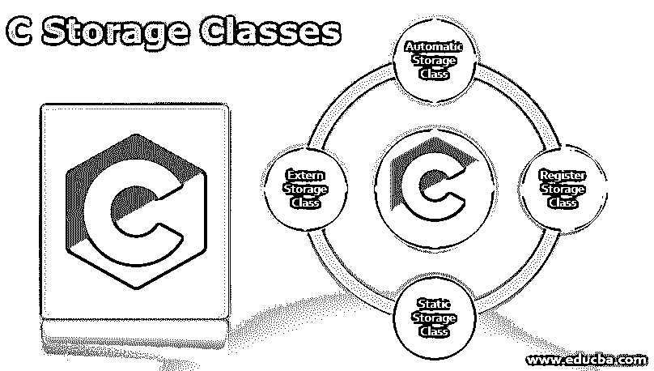
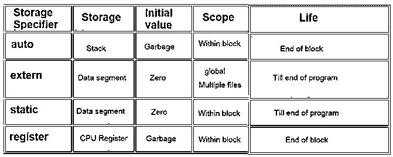

# c 存储类别

> 原文：<https://www.educba.com/c-storage-classes/>




## C 存储类介绍

每个值或数字都需要存储在某个地方以备后用，对吗？这可以通过使用 c 中的变量来实现。变量是我们程序中使用的存储区域。每个变量都有特定的类型，如整数、字符、特定的大小和布局，这取决于它们的类型。每种类型的变量都应该存储在内存的特定部分，并具有受限的或特定的访问权限。C 中的存储类决定了每个变量应该存储在内存的哪个部分，同时也决定了变量的作用域(可见性)。有四种类型的存储类–自动、外部、静态和注册。一个存储说明符可以和变量一起使用。




<small>网页开发、编程语言、软件测试&其他</small>

### C #中存储类的类型

C 中存储类的类型如下。

#### 1.自动存储类

默认情况下，函数或块中声明的所有变量都将存储在自动说明符中，即使它没有被显式定义。此存储类的说明符是“auto”。自动存储类中变量的范围或可见性对于它所定义的块或函数来说是局部的。一旦我们从函数或块中出来，变量就会被销毁。

这个可以用一个例子来更好的解释。考虑下面给出的例子:

**代码:**

```
#include<stdio.h>
int main() {
int i = 2;
{        int i = 4;
printf("%d\n", i);
}
printf("%d\n", i);
}
```

**输出:**


这里，首先声明整数类型的变量 I，并为其赋值 2。接下来，再次在一个循环或块中，声明相同整数类型的变量 I，并为其赋值 4。如果没有提到存储说明符，默认情况下，它将被视为 auto。块内提到的第一个 printf 语句将在打印 I 的值时打印 4，而在块外提到的第二个 printf 语句中将 I 的值打印为 2，即块外提到的值。最好将一些值初始化为 auto 变量，因为如果没有完成初始化，有时有可能得到垃圾值。这个例子清楚地展示了自动变量和局部作用域。

#### 2.寄存器存储类

存储在寄存器存储类中的变量也有局部作用域，这意味着它只在声明它的块中是可访问或可见的。这种存储类似于 auto，但主要区别是 auto 变量存储在内存中，而寄存器变量存储在 CPU 寄存器中。如果我们想非常频繁地访问变量，就要这样做。这些可以用的更快。只有少数变量使用寄存器说明符存储。如果寄存器中没有空间，那么它只存储在存储器中。寄存器变量没有初始值。此外，& (address-of)运算符不能用于寄存器变量。例如，使用寄存器说明符存储用于计数器或类似用途类型的变量。

#### 3.静态存储类

当变量需要声明一次并且需要保留值时，变量(无论是全局变量还是局部变量)使用静态存储类中的静态说明符来存储。当一个变量被声明为静态时，该值将在函数调用之间被保存或保留。创建永久存储，并且只声明一次。当一个局部变量被声明为 static 时，会为它创建永久存储，并且每次使用时都会保留该值。同样，按照通常局部变量的范围，静态局部变量也只对定义它的函数或块可见。当一个全局变量被声明为静态时，类似于静态局部变量，永久存储被创建，并且它只被声明一次。但是即使它是全局的，这些变量也只能在定义它的文件中看到。

使用下面的例子可以清楚地描述静态变量:

**代码:**

```
#include<stdio.h>
int samplefunc() {
static int a = 0;
a = a+2;
return a;
}
int main() {
int result1 = samplefunc();
int result2 = samplefunc();
printf("%d\n", result1);
printf("%d\n", result2);
}
```

**输出:**


这里，在上面的程序中，当调用 samplefunc()时，第一次定义并初始化变量 a，并为其创建永久存储。通过函数中使用的数学表达式，a 的值变成 2。但第二次调用同一个 samplefunc()时，变量 a 没有被再次定义或初始化；相反，它采用最后保留的值并继续运算，使最终结果为 4。这是静态变量的主要用法和优点。

#### 4.外部存储类

声明为 extern 的变量表示该变量在另一个程序中的其他地方定义。当我们希望在一个程序中定义的任何变量或函数也在另一个文件中使用时，就会用到这些外部变量。带有 extern 说明符的变量存储在 extern 存储类中。当变量被声明为 extern is 程序时，它指定了外部链接，因此它不再被定义或初始化。存储只分配一个，也只初始化一次。如果在外部程序中用另一个值再次初始化外部变量，我们将得到一个错误，说明“变量的重新定义”。

使用下面的示例解释外部变量:

**代码:**

**Prg1.c**

```
int count;
int main() {
count = 10;
}
```

**Prg2.c**

```
extern int count;
int main() {
printf(“%d”, count);
}
```

**输出:**


这里，整数变量 count 在第一个 C 程序(Prg1.c)中声明，在 main 函数内部，它被初始化为值 10。在第二个 C 程序中，使用 extern 说明符声明了相同的 count 变量，该说明符指定存在外部链接，并且从存储中获取值，当我们在第二个程序中打印它时，值 10 被赋予值 count。这是外部变量的用法。因此，根据不同的目的，每个[存储类都使用](https://www.educba.com/storage-class-in-c-plus-plus/)来表示适当的变量，并用相应的说明符来声明。

### 推荐文章

这是一个 C 存储类的指南。这里我们分别讨论 C 语言中四种不同类型的存储类的基本概念。您也可以阅读以下文章，了解更多信息——

1.  [ES6 vs ES5](https://www.educba.com/es6-vs-es5/)
2.  [C++与 Visual C++](https://www.educba.com/c-plus-plus-vs-visual-c-plus-plus/)
3.  [C 与 C++性能对比](https://www.educba.com/c-vs-c-plus-plus-performance/)
4.  [C 与 C++ |最大差异](https://www.educba.com/c-vs-c-plus-plus/)


