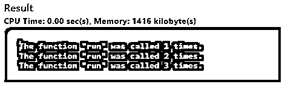

# C 中的静态关键字

> 原文：<https://www.educba.com/static-keyword-in-c/>


## C 语言中静态关键字介绍

C #中的 Static 关键字有所不同，它是一个既可以用于变量也可以用于函数的关键字。因此，非常需要对两者进行划分，以获得关键字的实际特征或行为，特别是在 C 语言的[术语中。对于一个初学者来说，要完全理解这一点有点困难，所以我们将介绍语法，它在 C 中的实际工作方式，一些要遵循的规范和规则，因为它可能会有点混乱，什么时候用于变量范围，什么时候用于函数块范围。](https://www.educba.com/what-is-c/)

**语法**

<small>网页开发、编程语言、软件测试&其他</small>

1.定义变量时 C 中静态关键字的语法:

```
static <variables's type> <variable's name>
<variable's type> static <variable's name>
```

静态变量的语法示例:

```
static int run = 0;
int static sleep = 0;
```

2.定义函数时 C 中静态关键字的语法:

```
static <function's type> <function's name ()>
<function's type>static<function's name ()>/code>
```

静态函数的语法示例:

```
static void run ()
{
}
void static sleep ()
{
}
```

### 静态关键字在 C 中是如何工作的？

基本上，静态关键字在 c 语言中有两种工作方式。

*   函数中的静态关键字。
*   函数外部的静态关键字。

#### 1.函数中的静态关键字

函数中变量的声明与函数调用中变量的编译时间和存储持续时间相关联。简而言之，定义为静态的变量为多个函数调用扩展了它们的作用域，并且一旦被声明，在程序执行结束之前不能失去它的作用域。它开始在编译时定义自己的作用域。

**例子**

```
# include<stdio.h>
int main ()
{
run ();
run ();
run ();
}
void run ()
{
static int running = 0;
++running;
printf ("The function \"run\" was called %d times.\n", running);
}
```

**输出:**




#### 2.函数外部的静态关键字

一旦静态关键字[在函数外被声明为](https://www.educba.com/static-keyword-in-c-sharp/)，它就限制了变量的作用域，并且只对当前文件可见，这意味着函数的作用域将被限制在源文件本身。对静态变量或函数的访问受到另一个源文件的约束。

尽管将一个函数声明为 static 有助于将数据封装到一个特定的范围内被认为是好的。OOPs 背景或 java 背景的人很容易将其与 private 和 public 关键字功能联系起来。

**例子**

要在外部函数中定义变量，即在全局级别，我们至少需要定义静态关键字。

在一个源文件中定义一个静态变量，在另一个源文件的第二个变量中定义相同的变量。

```
Source1.c
static int sleep = 0;
Source2.c
static int sleep= 0;
static void sleep ()
{
static int sleeping = 0;
++ sleeping;
printf ("the function \ "sleep\" was called %d times.\n", sleeping);
}
```

**输出:**


### 指定数组参数的最小大小

有一个非常重要的用途，我们有时会忽略，让我们来看看它。

我们还可以告诉编译器一个函数的数组指针中元素的最小声明的存储参数。但是这种情况很少发生(一直到 C99 编译器)。

**例子**

```
Void print Array (int myArray [static 10], int size)
{
int i;
printf ("[");
for (i<0; i<size; ++i)
{
printf ("%d", myArray[i]);
}
printf ("] \n");
}
```

基本上，这将告知参数将不为空。

### C #中静态关键字的规则和规定

#### 1.就静态变量而言

*   与 auto 和 reserved 关键字不同，当程序处于运行状态时，静态变量总是保持活动状态。
*   存储和内存分配发生在数据段，而不是堆栈段。
*   默认情况下，如果变量没有声明任何值，编译器会将其显式定义为 0。
*   静态变量的声明大部分是使用常量来完成的。
*   它主要被认为是我们不应该在一个函数中定义一个静态变量，它通常会使整个功能模块有点复杂。

#### 2.就静态功能而言

*   默认情况下，变量的声明基本上被认为是全局的，因此将 static 关键字与函数一起使用，通过将作用域限制在同一个源文件内，使其在作用域内受到限制。
*   使函数成为静态的一个很好的特性是可重用性，也就是说，我们可以在需要执行的时候多次调用同一个函数。

### 优势

*   将变量视为静态变量是有利的，因为它有助于优化整个代码流。
*   可重用性和重定义有助于编译器在内部调用任何变量，而不会让 extern 之类的任何其他关键字占据主导地位。
*   另一个优点是增加了可读性，将来会得到一个确认，文件被声明为静态的，不能被任何其他文件或源文件访问。
*   它还防止了大量的声明 c 文件，即重新声明它作为一些其他的外部变量。

### 结论

*   “静态”这个词无论被认为是有意义的还是没有意义的，都有它自己的趋势。不同的编程语言只有与静态关键字相关的不同含义。面向对象的语言，它的封装性能非常好。
*   就 C、C#和 C++而言，它具有不同的性质。有些人认为使用 static 是最好的，因为它拥有优化、可重用性、范围限制等优点。其中大部分是对最终可读文件的确认。
*   后来，有时包括一些天真的用户可以很容易地知道，如果两个源文件不匹配，通过计数静态函数和静态变量的内部内容，因为它会通过编译错误。
*   但是就 C 而言，这并不被认为是一种安全可靠的方式，因为线程之间的内部通信变得不安全和困难，因为它最终会变成一个全局变量。因此，有时在 C 语言中使用静态关键字被认为不是非常传统的方法。

### 推荐文章

这是一个关于 C 中静态关键字的指南。在这里我们讨论静态关键字如何在 C 中与规则和规则一起工作。您也可以阅读以下文章，了解更多信息——

1.  [C 语言中的变量](https://www.educba.com/variables-in-c/)
2.  [换入 C](https://www.educba.com/swapping-in-c/)
3.  [C 语言中的数学函数](https://www.educba.com/math-functions-in-c/)
4.  [反转 C 中的数字](https://www.educba.com/reverse-number-in-c/)


