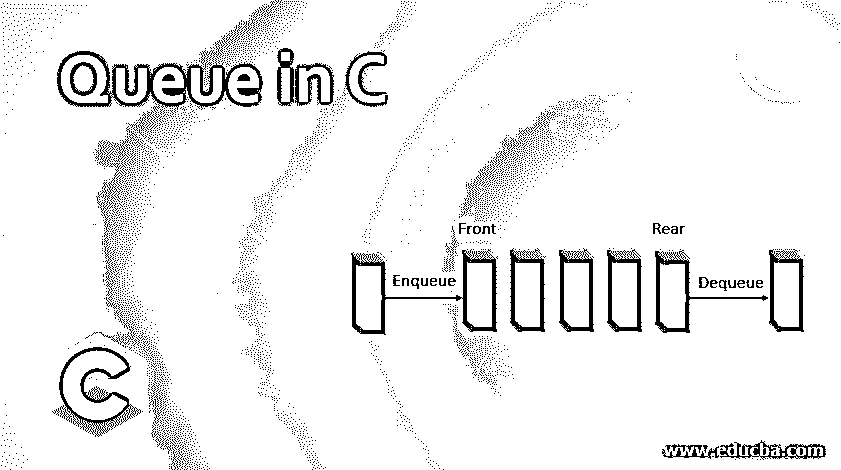

# C 中的队列

> 原文：<https://www.educba.com/queue-in-c/>




## C 语言中的队列介绍

C 语言中的队列是一种不同于堆栈的数据结构，人们可以将现实生活中的队列行为联系起来。不像堆栈，从一端打开，在另一端关闭，这意味着人们只能从一端进入元素。因此，为了克服我们需要从两端插入元素的情况，这种灵活性是由 c 中的数据结构队列提供的。这些数据结构在我们的日常生活中起着非常关键的作用，在某种程度上，效率和实现变得更加灵活和通用。

**语法:**

<small>网页开发、编程语言、软件测试&其他</small>

基本上，队列没有特定的语法，只是我们有一些特定的操作要在队列上执行，因为它是按照先进先出的顺序工作的。这种类似堆栈的数据结构用于移除 FIFO 顺序本身中的项目。

通用语法将包括所有这些要用数据结构执行的操作，如下所示:

*   排队()
*   出列()
*   正面()
*   后部()

```
Struct Queue {
// will create a queue
// allocation of memory to the queue
// empty queue or full queue
// Perform function with the operations such as enqueue, dequeue, Front and Rear ()
}
```

### C 语言中队列是如何工作的？

如上所述，队列已经有这些操作要执行，但另一方面，它还有一些操作要同时执行，这将意味着我们是否需要插入或删除所需的元素，以及队列是否有能力插入或删除，这意味着它是上溢还是下溢情况。

一个我们可以与现实世界场景联系起来的排队的经典例子是人们站在售票柜台前排队。一个人过来加入队列，而其他正在收票的人从队列中出来。队列正是以这种方式按 FIFO 顺序工作的。先来的人会先被招待。

使用数组、[链表、](https://www.educba.com/linked-list-in-c/)、指针和结构，可以以多种方式实现队列。但是为了简单起见，我们应该使用一维或一维数组来实现它。

在进入细节之前，我们应该预先知道什么时候使用当前的数据结构，为什么要使用它？

如果我们需要快速和紧急地处理一组输入和输出，队列永远不会被使用。使用队列的处理使用 FIFO 进行，尤其是在使用广度优先搜索时。这提供并让队列成为一种通用灵活的数据结构。

场景可能如下:

*   当多个消费者使用或需要单个资源时，使用队列作为数据结构。例如:磁盘调度、CPU 调度。
*   当数据从一个管道传输到另一个管道、从一个节点传输到另一个节点、从一个文件传输到另一个文件和缓冲区时，发送和接收的速度或速率不同。

因此，现在我们进入了使用队列的情况，现在我们将进行适当的工作:

为了实现 queue，我们需要获得两个指针，这两个指针将在两端持续保持跟踪，并且当我们需要从前端将一个元素入队时，以及当我们需要根据需求再次从后端将一个项目出队时，这两个指针将递增。

即使我们不断地移动指针，让它递增，也会出现一个问题，前面的指针可能会到达终点，或者越过后端。因此，为了避免这个问题，需要以循环方式移动指针。

### C #中的队列成员类型

有三种类型，即:

*   优先队列
*   环形队列
*   双端队列

#### 1.优先队列

顾名思义，优先级队列是一种为需要插入或删除的元素分配优先级的队列。

规则的分配如下:

*   以较高优先级插入的元素将首先被处理，然后以较低优先级被处理。
*   同时添加的两个元素将按照同时添加的顺序获得优先级。

此外，该优先级队列可以根据场景分为两种类型:

*   升序优先级队列
*   递减优先级队列

所有的分时系统都根据不同的情况使用升序或降序的优先级队列。

#### 2.环形队列

循环队列是一种队列，当队列已满时，从队列的第一个索引或插入到队列中的最后一个位置选择项目。当且仅当最后一个位置为空时，才会插入任何新元素。

接下来的规则是:

*   当正面指向第一个元素时。
*   如果 front=rear，则队列为空。
*   每当插入一个新元素时，后端就增加一个增量，即一个 rear[index]增加 rear+1。

#### 3.双端队列

Deque 代表双端队列，它允许元素以两种方式进入，即前端和后端。

此外，它们有两种类型:

*   输入受限出列。
*   输出受限出列。

### C 语言中的队列函数

基本功能包括:

**1** 。 **Enqueue():** 这个函数将帮助从前端或后端插入元素。

**2。Dequeue():** 这个函数将有助于从前端或后端删除元素。

**3。Peek():** 这将有助于将元素放在队列的前面，而不会将其从管道中删除。

**4。isFull():** 这个函数将确保队列已满，因为它处于溢出状态，所以不能再插入任何元素。

**5。isEmpty():** 这个函数将帮助确定队列是否为空，即是否处于下溢状态。

### 结论

C 语言中的队列是一种通用的数据结构，它克服了无论是从前端还是后端插入和删除元素的问题。此外，它还具有以某种方式确定操作的能力，即操作可以以任何方式入队和出队。与堆栈不同，它是以先进先出[FIFO]的顺序使用的。

### **推荐文章**

这是一个 C 语言中队列的指南，这里我们讨论了 C 语言中队列的工作方式，以及三种类型的成员和基本函数。您也可以看看以下文章，了解更多信息–

1.  [c#中的队列](https://www.educba.com/queue-in-c-sharp/)
2.  [c++中的队列](https://www.educba.com/queue-in-c-plus-plus/)
3.  [Java 中的队列](https://www.educba.com/queue-in-java/)
4.  [C++队列](https://www.educba.com/c-plus-plus-queue/)


