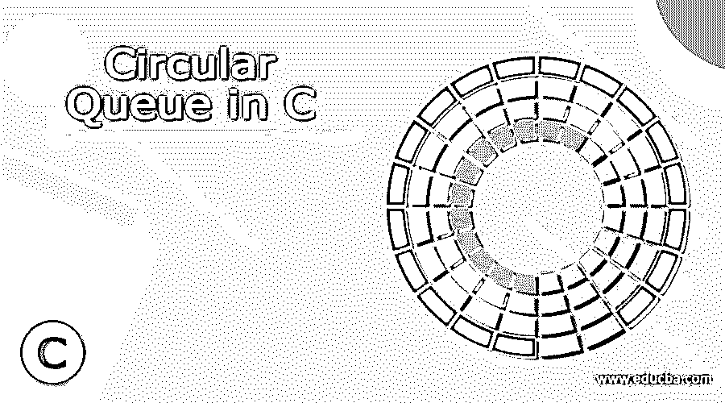
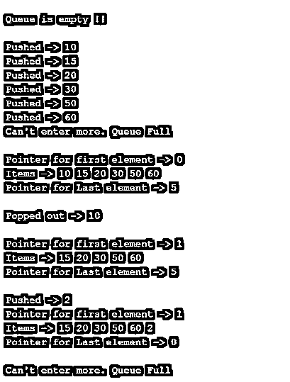

# C 语言中的循环队列

> 原文：<https://www.educba.com/circular-queue-in-c/>




## C 语言中循环队列的定义

C 循环队列被定义为 C 编程语言中循环队列概念的实际实现。循环队列是从线性数据结构的概念中产生的，线性数据结构允许按照 FIFO(先进先出)原则在该结构上执行操作，最后一个位置连接到第一个位置，以使线性结构成为循环结构，这种实现也称为环形缓冲区。循环队列的实现解决了普通队列的限制，即，即使队列到达了末尾，也有可能存储值，但是由于实现了 FIFO 技术，队列本身在前面有空的空间，所以队列中有一些空的空间。

### 句法

在语法一节中，我们将介绍在 c 中实现循环队列所需的一些语法。本文循环队列这一节中的元素并不一定描述完整的可运行代码，但可以让我们了解队列方法能够成功执行的不同占位符。

<small>网页开发、编程语言、软件测试&其他</small>

**声明 C 中的头:**

```
#include<stdio.h>
```

**C 中的 If 语句:**

```
if ( <variable name> <condition operator> <check value)> ){
<Statements>;
}
else{
<Statements>;
}
```

**C 语言中的函数定义:**

```
<return type> <function name>(){
<Function statements>;
}
```

**打印 C 语言语句:**

```
printf(" <Statements to be printed> " );
```

### 循环队列在 C 中是如何工作的？

到目前为止，我们对循环队列的结构已经有了一个大致的概念，它实现了 FIFO 排序。FIFO 的本质意思是先入的元素先被移除。这种结构类似于机场的队列，站在第一个的人登机，以此类推，直到最后一名乘客登机。但是现在我们谈论的机场排队，就像一个线性队列。航班上的座位数量是有限的，因此当满座时，没有人被允许排队，或者换句话说，甚至没有票。现在假设一个类似的情况，我们在一台计算机中有有限的资源，一台计算机正在执行内存密集型任务，所有这些都需要一些时间。现在，首先开始的任务开始堆积，随后依次开始的任务开始堆积，现在如果资源变满，另一个任务将被放到等待列表中。假设这种情况就像我们在航班中讨论的那样，那么等待列表中的任何任务都不会执行，因为队列已经完全结束了。现在，假设我们将最后一个元素链接到第一个元素，如果最后一个元素已满，则检查第一个元素是否空闲，如果是，则开始将任务放入或插入资源管理中，并保持工作流的连续性。

出于同样的目的，循环队列在 c 中工作。这种方法被称为循环递增，其中在输入任何新元素的情况下，试图保持递增指向数组尾部的计数器或指针(该过程被称为入队)，并且当任何元素被移除时，递增指向数组头部的指针(该过程被称为出队)。除了我们刚刚谈到的元素，即入队、出队、前端(指针)、后端(指针)，我们还有一个操作 isEmpty 或 isFull，它对队列进行检查，以了解队列是空的还是满的。

循环增量是通过模除法实现的，它给出了我们通过相应的分子和分母实现的除法的余数。现在，为了理解模除法的工作原理，在排队的情况下，后面的指针增加(rear + 1 )%( N)，其中 N 是数组长度。在出队的情况下，前指针也增加(前+ 1 )%( N)。发生这种情况是因为我们假设后面的指针在数组的末尾，因此索引号是 N-1，现在如果索引增加，它将达到 N，这就像一个越界的场景。于是，我们求助于(rear + 1 )%( N)，这样当 rear 被 N-1 代替时，我们得到((N-1)+1)%N = N%N = 0。因此，只有在队列未满的情况下，后方现在才再次开始指向起点。如果队列已满，人们可以很容易地抛出一个异常，说队列已满，无法装载更多的数据。现在让我们以伪代码的形式来看一下入队和出队的过程，这样当我们看代码的时候，就会非常容易理解，而且循环队列的工作方式也更加清晰。

**入队:**

*   检查队列是否已满。如果是，抛出一个异常，说明没有东西可以入队。
*   第一个元素应该包含 FRONT 作为 0。
*   使用模除法递增后面的索引。
*   将该元素添加到新的后部索引中。

**出列:**

*   检查队列是否为空。如果是，抛出一个异常，说明没有东西可以出列。
*   返回 FRONT 指向的值。
*   使用模除法递增前端索引。
*   对于最后一个元素，我们可以将 FRONT 和 REAR 的值强制设置为-1。

### 例子

让我们讨论一些例子

#### 示例#1

**循环队列的实现:**

**语法:**

```
#include <stdio.h>
#define ARRSIZE 6
int array[ARRSIZE];
int front = -1, rear = -1;
// Is the queue full?
int checkFull() {
if ((front == rear + 1) || (front == 0 && rear == ARRSIZE - 1)) return 1;
return 0;
}
// Is the Queue Empty?
int checkEmpty() {
if (front == -1) return 1;
return 0;
}
// Element Adding
void enQueue(int ele) {
if (checkFull())
printf("\n Can't enter more. Queue Full \n");
else {
if (front == -1) front = 0;
rear = (rear + 1) % ARRSIZE;
array[rear] = ele;
printf("\n Pushed -> %d", ele);
}
}
// Element removing
int deQueue() {
int ele;
if (checkEmpty()) {
printf("\n Queue is empty !! \n");
return (-1);
} else {
ele = array[front];
if (front == rear) {
front = -1;
rear = -1;
}
// Reset Queue after all elements are removed
else {
front = (front + 1) % ARRSIZE;
}
printf("\n Popped out -> %d \n", ele);
return (ele);
}
}
// Queue Display
void display() {
int i;
if (checkEmpty())
printf(" \n The queue is Empty\n");
else {
printf("\n Pointer for first element -> %d ", front);
printf("\n Items -> ");
for (i = front; i != rear; i = (i + 1) % ARRSIZE) {
printf("%d ", array[i]);
}
printf("%d ", array[i]);
printf("\n Pointer for Last element -> %d \n", rear);
}
}
int main() {
// Will print out an empty array
deQueue();
enQueue(10);
enQueue(15);
enQueue(20);
enQueue(30);
enQueue(50);
enQueue(60);
// Will Fail inserting as the Queue is Full
enQueue(1);
display();
deQueue();
display();
// Will succeed as we removed one element using deQueue()
enQueue(2);
display();
// Will again Fail inserting as the Queue is Full
enQueue(100);
return 0;
}
```

**输出:**




### 结论

总之，在本文中，我们已经了解了 c 中循环队列的工作方式。接下来，我们鼓励读者尝试 switch case，这将是一个更加用户友好的循环队列实现，因为用户可以灵活地推送和弹出元素。

### 推荐文章

这是一个 C 语言中循环队列的指南。这里我们讨论循环队列的定义，语法，如何在 C 语言中工作？代码实现示例。您也可以看看以下文章，了解更多信息–

1.  [Python 中的队列](https://www.educba.com/queue-in-python/)
2.  [c++中的优先级队列](https://www.educba.com/priority-queue-in-c-plus-plus/)
3.  [在 C 中排队](https://www.educba.com/queue-in-c/)
4.  [Java 队列接口](https://www.educba.com/java-queue-interface/)


