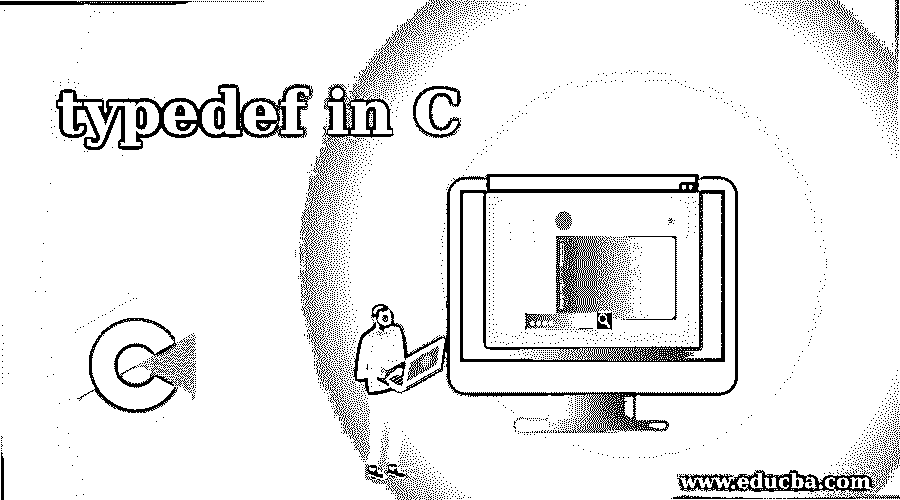
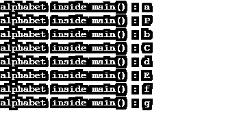

# C #中的 typedef

> 原文：<https://www.educba.com/typedef-in-c/>




## C 语言中的 typedef 介绍

typedef 是 C 语言中预定义的关键字。这个 typedef 关键字告诉 C 编译器“请给已经存在的类型分配一个用户给定的关键字”。这意味着 typedef 为现有的 C 语言数据类型(如无符号 int、long、int、char、float 等)提供了另一个用户友好的关键字。当现有的数据类型比较容易使用时，这个概念非常有用；然后，我们将使用这个 typedef 概念。

**实时例子:**就拿我们来说，如果要声明一些像 unsigned int 这样的变量，那么我们就要一直写 unsigned int，整个程序是一个非常漫长的过程。因此，我们可以给已经存在的数据类型分配一个新的名称，这样就很容易在代码中使用了。为此，我们可以使用 typedef 关键字。

<small>网页开发、编程语言、软件测试&其他</small>

### typedef 在 C 语言中是如何工作的？

该关键字使用 typedef，后跟现有数据类型，并且用户需要该数据类型的名称。那么编译器将假定现有的关键字名称成为整个应用程序的用户给定名称。

**语法:**

```
typedef<existing data type or keyword in C><user required name for the data type or keyword>;
```

### C #中的 typedef 示例

下面给出了 typedef 的实际例子:

#### 示例# 1–Typdef 无符号整数 ui

**代码:**

```
#include <stdio.h>//Add all the basic C language libraries
#include <string.h>//Add the String library to perform string actions
//typedef for give struct keyword to user wanted keyword as like below (Courses)
typedef struct Courses {
char courseName[60];//declare character variable
float CourseFee;//declare float variable
char companyName[100];//declare character variable
int loginID;//declare integer variable
} Courses; //To make work user defined keyword we have call the keyword from here
//main method to execute application code
int main( ) {
//Taken Courses name as course( alias name)
Courses course;
//Copying character values into varaible
strcpy(course.courseName, "C Programming");
strcpy(course.companyName, "EDUCBA");
//Initailize float values into varaible
course.CourseFee = 5000.00;
//Initailize integer values into varaible
course.loginID=2452;
//display the output of all the declared variable below
printf( "Course Name : %s\n", course.courseName);
printf( "Company Name : %s\n", course.companyName);
printf( "Course Fee : %f\n", course.CourseFee);
printf( "Login ID : %d\n", course.loginID);
return 0;
}
```

**输出:**


#### 示例 2–Typedef 联合关键字

**代码:**

```
#include <stdio.h>//Add all the basic C language libraries
#include <string.h>//Add the String library to perform string actions
//typedef for give struct keyword to user wanted keyword as like below (Employee)
typedef union Employee
{
inteID;//declare integer variable
float salary;//declare float variable
char company[30];//declare character variable
}Employee;//To make work user defined keyword we have call the keyword from here
//main method to execute application code
int main()
{
//Taken Courses name as course( alias name)
Employee e1, e2, e3, e4;
//Initailize float values into varaible
e1.salary = 18314912111343777091682304.000000 ;
//Initailize integer values into varaible
e1.eID=1769104726;
//Copying character values into varaible
strcpy(e1.company,"Verinon Technologies Private Limited");
//displaying employee details
printf("Details of First Employee\n");
printf("Employee ID : %d\n", e1.eID);
printf("Employee Salary : %f\n", e1.salary);
printf("Company Name : %s\n", e1.company);
//Initailize integer values into varaible
e2.eID = 1667330639 ;
//Initailize float values into varaible
e2.salary = 4158754218828133040128.000000;
//Copying character values into varaible
strcpy(e2.company,"Oracle Technologies Private Limited");
//displaying employee details
printf("Details of Second Employee\n");
printf("Employee ID : %d\n", e2.eID);
printf("Employee Salary : %f\n", e2.salary);
printf("Company Name : %s\n", e2.company);
//Initailize integer values into varaible
e3.eID = 1919117645;
//Initailize float values into varaible
e3.salary = 4504345476014339048099257778176.000000;
//Copying character values into varaible
strcpy(e3.company,"Microsoft Technologies Private Limited");
//displaying employee details
printf("Details of Third Employee\n");
printf("Employee ID : %d\n", e3.eID);
printf("Employee Salary : %f\n", e3.salary);
printf("Company Name : %s\n", e3.company);
//Initailize integer values into varaible
e4.eID = 1735356231 ;
//Initailize float values into varaible
e4.salary = 1130698294087203659186176.000000;
//Copying character values into varaible
strcpy(e4.company,"Google Technologies Private Limited");
//displaying employee details
printf("Details of Fourth Employee\n");
printf("Employee ID : %d\n", e4.eID);
printf("Employee Salary : %f\n", e4.salary);
printf("Company Name : %s\n", e4.company);
return 0;
}
course.loginID=2452;
//display the output of all the declared variable below
printf( "Course Name : %s\n", course.courseName);
printf( "Company Name : %s\n", course.companyName);
printf( "Course Fee : %f\n", course.CourseFee);
printf( "Login ID : %d\n", course.loginID);
return 0;
}
```

**输出:**

**T2】**


 **#### 示例 3–Typedef 无符号字符

**代码:**

```
#include <stdio.h>//Add all the basic C language libraries
int main()
{
//typedef for give struct keyword to user wanted keyword as like below
typedef unsigned char uchar;
//declare character variable with user defined keyword
uchar alphabet = 'a';
//declare character variable with user defined keyword
uchar a='P';
//declare character variable with user defined keyword
uchar b='b';
//declare character variable with user defined keyword
uchar c = 'C';
//declare character variable with user defined keyword
uchar d='d';
//declare character variable with user defined keyword
uchar e = 'E';
//declare character variable with user defined keyword
uchar f='f';
//declare character variable with user defined keyword
uchar g='g';
//Displaying output of the user
printf("alphabet inside main() : %c\n", alphabet);
printf("alphabet inside main() : %c\n", a);
printf("alphabet inside main() : %c\n", b);
printf("alphabet inside main() : %c\n", c);
printf("alphabet inside main() : %c\n", d);
printf("alphabet inside main() : %c\n", e);
printf("alphabet inside main() : %c\n", f);
printf("alphabet inside main() : %c\n", g);
return 0;
}
```

**输出:**




### 结论

Typedef 用于声明预定义的 C 数据类型或带有用户定义名称的关键字。它减少了反复重复相同的数据类型。由此我们可以得出结论，我们可以用任何用户想要的名称来更改任何 c 数据类型名称。

### 推荐文章

这是一个 c 语言的 typedef 指南，在这里我们也讨论了 typedef 的介绍和工作原理，以及例子和代码实现。您也可以看看以下文章，了解更多信息–

1.  [C 中的常数](https://www.educba.com/constants-in-c/)
2.  [c#中的冒泡排序](https://www.educba.com/bubble-sort-in-c-sharp/)
3.  [在 C 中排队](https://www.educba.com/queue-in-c/)
4.  [C 语言中的空指针](https://www.educba.com/null-pointer-in-c/)


**