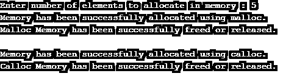

# C 语言中的内存分配

> 原文：<https://www.educba.com/memory-allocation-in-c/>


## C 语言中的内存分配介绍

一般来说，内存分配是指执行计算机程序和服务来保留计算机的部分或全部空间或虚拟内存，这一过程称为内存分配。这个过程是硬件操作，通过操作系统和软件应用程序的内存管理来实现。一般来说，内存分配有静态和动态之分，而在 C 编程语言中，我们将看到动态内存分配，程序在运行时被分配到内存中，静态内存分配是在编写 C 程序时分配内存的过程，这意味着内存是在编译时分配的。

### C 语言中内存分配是如何工作的？

在 C 语言中，静态和动态内存分配也称为堆栈内存和堆内存，它们分别在编译时和运行时分配。

<small>网页开发、编程语言、软件测试&其他</small>

#### 1.静态内存分配

正如我们所讨论的，静态内存分配是在计算机程序启动时为数据变量分配内存。这种类型的分配仅适用于全局变量、文件范围变量以及那些声明为静态的变量。这种类型的分配有一个缺点，当你分配内存时，我们应该在分配前知道确切的内存，因为这个过程分配固定的内存，并且在分配后不能改变。

**1。**静态内存分配有一些特点。它们是:这种类型的分配永久地分配变量；因此，这种类型的内存分配无法重用，因此效率较低。这种分配使用堆栈来实现分配过程。

让我们看下面一个例子:

**代码:**

```
void play
{
int x;
}
int main()
{
int y;
int c[10];
return 1;
}
```

**解释:**在上面的程序中，变量 x、y 和 care 是静态分配的，所以内存是在编译时严格为变量数据分配的。注意，当变量不被使用时，删除内存是必要的，因为这将导致内存泄漏。因此，在静态内存分配中，它会根据变量的范围自动释放内存，这意味着一旦变量的范围结束，内存就会被释放。

**2。**一个变量可以在内部或外部声明为 static，其值持续到程序结束，这可以在变量声明前使用关键字 static 来实现。可以有在函数内部或外部声明的内部或外部静态变量。

让我们看一个例子:

```
#include<stdio.h>
void stat(void);
int main()
{
int i;
for(i=1; i<=3 ; i++)
stat();
return 1;
}
void stat(void)
{
static int n = 0;
n = n+1;
printf("n = %d""\n", n);
}
```

**输出:**


#### 2.动态存储分配

如上所述，动态内存分配是运行时或程序执行期间的内存分配。动态内存分配在 C 编程语言中提供了不同的功能。分别是:malloc()、calloc()、realloc()、free()。让我们详细看看。

##### 1.malloc()

此方法在执行期间分配内存空间，但不会在执行期间初始化内存分配，因为它携带垃圾值，如果它无法分配请求的内存，则返回空指针。

**语法:**

```
(CastType*) malloc(size);
```

**代码:**

```
mptr = (int*) malloc(100 * sizeof (int));
```

在上面的例子中，语句分配了 200 个字节的内存，因为 C 中的 int 大小是 2 个字节，变量 mptr 指针保存了内存中第一个字节的地址。

##### 2\. calloc()

这也称为连续分配。因为 malloc()不会初始化任何内存位。但是在 calloc()中，它在分配内存的同时将位初始化为零。

**语法:**

```
(CastType*) calloc(n, size)
```

**代码:**

```
cptr = (int*) calloc(35, sizeof (int));
```

在这个函数中，上面的示例语句为大约 35 个数据类型为“int”的元素分配连续的内存空间。

##### 3.免费()

如上所述，如果内存空间没有被使用，应该释放内存空间。在动态内存分配中，malloc()和 calloc()函数只分配内存，而不能自己释放内存，因此这是通过使用 free()方法显式释放未使用的内存来实现的，以避免内存泄漏。

**语法:**

```
free (pointer_variable);
```

**代码:**

```
#include <stdio.h>
#include <stdlib.h>
int main()
{
int *p, *p1;
int x, i;
x = 5;
printf("Enter number of elements to allocate in memory : %d\n", x);
p = (int*)malloc(x * sizeof(int));
p1 = (int*)calloc(x, sizeof(int));
if (p == NULL || p1 == NULL) {
printf("Memory is not allocated.\n");
exit(0);
}
else {
printf("Memory has been successfully allocated using malloc.\n");
free(p);
printf("Malloc Memory has been successfully freed or released.\n");
printf("\nMemory has been successfully allocated using calloc.\n");
free(p1);
printf("Calloc Memory has been successfully freed or released.\n");
}
return 0;
}
```

**输出:**




##### 4.realloc()

顾名思义，在动态内存分配中，如果用户想要分配更多的内存，这意味着比程序指定或要求的内存更多，那么我们可以使用这个 realloc()函数来改变之前分配的内存大小。

**语法:**

```
realloc (pointer_variable, n);
```

**代码:**

假设我们想把内存的大小从 200 字节改成 600 字节。让我们看看如何使用 realloc()来实现这一点。

```
char *rptr;
rptr = malloc(200);
rptr = realloc(rptr, 600);
```

### 结论

C 编程语言中的内存分配很简单，使用静态内存分配，它在编译时分配内存，或者我们可以说在程序执行之前分配内存，它还有另一种类型，称为动态内存分配，它在运行时分配内存，或者在程序执行期间分配内存，它使用 4 个不同的函数，如 malloc()、calloc()、free()和 realloc()。这两种方法各有利弊。

### 推荐文章

这是一个关于 C 语言中内存分配的指南。在这里，我们用函数来讨论 C 语言中的静态和动态内存分配。您也可以浏览我们的其他相关文章，了解更多信息——

1.  [C 中的多维数组](https://www.educba.com/multidimensional-array-in-c/)
2.  [Java 中的内存类型](https://www.educba.com/types-of-memory-in-java/)
3.  [C 文字量](https://www.educba.com/c-literals/)
4.  [什么是堆内存？](https://www.educba.com/what-is-heap-memory/)


