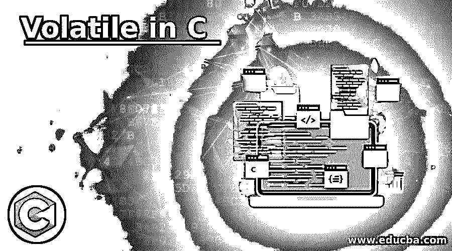

# 在 C 中挥发

> 原文：<https://www.educba.com/volatile-in-c/>




## C 语言中的 Volatile 简介

C 中的 volatile 关键字只不过是程序员在源代码中声明变量时使用的限定符。它用于通知编译器，变量值可以随时更改，无需源代码给出任何任务。Volatile 通常在我们声明变量时应用于变量。使用 volatile 关键字的主要原因是，它用于防止在源代码中对对象进行优化。因此，声明为 volatile 的对象不能被优化，因为它的值很容易被代码更改。我们已经看到了 c 中的 volatile。同样，我们将看到在代码中用来表示 Volatile 对象的语法。但是请记住，volatile 关键字的值不能被程序显式地更改。

### 句法

```
volatile data_type variable_name ;
volatile data_type  *variable_name ;
```

**解释:**在上面的声明中，volatile 关键字是强制使用的，那么 data_type 表示任何数据类型，可以是整型、浮点型或双精度型。最后，我们选择变量的名字。由于这两个声明都是正确的，我们可以使用上面的任何一个来声明一个可变变量。

<small>网页开发、编程语言、软件测试&其他</small>

例如:

```
volatile int x ;
volatile int *a;
```

### Volatile 关键字在 C 中是如何工作的？

现在让我们通过一些带有简要说明的编码示例来看看 volatile 关键字在 C 编程代码中是如何工作的。在下面的两个代码中，我们将看到当我们使用 volatile 关键字声明一个变量时，与非 volatile 关键字相比，程序是如何变化的。我们将看到当我们使用 volatile 时，代码的效率是如何变化的，以及我们可以多快地在代码中应用这一功能。在 C 编程中，当我们需要在指针指向的地址读取指针存储的值时，使用 Volatile。如果您需要在代码中更改编译器无法达到的任何内容，您可以在要更改其值的变量之前使用这个 volatile 关键字。

### 用 C 实现 Volatile 的例子

下面是演示 volatile 关键字工作的示例代码:

#### 示例#1

不使用关键字 Volatile:

**代码:**

```
#include<stdio.h> // C header file for standard input and output
int a = 0 ; // initilaizing and declaring the integer a to value 0.
int main ()  // main class
{
if ( a == 0 )  //  This condition will be true
{
printf ( " a = 0  \n " ) ;
}
else                        // Else part will be optimized
{
printf ( " a ! = 0  \n " ) ;
}
return 0 ; // returning value
}
```

**输出:**


**说明:**在上面的代码中，我们声明了一个整型变量，并为其赋值 0。然后在主类中，我们设置了 if 条件，它将保持为真，直到变量 a 的值为 0。正如您所看到的，输出将始终为 0，因为条件将始终保持为真，所以代码不会移动到 else 部分，因为它将忽略 else 部分。但是，当我们将关键字 volatile 添加到整型变量 a 的声明中时，情况会发生变化。

#### 实施例 2

使用关键字 Volatile:

**代码:**

```
#include<stdio.h>
volatile int a ;    /* volatile Keyword used before declaration of integer variable a */
int main() // main class
{
a = 0 ;   // initializing the integer value to 0
if (a == 0)  // applying if condition
{
printf ( " a = 0 \n " ) ;
}
else// Now compiler never optimize else part because the variable is declared as volatile
{
printf ( " a ! = 0  \n " ) ;
}
return 0 ;
}
```

**输出:**


**解释:**在上面的代码中，我们声明了一个易变的整型变量 a，然后在 main 类中，我们设置了两件事一是整型变量的值为 0，二是 if 条件，它将保持为真，直到且除非变量 a 的值为 0。如你所见，输出将始终为 0，因为条件将始终保持为真，因为变量被声明为 volatile。因此，编译器不会优化代码的 else 部分，因为在 integer 之前使用了 volatile 关键字。因此，编译器将知道变量可以在任何时候改变，因此，它将读取 else 部分作为最终的可执行代码，并显示结果。

#### 实施例 3

下面是另一个 C 编程代码，演示了 volatile 关键字在 C 中的工作方式:

**代码:**

```
#include <stdio.h>
int main (void)                 // main class declaration in the code
{
const volatile int local_value = 25 ; // declaring constant volatile integer variable with assigned value
int *ptr = ( int* ) &local_value ;
printf ( " The initial value of the local_value is  : %d \n ", local_value ) ;
*ptr = 195 ;  // value to the pointer
printf ( " The modified value of the local_value is: %d \n ", local_value ) ;
return 0 ;
}
```

**输出:**


**解释:**在上面的代码中，你可以看到我们声明了一个名为 local_value 的整型数据类型的常量 volatile 变量，并为它分配了值 25。然后，我们声明了整型数据类型的指针，我们在其中存储“local_value”的地址值。此外，我们打印旧值，然后在屏幕上打印修改后的值。这种修改之所以可能，仅仅是因为我们在变量声明中使用了 volatile 关键字。

### 结论

volatile 在 C 编程中起着重要的作用，因为编译器无法猜测它的值。使用 volatile 的主要原因是，它可以在用户希望改变值的任何时候改变值，或者当另一个线程正在运行但使用相同的变量时改变值。

### 推荐文章

这是一个关于 C 语言中 Volatile 的指南。这里我们讨论了 C 语言中 Volatile 的介绍，以及语法、工作和各自的例子，以便更好地理解。您也可以浏览我们的其他相关文章，了解更多信息——

1.  [C 语言中的无限循环](https://www.educba.com/infinite-loop-in-c/)
2.  [C 关键词](https://www.educba.com/c-keywords/)
3.  [C 语言中的十六进制](https://www.educba.com/hexadecimal-in-c/)
4.  [Java 标识符](https://www.educba.com/java-identifiers/)


