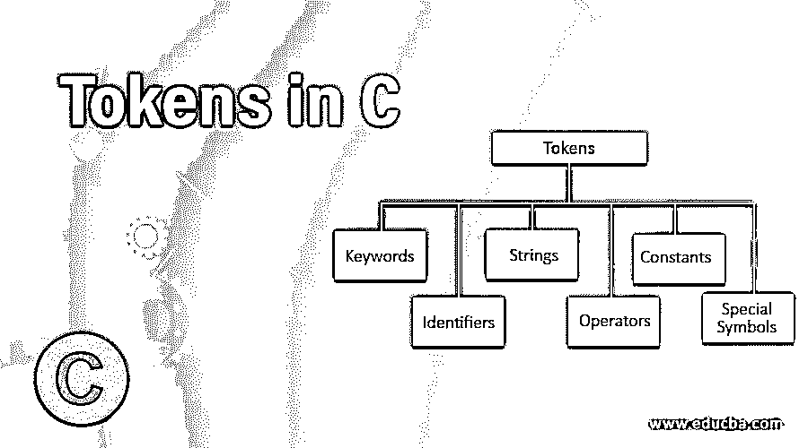
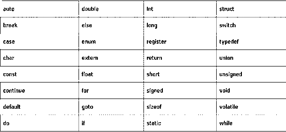
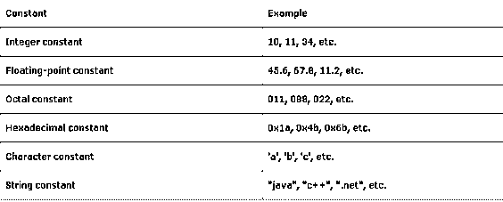
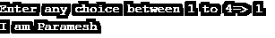
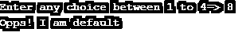
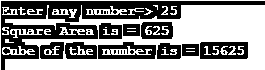
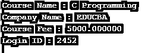

# C 语言中的标记

> 原文：<https://www.educba.com/tokens-in-c/>




## C 语言中的标记介绍

C 语言中的标记是开发 C 程序时使用的最重要的概念。我们可以说 C 语言中的令牌是最小的个体部分。假设我们有很多单词，如果不把它们组合起来，我们就不能造一个句子，同样，如果不使用 C 语言中的标记，我们就不能开发应用程序。因此，我们可以说 C 语言中的标记是 C 编程语言的构建块。

### C #中前 6 种类型的标记

c 支持 6 种类型的标记

<small>网页开发、编程语言、软件测试&其他</small>

*   关键词
*   标识符
*   用线串
*   经营者
*   常数
*   特殊符号

#### 1.关键词

C 语言中的关键字是预定义的或保留的关键字，用于公开数据的行为。c 语言中有 32 个关键字，每个关键字都有自己的功能。

**语法:**




#### 2.标识符

C 语言中的标识符用于命名函数、变量、结构、联合、数组等。标识符是用户定义的单词。这些标识符可以由大写字母、小写字母、数字和下划线组成。标识符从不用于关键字。构造标识符的规则如下

*   第一个字符应该是字母或下划线，然后是任何字符、数字。
*   标识符区分大小写，因为 **A** 和 **a** 被视为不同。
*   不允许使用逗号和空格
*   关键字不能用作标识符。
*   标识符的长度不应超过 31 个字符。
*   命名约定应该是用户可以理解的。

**语法:**

```
dataType _abc1= Valid
dataType 123abcZ=Invalid
dataType int=Invalid
dataType abc, ap=Invalid
```

#### 3.用线串

C #中的 Strings 是一个字符数组，在字符串末尾有一个空字符' \0 '。C #中的字符串用双引号("")括起来，字符用单引号(")括起来。

**语法:**

```
char a[10]={'1','2','3'};
char a[]="Amardeep";
char a[10]="Paramesh";
```

#### 4.经营者

这用于对数据执行特殊操作。

**一元运算符:**应用单个操作数。

**二元运算符:**应用于两个操作数之间。

*   算术运算符
*   关系运算符
*   移位运算符
*   逻辑运算符
*   按位运算符
*   条件运算符
*   赋值运算符
*   杂项运算符

#### 5.常数

C 语言中的常量是用来使值固定的，我们不能改变常量值。

有两种方法声明常数:

**1。**使用 const 关键字

```
const variableName;
```

**2。**通过使用#定义前置处理器

```
#define NAME value;
```

**常量类型**




#### 6.特殊符号

*   **方括号[ ]:** 用于单维和多维数组。
*   **简单括号():**用于函数声明。
*   **花括号{ }:** 用于打开和关闭代码。
*   **逗号(，):**用来分隔变量。
*   **哈希/预处理程序(#):** 用于头文件。
*   **星号(*):** 用于指针。
*   **波浪号(~):** 用于析构内存。
*   **句号(。):**用于访问工会成员。

### 用 C 语言实现标记的示例

下面是提到的例子:

#### 示例#1

关键词

**代码:**

```
#include <stdio.h>//Add all the basic C language libraries
int main()
{
//declare integer variable
int i=121;
//declare float variable
float f=11.11;
//declare character variable
char c='C';
//declare String variable in 2 ways
char s1[20]="Paramesh";
char s3[]="Paramesh";
//declare constant variable
const constant=3.14;
//declare short variable
short s=10;
//declare double variable
double d=12.12;
//displaying output of all the above keywords
printf("INT: %d\n", i);
printf("SHORT: %d\n", s);
printf("FLOAT: %f\n", f);
printf("DOUBLE: %f\n", d);
printf("CHAR: %c\n", c);
printf("STRING 1: %s\n", s1);
printf("STRING 3: %s\n", s3);
printf("CONSTANT: %d\n", constant);
return 0;
}
```

**输出:**


#### 实施例 2

转换

**代码:**

```
#include <stdio.h>//Add all the basic C language libraries#include
//main method used for running the application
int main()
{
//decalre variable
int n;
//asking enter any choice between 1 to 4
printf("Enter any choice between 1 to 4=>");
scanf("%d",&n);
//switch case, based on choice it will gives us output
//if we did not take break each case then where ever it is true that value and rest are printf
//none are true then default value will be print
switch (n)
{
case 1:
printf("I am Paramesh");
break;
case 2:
printf("I am Amardeep");
break;
case 3:
printf("I am Venkatesh");
break;
case 4:
printf("I am Krishna");
break;
default:
printf("Opps! I am default");
}
return 0;
}
```

**输出:**







#### 实施例 3

功能

**代码:**

```
#include <stdio.h>//Add all the basic C language libraries#include
int input(void);//declaring method
int getSquareArea(int side);//declaring method
int getCube(int cube);//declaring method
//main method used for running the application
int main()
{
int i=input();
int sArea= getSquareArea(i);
int cube=getCicrcleArea(i);
//displaying output
printf("Square Area is = %d\n",sArea);
printf("Cube of the number is = %d\n",cube);
return 0;
}
//method definination
//this for asking the user input
int input(void)
{
int n;
//asking the user to input
printf("Enter any number=> ");
scanf("%d",&n);
return n;
}
//method definination
//this for getting square area
int getSquareArea(int input)
{
return input*input;
}
//method definination
//this for getting cube of the number
int getCicrcleArea(int cube)
{
return cube*cube*cube;
}
```

**输出:**




#### 实施例 4

Typedef

**代码:**

```
#include <stdio.h>//Add all the basic C language libraries
#include <string.h>//Add the String library to perform string actions
//typedef for give struct keyword to user wanted keyword as like below (Courses)
typedef struct Courses {
char courseName[60];//declare character variable
float CourseFee;//declare float variable
char companyName[100];//declare character variable
int loginID;//declare integer variable
} Courses; //To make work user defined keyword we have call the keyword from here
//main method to execute application code
int main( ) {
//Taken Courses name as course( alias name)
Courses course;
//Copying character values into varaible
strcpy( course.courseName, "C Programming");
strcpy( course.companyName, "EDUCBA");
//Initailize float values into varaible
course.CourseFee = 5000.00;
//Initailize integer values into varaible
course.loginID=2452;
//display the output of all the declared variable below
printf( "Course Name : %s\n", course.courseName);
printf( "Company Name : %s\n", course.companyName);
printf( "Course Fee : %f\n", course.CourseFee);
printf( "Login ID : %d\n", course.loginID);
return 0;
}
```

**输出:**




### 结论

C 语言中的标记被称为应用程序的构造块。它可以包含关键字、标识符、常量、字符串、运算符和特殊符号。这都是给出一个完整结构的 C 语言代码。

### 推荐文章

这是一个 c 语言中标记的指南。这里我们讨论一个介绍，前 6 种标记类型，以及一些例子来更好的理解。您也可以浏览我们的其他相关文章，了解更多信息——

1.  [C 语言中的表达式](https://www.educba.com/expression-in-c/)
2.  [C 关键词](https://www.educba.com/c-keywords/)
3.  [认证令牌](https://www.educba.com/authentication-tokens/)
4.  [Python 中的标记化](https://www.educba.com/tokenization-in-python/)


