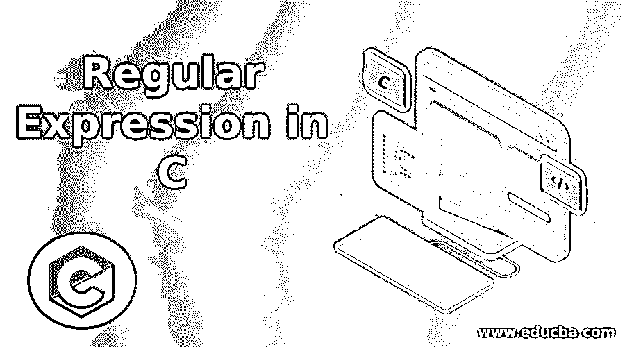
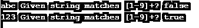
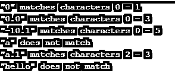

# C 语言中的正则表达式

> 原文：<https://www.educba.com/regular-expression-in-c/>




## C 语言正则表达式简介

正则表达式是具有一系列字符的表达式，用于搜索特定模式或与字符串匹配的模式，例如在给定文本中查找潜台词。在 C 编程语言中，有一个称为 POSIX 的库用于正则表达式，而在不同的编程语言中有不同的正则表达式库。c 不包括正则表达式，但是你可以通过使用函数库来使用它们。有一些通配符运算符，如“*”和“？”是正则表达式支持的最常用的元字符。正则表达式主要用于文本操作任务。

### C 语言中正则表达式的使用举例

在 C 中，它不支持正则表达式，但有一个 POSIX 库。C 程序中使用的 POSIX 表达式很少是[]该表达式用于查找写在这些括号内的字符或数字，[: number:]该表达式用于查找数字中的任何数字，[: lower:]该表达式用于查找小写字母，[: word:]该表达式可用于查找特定的单词，该单词可以是给定文本中的字母、数字或下划线的组合。

<small>网页开发、编程语言、软件测试&其他</small>

一些函数用于编译 C 中的正则表达式，它们如下:

#### 1.regcomp()

此函数用于编译正则表达式，它有 3 个参数，第一个参数有一个指向存储匹配模式的内存位置的指针，第二个参数有一个指向模式的字符串类型指针，第三个参数包含解释编译类型的标志，如果编译成功则返回 0，如果编译不成功则抛出错误。

##### 例子

```
#include <stdio.h>
#include <regex.h>
int match(const char *string, const char *pattern)
{
regex_t re;
if (regcomp(&re, pattern, REG_EXTENDED|REG_NOSUB) != 0) return 0;
int status = regexec(&re, string, 0, NULL, 0);
regfree(&re);
if (status != 0) return 0;
return 1;
}
int main(void)
{
const char* s1 = "abc";
const char* s2 = "123";
const char* re = "[1-9]+";
printf("%s Given string matches %s? %s\n", s1, re, match(s1, re) ? "true" : "false");
printf("%s Given string matches %s? %s\n", s2, re, match(s2, re) ? "true" : "false");
}
```

**输出:**




在上面的程序中，我们可以看到我们在 C 编程语言中使用了一个库文件 regex.h 头文件。这个头文件主要在我们使用正则表达式时使用，正则表达式定义了这个头文件中提供的函数所使用的结构和常数，例如 regcomp()、regexec()、regerror()和 regfree()，它具有名为 regex_t 的结构类型，其中包含 size_t、re_nsub 等。在上面的程序中，我们使用了 regcomp()函数来编译正则表达式，并将其标记为参数之一，如用于扩展正则表达式的 REG_EXTENDED、用于报告 regexec()执行成功或失败的 REG_NOSUB，以及许多其他标记，如 REG_ICASE、REG_NEWLINE 等。

#### 2.regexec()

该函数用于将字符串与字符串的给定模式进行匹配。它还有 5 个参数，如预编译模式，第二个参数将接受需要搜索的字符串，第三个参数包含匹配位置的详细信息，第四个参数包含搜索的详细信息，第五个参数包含指示匹配行为变化的标志。如果匹配成功，regexec()函数返回 0，如果字符串不匹配，则返回 REG_NOMATCH。

##### 例子

从上面的例子中，

```
int status = regexec(&re, string, 0, NULL, 0);
```

我们可以看到，这个 regexec()函数用于执行正则表达式，在上面的语句中，我们可以看到，它将比较具有空字符的字符串，该字符串是由带有已编译正则表达式的字符串指定的，这将由前面的函数调用(如 regcomp()进行初始化，并找到以空字符结尾的字符串和带有已编译正则表达式的字符串之间的匹配。这个函数使用了一些标志，比如 REG_NOTBOL 这是在我们使用一些特殊字符时使用的，这样它就不会匹配字符串的开头，REG_NOTEOL 这也是在我们使用特殊字符时使用的，这样它就不会匹配字符串的结尾。此函数的一些错误返回值是 REG_NOmATCH，它指定如果没有匹配则失败，REG_BADPAT 无效正则表达式，REG_ERANGE 在范围表达式中给出无效端点。

#### 3.regfree()

当我们想要释放由 regcomp()函数分配的与 preg 相关联的任何内存位置时，使用该函数，并且如果将该 preg 提供给 regfree()，则该 preg 不再是已编译的正则表达式。

##### 例子

从上面的例子中，

```
regfree(&re);
```

在上面的语句中，我们可以看到我们正在释放在 regcomp()函数中分配给“re”preg 的内存。

#### 4.注册表错误()

当 regcomp()或 regexec()函数抛出错误时使用该函数，然后该函数将返回一些错误消息，并且该函数存储的字符串总是以空字符结束。

##### 例子

让我们看看实现上述所有功能的另一个示例:

```
#include <regex.h>
#include <stdio.h>
#define MAX_MATCHES 1
void match(regex_t *pexp, char *sz) {
regmatch_t matches[MAX_MATCHES];
if (regexec(pexp, sz, MAX_MATCHES, matches, 0) == 0) {
printf("\"%s\" matches characters %d - %d\n", sz, matches[0].rm_so, matches[0].rm_eo);
} else {
printf("\"%s\" does not match\n", sz);
}
}
int main() {
int rv;
regex_t exp;
rv = regcomp(&exp, "-?[0-9]+(\\.[0-9]+)?", REG_EXTENDED);
if (rv != 0) {
printf("regcomp failed with %d\n", rv);
}
//2\. Now run some tests on it
match(&exp, "0");
match(&exp, "0.0");
match(&exp, "-10.1");
match(&exp, "a");
match(&exp, "a.1");
match(&exp, "hello");
regfree(&exp);
return 0;
}
```

**输出:**




### 结论–C 语言中的正则表达式

在本文中，我们得出结论，所有编程语言都使用正则表达式从给定的大量文本中寻找文本模式。在 C 编程语言中，它不直接支持正则表达式，但是它提供了称为 regex.h 头文件的库来支持这些编译后的正则表达式。在 C 语言中，它支持 POSIX 表达式，因此它提供了库，这样它也可以像其他编程语言一样支持正则表达式。这个头文件提供了几个函数，如 regcomp()、regexec()、regfree()、regerror()等。

### 推荐文章

这是 c 中正则表达式的指南，在这里我们也讨论了 c 中正则表达式的介绍和工作，以及不同的例子和它的代码实现。您也可以看看以下文章，了解更多信息–

1.  [Perl 正则表达式](https://www.educba.com/perl-regular-expression/)
2.  [C 语言中的编程错误](https://www.educba.com/programming-errors-in-c/)
3.  [c++中的正则表达式](https://www.educba.com/regular-expressions-in-c-plus-plus/)
4.  [C 中的 f 输出](https://www.educba.com/fputs-in-c/)


