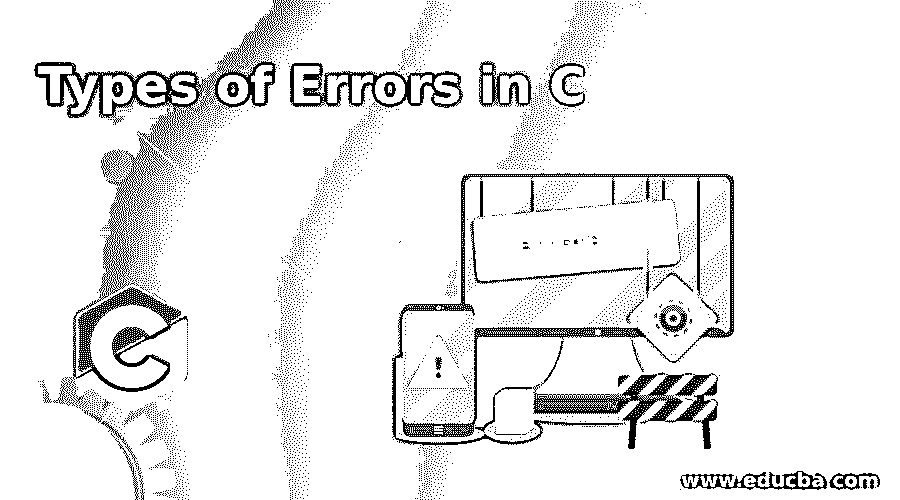
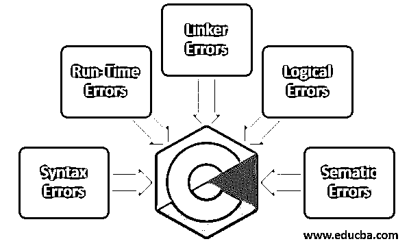
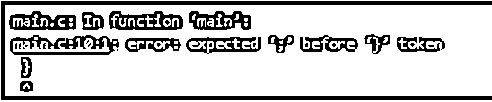
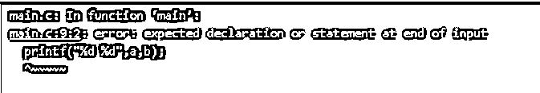
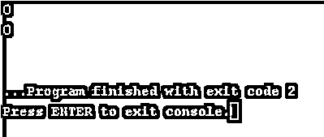
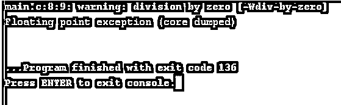
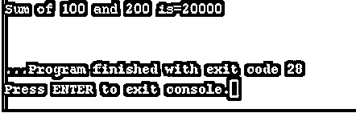

# C 语言中的错误类型

> 原文：<https://www.educba.com/types-of-errors-in-c/>




## C 语言中的错误类型介绍

C 语言中的错误是指用户执行的非法操作，它会导致程序逻辑的异常或突然运行。在程序编译或执行之前，编程错误是无法识别的。C 中的一些错误是隐藏的，或者阻止程序编译或执行。因此，当我们成功地执行我们的应用程序时，我们必须从程序中删除错误。

**实时场景:**我们有一个应用程序，用于在声明变量时显示数字的总和，我们在执行应用程序时遗漏了分号或 main 方法的错误语法。

<small>网页开发、编程语言、软件测试&其他</small>

**优势:**

*   在编译之前，我们将消除所有的错误问题。

### C 语言中的错误类型

c 语言将错误大致分为 5 种类型。他们是




#### 1.语法错误

当你违反了编写 C 语法的规则时就会出现错误，这种错误被称为“语法错误”。此编译器错误表明，在编译代码之前，必须修复此问题。这些错误由编译器识别，因此这些错误被称为“编译时错误”。

**语法:**

1.

```
void main()
{
int a //here semi colon(;)missed
}
```

2.

```
void main()
{
int a;
//here parenthesis(}) missed
```

#### 2.运行时错误

程序编译成功后出现的错误称为“运行时错误”。可被零整除的数字、数组索引越界、字符串索引越界等。是最常见的运行时错误。这些错误在编译时很容易被发现。

**语法:**

1.

```
void main()
{
int a=10;
int c=a/0;// Here number divisible zero error occurs
}
```

2.

```
void main()
{
int a[3]={1,2,3};
int out=a[4];// Here array out of bounds error occurs
}
```

#### 3.链接器错误

这些错误是在编译后产生的，我们使用 Ctrl+F9 快捷键将不同的目标文件与主对象链接起来。无法生成可执行程序时会出现这些错误。这可能是由于错误的函数声明、导入不正确的头文件等原因造成的。最常见的链接错误是编写 main()而不是 Main()方法。

**语法:**

```
void Main() // Here Main() method used instead of main() method
{
}
```

#### 4.逻辑错误

如果我们的期望是一回事，结果输出是另一回事，那么这种错误我们称之为“逻辑错误”。假设我们想要两个数的和，但是给定的输出是两个数的乘积，那么这就是逻辑错误。可以通过逐行调试检测出来。

**语法:**

```
void Main()
{
printf("%d",sum(10,20));
}
int sum(int a, int b)
{
return x*y;//expectation is sum but we are multiplying the numbers
}
```

#### 5 .语义错误

当且仅当编写的代码不是 C 编译器可理解的格式时，才会生成此错误。

**语法:**

```
void main()
{
int x, y, z;
x + y = z; //semantic error }
```

### C 中错误类型的示例

下面是一些例子:

#### 1.分号示例语法错误

**代码:**

```
#include<stdio.h> //Used to include basic c library files
void main() //Used to execute the C application
{
//declaring and defining the variables
int x = 10;
int y = 15;
//displaying the output
printf("%d", (x, y)) //Here semi-colon missed
}
```

**输出:**




#### 2.小胡子括号示例的语法错误

**代码:**

```
#include<stdio.h> //Used to include basic c library files
void main() //Used to execute the C application
{
//declaring and defining the variables
int a = 100;
int b = 105;
//displaying the output
printf("%d %d",a,b);
//Here mustache brace missed
```

**输出:**




#### 3.数组索引越界的运行时错误示例

**代码:**

```
#include<stdio.h> //Used to include basic c library files
void main() //Used to execute the C application
{
//declaring and defining the array variables
int a[5] = {100,101,102,103,104};
int b[5] = {105,106,107,108,109};
//displaying the output
printf("%d\n",a[100]); //array index out of bounds run-time error
//in c this is not shown any error message it will just show out of bound values as 0
printf("%d\n",b[700]);//array index out of bounds run-time error
}
```

**输出:**




#### 4.运行时错误，零可被数整除示例

**代码:**

```
#include<stdio.h> //Used to include basic c library files
void main() //Used to execute the C application
{
//declaring and defining the variables
int x = 200;
int y = 400;
int a=x/10;
int b=y/0;
//displaying the output
printf("%d\n",a); // Here no divisible by zero error occurs
printf("%d\n",b); //divi by zero run time error
}
```

**输出:**




#### 5.链接器错误，错误的 Main()方法语法示例

**代码:**

```
#include<stdio.h> //Used to include basic c library files
void Main() //Linker error as wrong syntax of main method used
{
//declaring and defining the array variables
char a[] = "Amardeep";
char c[] = "Paramesh";
//displaying the output
printf("%s\n",a);
printf("%s\n",c);
}
```

**输出:**


#### 6.逻辑错误示例

**代码:**

```
#include<stdio.h> //Used to include basic c library files
int sum(int a, int b);// Including method
void main()//main() method for executing the application
{
//declaring and defining the variables
int a=100;
int b=200;
//displaying the output
printf("Sum of %d and %d is=%d\n",a,b,sum(a,b));//sum(a,b) is calling method
}
//called method
int sum(int a, int b)
{
return a*b;//instead of sum here developer make a mistake by return multiplication logic
}
```

**输出:**




#### 7.语义错误示例

**代码:**

```
#include<stdio.h> //Used to include basic c library files
void main() //main() method for executing the application
{
//declaring and defining the variables
int a=100;
int b=200;
int a+b=c;//sematic error by unkwoning c language code
//displaying the output
printf("%d %d",a,b);
}
```

**输出:**


### 结论

C 语言中的错误是由于编写可理解的语句传递给编译器，然后编译器抛出一些错误。这些错误可能是程序员的错误，或者有时是机器内存不足以加载代码。错误主要有 5 种类型，即语法错误、运行时错误、链接器错误、逻辑错误和逻辑错误。

### 推荐文章

这是一个 c 中错误类型的指南，在这里我们也讨论了 c 中错误的介绍和类型，以及不同的例子和它的代码实现。您也可以看看以下文章，了解更多信息–

1.  [c#中的定时器](https://www.educba.com/timer-in-c-sharp/)
2.  [C 中的双指针](https://www.educba.com/double-pointer-in-c/)
3.  [空 C 中的指针](https://www.educba.com/void-pointer-in-c/)
4.  [C 语言中的标准错误](https://www.educba.com/stderr-in-c/)


