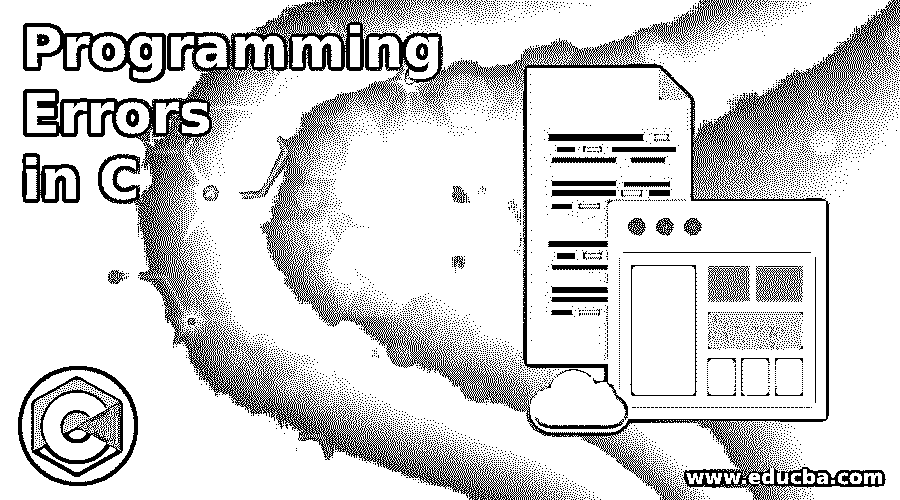
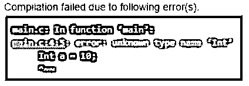
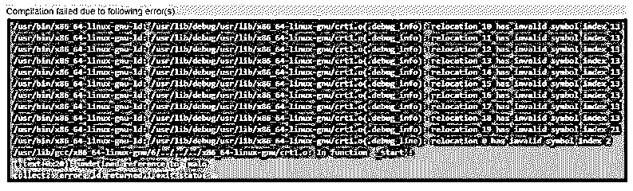
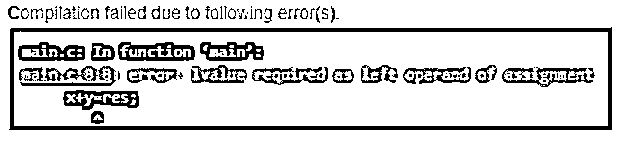

# C 语言中的编程错误

> 原文：<https://www.educba.com/programming-errors-in-c/>




## C 语言编程错误介绍

一般来说，错误是指不正确的或使程序行为异常的动作、错误或问题。在 C 编程语言中，编程错误是在运行时或编译时发生的错误或故障，此时程序不能正常执行，或者还会打印出垃圾值。在 C 或任何编程语言中消除或纠正这些错误的过程称为调试。因此，为了成功执行程序，它们必须没有错误。编译器也会生成警告，但它们有时会被忽略，因为它们很少发生，而错误不能被忽略，以获得所需的输出。

### C 语言编程错误的类型及实例

在 C 语言中，程序中会出现不同类型的错误，这些错误会导致程序运行异常。初学者会出现错误，如运行时、编译时错误、警告等，可以用不同的方法来纠正。

<small>网页开发、编程语言、软件测试&其他</small>

下面给出了 C 程序中出现的编程错误的类型:

#### 1.语法错误

这些是编译程序时出现的错误。这些错误是编译时错误。由于这些语法错误是由编译器在程序执行期间抛出的，因此这些语法错误被称为编译错误。一般来说，这些错误是在编写程序时出现的，或者是在编写程序时没有遵守语法编写规则。这种已知的错误很容易纠正。这些类型的错误通常是学习编程语言的初学者所犯的。

**举例:**

假设我们想要声明任何具有特定数据类型的变量，那么声明变量的正确方法或语法如下:

**语法:**

```
int a;
```

但是如果我们照做

```
Int a;
```

那么上面的声明给出了语法错误，因为数据类型“int”的字母“I”是大写字母 so。

**代码:**

```
#include <stdio.h>
intmain()
Int a = 10;
printf("The value of a is : %d", a);
return 0;
}
```

**输出:**




在上面的程序中，我们看到数据类型被写错了，所以由于这个错误，它给出了编译失败，并且由于这个错误的发生，程序不能被执行。语法错误可能是没有在变量前提到数据类型，或者没有用分号(；)，不以花括号({})结束程序等。

#### 2.运行时错误

此错误发生在运行时，这意味着它发生在程序编译后的程序执行期间。该错误主要发生在程序仍在运行时，它将无法执行某些特定的操作，这可能会导致内存泄漏。

**举例:**

**代码:**

```
#include<stdio.h>
intmain()
{
int n = 9;
int div = 0;
int rem = n/0;
printf("Result of division = %d", rem);
}
```

**输出:**


上面的程序在程序执行期间给出了被零除的错误，可以通过使用异常来处理。

#### 3.链接器错误

当未找到或未创建可执行文件时，会出现此错误。假设 main.c 包含 func()之类的函数，其可执行文件为 func.c，则该 func()在 sample.c 之类的其他文件中定义，生成的目标文件为 main.o 和 sample.o。当程序执行时，如果在 sample.o 中没有找到 func()定义，则链接器将抛出错误。

**举例:**

**代码:**

```
#include <stdio.h>
intMain()
{
int n=9;
printf("The value of n is : %d",n );
return 0;
}
```

**输出:**




在上面的程序中，发生错误是因为写了“main”而不是“Main ”,这是最常见的链接器错误。

#### 4.语义误差

这些错误发生在程序语句编写不正确时，这将使编译器难以理解，如使用未初始化的变量、类型兼容性、编写表达式时的错误等。

**举例:**

**代码:**

```
#include <stdio.h>
intmain()
{
intx,y,res;
x=2;
y=3;
res=1;
x+y=res;
return 0;
}
```

**输出:**




在上面的程序中，变量“res”不能作为左操作数使用两次。

#### 5.逻辑误差

这是一个错误，由于不合逻辑的程序执行而导致不正确的输出，但它们似乎是没有错误的，因此它们被称为逻辑错误。

**举例:**

**代码:**

```
#include <stdio.h>
intmain()
{
int sum=0;
int a=1;
for(inti=1;i<=20;i++);
{
sum=sum+a;
a++;
}
printf("The sum of the numbers is %d", sum);
return 0;
}
```

**输出:**


上面的程序是将输出打印为小于 20 的数字的和，但是由于我们在 for 循环语句后指定了分号，所以它给出了错误的输出，其中 for 循环内的语句没有被执行。因此，将 20 个数的和打印为 1 会出现逻辑错误。

### 结论

在这篇文章中，我们讨论了 C 语言中出现的编程错误。本文的结论是，会出现不同类型的错误，这些错误可能是由于错误地编写程序、编写错误的语法、在程序中编写错误的表达式或不遵守编写程序的规则(如不区分大小写)等造成的。在本文中，我们讨论了主要的错误，如运行时错误、编译时错误、语法错误、语义错误和逻辑错误。

### 推荐文章

这是一个关于 C 语言中编程错误的指南。在这里，我们用 5 个不同的错误和相应的示例代码来介绍 C 语言中编程错误的类型。您也可以看看以下文章，了解更多信息–

1.  [C 编程中的数组](https://www.educba.com/arrays-in-c-programming/)
2.  [C 语言中的闰年程序](https://www.educba.com/leap-year-program-in-c/)
3.  [C 中的常数](https://www.educba.com/constants-in-c/)
4.  [C 语言中的错误类型](https://www.educba.com/types-of-errors-in-c/)


