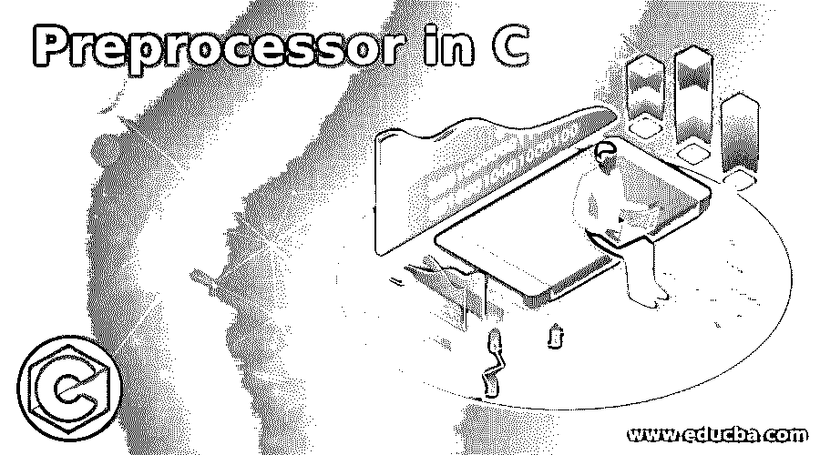
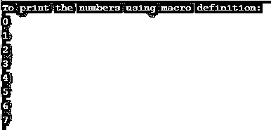
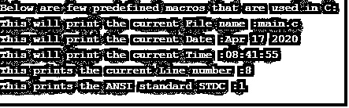

# C 语言中的预处理器

> 原文：<https://www.educba.com/preprocessor-in-c/>




## C 语言预处理器简介

预处理器是一个处理器，它允许你为程序中使用的更长的结构定义缩写，而不是从多行代码到少行代码。在 C 语言中，预处理器不是编译器的一部分，而是用来在编译前转换代码的。这也称为宏处理器，因为它可以帮助您以简称定义代码，称为宏。在 C 语言中，预处理程序提供了一些以#(散列符号)开头的命令。这些预处理器指令包含一组语句，作为在程序开始时使用的单个宏，这样我们就可以在整个程序中多次使用它。

### 预处理器在 C 中是如何工作的？

在 C 编程语言中，预处理器指令是使用# hash 符号定义的。一般来说，当编写 C 程序并使用。c 和这样的文件然后由预处理器处理，这个扩展文件然后被编译，目标文件用。用链接器链接这些对象文件来生成一个可执行文件。exe 文件。所以这些预处理器指令有一组代码，可以用一个名为宏的名字来定义，这个宏可以在整个程序中使用任意次，这个宏是在程序开始时定义和声明的。

<small>网页开发、编程语言、软件测试&其他</small>

### C 语言中预处理程序的类型

不同类型的预处理程序指令如下:

#### 1.宏指令

如上所述，宏是一段代码，其中包含一组执行特定工作的语句，或者包含需要在程序中多次使用的逻辑，那么只要需要在程序中执行该逻辑，我们就可以在程序中声明这个定义的宏。每当编译器在程序中遇到这个宏名时，编译器就这样做，然后编译器用程序开始时定义的一组代码替换这个宏名。这是使用#define 指令定义宏名来完成的。

让我们考虑一个宏是如何在程序中定义和使用的例子。

```
#define macro_name macro_value
```

**代码:**

```
#include <stdio.h>
#define  MAX 8
int main()
{
printf("To print the numbers using macro definition:\n");
for (int i = 0; i < MAX; i++)
{
printf("%d \n",i);
}
return 0;
}
```

**输出:**




**说明:**在上面的程序中，我们可以看到我们定义了一个名为“MAX”的宏，其值为 8。这意味着程序在程序中取一个宏名来打印数字，直到宏值在开始定义。

在 C 语言中，宏分为两种不同的类型:类对象宏和类函数宏。在类对象中，宏是用来定义标识符的符号常量。

例如#定义 PI 3.14

类似函数的宏是用来执行某些特定操作的表达式。

```
#define SQUARE (s) s*s
```

**代码:**

```
#include<stdio.h>
#define SQUARE(s)s*s
int main()
{
printf("Welcome to Educba tutorials!\n\n");
int side = 3;
int area = SQUARE(side);
printf("The area is: %d\n", area);
return 0;
}
```

**输出:**


**解释:**在上面的程序中，我们用一个被称为类函数宏的参数定义了宏名“SQUARE ”,上面的程序使用了被称为“MAX”的宏，其中值被指定为 8。这种类型的宏被称为类对象宏。

#### 2.C 语言中预定义的宏

在 C 编程语言中，ANSI C 提供了可在程序中使用的预定义宏。有一个预定义宏的列表，如下所示:

1.  _DATE_ 该宏定义了程序中的当前日期，它将以“MMM DD YY”的格式显示。
2.  _FILE_ 这个预定义的宏给出了程序将显示的当前文件的名称。
3.  _TIME_ 该宏还定义了当前时间，其显示格式为“HH: MM: SS”。
4.  _LINE_ 该宏定义程序的当前行号。
5.  _STDC_ 当编译器编译这个 ANSI 标准时，这个宏的 ANSI 标准值为 1。

让我们在一个程序中实现所有上述预定义的宏，看看它们是如何显示输出的。

**代码:**

```
#include<stdio.h>
int main()
{
printf("Below are few predefined macros that are used in C:\n");
printf("This will print the current File name :%s\n", __FILE__ );
printf("This will print the current Date :%s\n", __DATE__ );
printf("This will print the current Time :%s\n", __TIME__ );
printf("This prints the current Line number :%d\n", __LINE__ );
printf("This prints the ANSI standard STDC :%d\n", __STDC__ );
return 0;
}
```

**输出:**




**解释:**在上面的程序中，我们使用了 ANSI C 标准的所有 5 个预定义宏，我们可以看到不同的输出。

### 结论

在本文中，我们得出的结论是，C 编程语言中的预处理器只不过是一小段代码，它被用作在程序开始时定义的单个名称，称为宏，这个宏可以在整个程序中使用任意次，只要需要使用宏的值，就可以在程序中简单地指定宏的名称。有两种类型的宏，即类对象宏和类函数宏。ANSI C 标准也提供了一些预定义的宏。

### 推荐文章

这是一个 C 语言预处理器的指南。这里我们讨论 C 语言预处理器的介绍，它是如何工作的，类型和相应的例子。您也可以浏览我们的其他相关文章，了解更多信息——

1.  [C++头文件](https://www.educba.com/c-plus-plus-header-files/)
2.  [C 语言中的预处理器指令](https://www.educba.com/preprocessor-directives-in-c/)
3.  [C 中的常数](https://www.educba.com/constants-in-c/)
4.  [C 语言中的编程错误](https://www.educba.com/programming-errors-in-c/)


