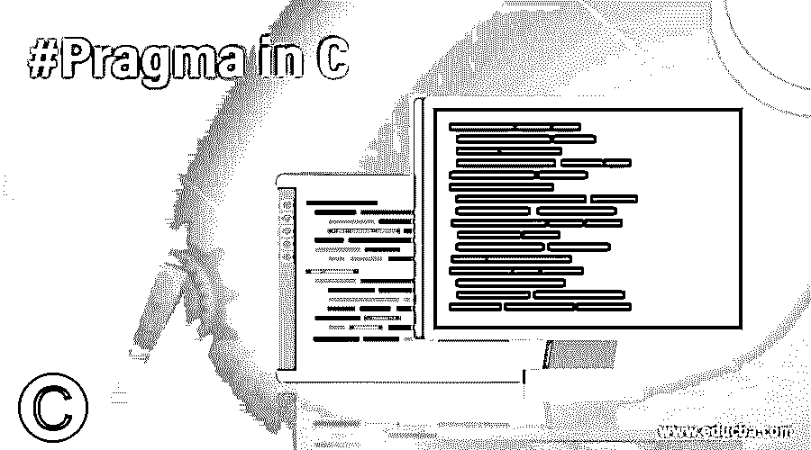
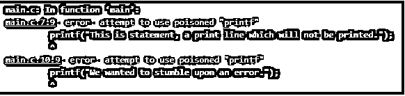

# # C #中的 Pragma

> 原文：<https://www.educba.com/hash-pragma-in-c/>




## C #中的#Pragma 简介

C #中的#pragma 是由 C 标准提供的指令，目的是为 C 编译器提供额外的必需细节。这些额外的细节可以是程序或代码逻辑中没有传递的任何东西。这些指令称为 pragma，在标准中以 STDC 为前缀。

C 语言中的这个 pragma 有一个特殊的目的，负责打开或关闭程序中的任何功能。接下来，我们将学习 C 语言中 pragma 的标准语法及其解释。

<small>网页开发、编程语言、软件测试&其他</small>

### 句法

基本上有两种类型的语法可以在程序中实现 pragma 指令。对于这两种语法，关键字和参数是相同的，但唯一的区别是我们如何启动代码语句。

**语法#1**

```
#pragma token-string
```

这里我们有一个在程序中实现 pragma 指令的标准方法，它以 hashtag 开始，后跟 pragma 关键字，然后是一个简单的标记字符串。

语法 2 与第一个类似，唯一的区别是我们在关键字 pragma 前使用了不同的运算符:

```
__pragma( token-string )
```

对于 pragma 语法的第二种格式，在 pragma 关键字之前有两个下划线。一些最常用的标记字符串是启动、退出、警告等。根据需求，实现这些令牌。我们将借助例子来了解这些令牌，并观看演示。

### #Pragma 在 C 中如何工作？

我们现在将继续理解 C #中的#pragma 指令实际上是如何工作的。我们已经知道，pragma 指令用于通知编译器将要发生的任何特殊事件。这正是 pragma 指令在 C 中的工作方式，这些 pragma 指令在编译之前执行，然后是预处理。这样，pragma 指令就能够通知编译器要忽略什么，不要忽略什么。还建议在程序中使用一次 pragma 指令。

### C #中的#Pragma 示例

现在我们已经了解了 C 语言中的编译指示是如何工作的，让我们继续演示一些例子。

#### 示例#1

我们的第一个例子是一个简单的输出语句。我们将简单地用它的两个标记 startup 和 exit 实现 pragma 指令。该程序的代码如下:

**代码:**

```
#include<stdio.h>
#include<conio.h>
void func() ;
#pragma startup func
#pragma exit func
void func(){
printf("\n Simple statement for a pragma directive.");
getch();
}
void main(){
printf("\n This is a sample to test pragma directive.");
getch();
}
```

**代码解释:**从一个简单的系统开始包含程序所需的文件。然后我们有一个单一的函数，后面是启动和退出的 pragma 定义。然后我们有另一个函数来保存打印语句。接下来是 getch 函数，代表 getch，用于在输出打印后保持输出屏幕，等待用户提供输入退出。最后，我们有我们的主代码，它包含一个简单的 print 语句和一个 getch 函数。


#### 实施例 2

**代码:**

```
#include<stdio.h>
#pragma warn -rvl /* return value */
#pragma warn -par /* parameter never used */
#pragma warn -rch /*unreachable code */
int show(int x) {
printf("\n This is a sample to demonstrate working of pragma.  ");
}
int main() {
show(10);
return 0;
}
```

**代码解释:**从单个包含文件开始，然后是几个 pragma 派生文件。我们在这里实现的 pragma 派生物是-rvl、-par 和-rch。这些都是 warn 标记的一部分，它们的意思是-rvl 表示返回值，然后-par 表示参数，这是从来没有使用过的。-rch 代表不可及的代码。然后我们有了打印一个简单输出语句的代码。然后我们有我们的主要代码，在其中我们传递我们的显示函数和一个简单的返回。成功执行后，代码将顺利运行，并返回我们包含的语句。


正如预期的那样，输出是我们想要打印的简单语句。接下来，我们将演示一个程序，我们将有意编写代码来打印输出错误。

#### 实施例 3

我们将在 pragma 关键字后实现 GCC 毒药标记，程序代码如下:

**代码:**

```
#include<stdio.h>
#pragma GCC poison printf
int main() {
int a=10;
if(a==10)  {
printf("This is statement, a print line which will not be printed.");
}
else
printf("We wanted to stumble upon an error.");
return 0;
}
```

**代码解释:**和所有其他例子一样开始，然后是我们的 pragma 派生物，后面是关键字 GCC poison 和一个名为的函数，它应该是中毒的。然后我们有 main、integer 和 if 语句，其中有 print 语句和 return 语句。但是我们已经毒化了 printf 语句，这意味着当代码到达 printf 行时应该会发生错误。

当与 pragma GCC 一起使用时，毒药用于识别和删除一些代码或代码的任何部分，并且确保它不会干扰任何其他部分，然后我们使用 GCC 毒药。我们简单地定义 pragma，后跟 GCC poison 关键字，最后一部分是您想要避免或删除的代码部分。




正如预期的那样，代码给出了与 printf 语句完全相同的错误。除了 poison 之外，还有许多其他的 gcc 标记可以实现，比如 GCC 依赖、警告、头等。这些字符串标记有一个目的，可以根据具体情况来实现。

### 结论

总之，C #中的#pragma 是一个特殊的指令，由 C 标准指定，负责打开或关闭一些功能。基本上，pragma 指令通知 C 编译器正在进行一个特殊的请求。这些指令对于不同的编译器可能是不同的，这意味着它们是特定于编译器的。

### 推荐文章

这是 C 语言中#Pragma 的指南。这里我们讨论#Pragma 在 C 语言中是如何工作的，并附有示例和解释。您也可以看看以下文章，了解更多信息–

1.  [C 语言中的结构填充](https://www.educba.com/structure-padding-in-c/)
2.  [C 语言中的预处理器指令](https://www.educba.com/preprocessor-directives-in-c/)
3.  [将 int 转换成字符串 C#](https://www.educba.com/convert-int-to-string-c-sharp/)
4.  [C#排序集](https://www.educba.com/c-sharp-sortedset/)


