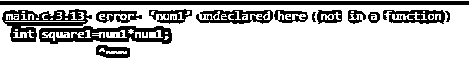

# #在 C #中

> 原文：<https://www.educba.com/sharp-undef-in-c/>


## C #中的#undef 介绍

Undef 是 C 编程语言中的一个指令，它帮助删除给定宏名的所有定义或任何使用#define 指令定义的常量。它是预处理器指令的一部分，因为在实际编译开始之前，编译器会自动调用它。在 C 程序被编译器编译之前，源代码被处理，这个过程叫做预处理。所有用于预处理器的命令都称为预处理器指令，所有预处理器指令都是使用#定义的。当使用#define 定义常量时，可以在大型程序中使用#undef 指令来限制它的作用域。

### 句法

预处理器是 C 中提供的一个特性，用于在实际编译完成之前处理程序员编写的源代码。在程序通过预处理器之前，编译器将代码通过预处理器，在预处理器中查找 C 程序中的特定指令(如指令)，这些指令称为预处理器指令，预处理器很容易理解。这些预处理器指令必须以(#)符号开头。

<small>网页开发、编程语言、软件测试&其他</small>

预处理器是编译器的一部分，它在编译器实际编译给定代码之前执行代码中的基本操作。预处理器执行的转换是词汇性的，这表明预处理器的输出是文本形式的。

为了定义宏，我们使用下面的语法

```
#define macro_name
```

**例如:**#定义圆周率 3.14

因此，当上述代码行被传递给预处理器时，它将 3.14 的值赋给 PI 变量，该变量可以在程序中的任何地方使用。此外，如果我们需要在程序中限制这个 macro_name 的作用域，我们可以使用#undef 指令删除声明的 macro_name，以便进一步赋值。

```
#undef macro_name
```

*   这里的 macro_name 指的是我们之前定义的需要移除的变量的名称。
*   Here #指定它是一个预处理器指令，并且在将实际的编译代码发送到编译器之前使用预处理器进行编译。

### #undef 在 C 中是如何工作的？

预处理器指的是甚至在代码进入编译器进行编译之前就在我们的源代码中被处理的程序。# under 是预处理器的一个命令。

*   用户编写的源代码首先被送到预处理器进行预处理，预处理器生成一个与程序同名的扩展源文件。该扩展文件被进一步发送到编译器进行编译，以生成库函数的目标代码，并且一旦该目标代码被链接到正在使用的各种库函数，可执行文件(。exe)文件。
*   使用# symbol 识别的预处理程序找到#undef macro_name 命令时，预处理程序会检查具有相同名称的宏。当它找到这样一个名字时，它从内存中删除该宏，以便可以再次使用。如果正在使用的宏已经被赋值，则会引发编译时错误。
*   也可以使用#ifdef..#endIf 指令有助于检查一个特定的宏名是否存在，否则，如果我们访问一个已经运行了#undef 的宏名，就会抛出编译时错误，如下例 2 所示。

### 预处理程序的类型

可以定义各种预处理器指令，这些指令可以分为以下 4 个主要类别:

*   宏指令
*   文件包含
*   条件编译
*   其他指令

### 在 C 中实现#undef 的示例

下面是提到的例子:

#### 示例#1

让我们看看当我们用值 7 声明一个 num 变量，然后用 undef 指令取消它的定义时会发生什么。然后再次用值 10 定义它，看看变量 square 和 square2 的值是如何变化的。

**代码:**

```
#include <stdio.h>
#define num 7
int square1=num*num;
#undef num
#define num 10
int square2=num*num;
int main() {
printf("Value of square with first value of num variable is = %d",square1);
printf("\n");
printf("Value of square with second value of num variable is = %d",square2);
return 0;
}
```

**输出:**


#### 实施例 2

在这个例子中，我们将看到当一个人试图访问一个用#define 定义的常量或宏，但这个常量或宏已经被用#undef 指令删除时会发生什么。

**代码:**

```
#include <stdio.h>
#define num 7
int square1=num1*num1;
#undef num1
int main() {
printf("Value of constant num that has been removed using #undef directive  = %d",num1);
return 0;
}
```

**输出:**




#### 实施例 3

在这个例子中，我们将看到如何实现 define 和 undef 指令来声明程序中的宏名和常量。我们将使用#ifdef 指令来检查一个特定的宏是否存在，并处理诸如由于调用不存在的宏而失败的情况。

**代码:**

```
#include <stdio.h>
#define StudentId 12
#undef StudentId
int main()
{
#ifdef StudentId
printf("Student with roll_no %d exists \n", StudentId);
#endif
printf("Learning preprocessor directives is fun\n");
return 0;
}
```

**输出:**


#### 实施例 4

这是上述示例中#ifdef 指令返回 true 并执行语句的另一个原因。

**代码:**

```
#include <stdio.h>
#define StudentId 12
//#undef StudentId
int main()
{
#ifdef StudentId
printf("Student with roll_no %d exists \n", StudentId);
#endif
printf("Learning preprocessor directives is fun\n");
return 0;
}
```

**输出:**


### 结论

在大型 C 程序中使用预处理器指令时，可以使用#define 预处理器指令定义常量和宏，以定义可以使用的各种常量，但是如果需要通过更改 maco_name 的定义来重用它，我们可以使用#undef 指令删除它们，并限制它们在程序中的作用域。

### 推荐文章

这是一个 C #中#undef 的指南。这里我们讨论一个 C #中#undef 的介绍，语法，它是如何工作的例子。您也可以浏览我们的其他相关文章，了解更多信息——

1.  [C 语言中的预处理器指令](https://www.educba.com/preprocessor-directives-in-c/)
2.  [C 中的内存分配](https://www.educba.com/memory-allocation-in-c/?source=leftnav)
3.  [C 语言中的正则表达式](https://www.educba.com/regular-expression-in-c/?source=leftnav)
4.  [C 语言中的地址运算符](https://www.educba.com/address-operator-in-c/?source=leftnav)


