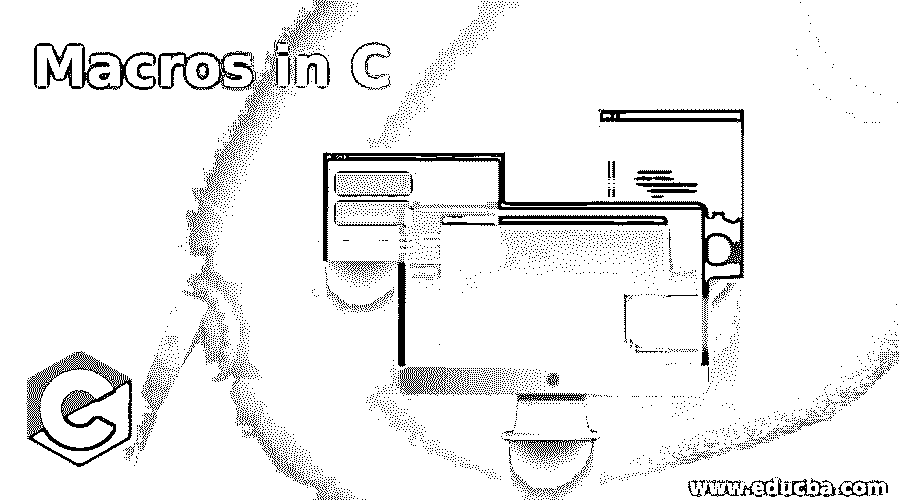
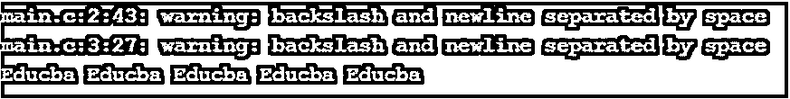

# C 语言中的宏

> 原文：<https://www.educba.com/macros-in-c/>




## C 语言中宏的介绍

在 C 程序设计语言中，当编译 C 程序时，程序被送到编译器，编译器将 C 程序转换成机器语言，然后编译完成并执行 C 程序。C 预处理器也称为宏预处理器。C 语言中的宏可以定义为一组给定了名称的程序语句，只要需要使用这组代码，就会使用这个名称。这些宏总是以符号“#”开始，以该符号开始的语句由编译器调用。有两种类型的宏:使用数据对象时的类对象宏和使用函数调用时的类函数宏。

### C 语言中宏的例子

C 编程语言中的宏是程序代码的一个块或一组语句，可以用 macro #define 指令代替。如上所述，有两种类型的宏。它们是:

<small>网页开发、编程语言、软件测试&其他</small>

#### 1.类对象宏

这个宏可以是一个指针变量或标识符或使用#define 定义的变量，它被它的值替换。这主要在需要数字常量时使用。

**举例:**

```
#define MAX 100
```

在本例中，我们可以使用“MAX”作为宏名，其值为 100，将被替换为“MAX”。

#### 2.类似函数的宏

这个宏类似于 C 编程语言中的函数调用。在这种情况下，函数名是用传递给函数的参数定义的。

**举例:**

```
#define ADD (p, q) (p) + (q)
```

在上面的例子中，我们可以将名为“ADD”的函数定义为执行两个数字“p”和“q”的加法。

在 C 编程中使用宏之前，我们应该注意以下几点:

*   在 C 语言中，当我们使用“define”来定义一个带有前缀“#”的宏时，它用于定义整个程序的常量，因此当我们用某个宏名定义一个常量时，那么在整个程序中，定义的常量将被匹配，并被替换为在用“#define”语句声明宏的开始时分配的值。示例:

```
#include<stdio.h>
#define PI 3.14
intmain()
{
printf("The value of Pi is %f", PI);
return 0;
}
```

**输出:**


类似地，在 C 程序中使用“#include”来包含头文件。例如，我们在上面的代码中看到“#include <stdio.h>”这个“stdio.h”是一个头文件，我们使用这个头文件是因为读取和打印我们使用的值“printf”和“scanf”都在这个“stdio.h”头文件中。</stdio.h>

*   你应该注意，当参数传递给函数类宏时，它支持任何数据类型。让我们考虑下面的一个例子:

**举例:**

```
#include <stdio.h>
#define INCREMENT(n) ++n
intmain()
{
char *p = "Educba";
int a = 20;
printf(" This use char datatype %s ", INCREMENT(p));
printf("\n This uses int datatype %d", INCREMENT(a));
return 0;
}
```

**输出:**


*   宏也可以写成多行，语句以“\”开头，不需要以“\”结尾。让我们看一个例子:

**举例:**

```
#include <stdio.h>
#define MACRO(n, limit) while (n < limit) \
{ \
printf("Educba "); \
n++; \
}
intmain()
{
int n = 0;
MACRO(n, 5);
return 0;
}
```

**输出:**




*   在 C 语言中，宏可以使用类似 if-else 指令的条件语句，同时定义可用于条件编译的语句。让我们考虑一个例子:

**举例:**

```
intmain()
{
#if VERBOSE >= 2
printf("Message");
#endif
}
```

**无输出:**

*   如果宏用于传递了参数的类似函数的宏，则在宏展开之前不会对其求值。让我们看看这个例子:

**举例:**

```
#include <stdio.h>
#define DIV(a, b) a/b
intmain()
{
printf("%d", DIV(5+3, 3+2));
return 0;
}
```

**输出:**


在这里，上面的宏被扩展为 2 +3 /3 + 5 = 2 + 1 + 5 =8，这是令人困惑的，所以你可以通过下面修改的宏来解决。

```
#include <stdio.h>
//here, instead of writing a*a we write (a)*(b)
#define DIV(a, b) (a) / (b)
intmain()
{
printf("%d", DIV(5+3, 3+2));
return 0;
}
```

**输出:**


宏扩展为(2 + 3) * (3 + 5)，即 5*8 = 1

*   该宏还支持使用特殊运算符“##”将标记传递给宏以连接标记，该运算符称为标记粘贴运算符。让我们看一个例子:

**举例:**

```
#include <stdio.h>
#define concate(p, q) p##q
intmain()
{
printf("%d ", concate(56, 78));
}
```

**输出:**


上面的代码定义了一个类似函数的宏，在这个宏中，令牌被传递来连接两个值“p”和“q”。

*   宏还可用于传递标记，通过在标记前使用特殊符号“#”可将标记转换为字符串。让我们看一个例子:

**举例:**

```
#include <stdio.h>
#define get_string(n) #n
intmain()
{
printf("%s", get_string(Educba));
}
```

**输出:**


在上面的代码中，我们定义了类似函数的宏，其中参数“n”与“#n”一起传递，这将允许您检索字符串文字。

### 结论

在 C 编程语言中，宏不亚于类似的函数，但宏也有内置宏。在 C 中，宏用于定义整个程序中的任何常量值或任何变量，其值将被该宏名替换，其中宏包含在程序中使用宏名时将调用的代码集。宏使用“#define”指令在 C 编程语言中定义宏。这对于节省时间和减少代码编写非常有用。

### 推荐文章

这是一个 c 语言中宏的指南，在这里我们也讨论了 c 语言中宏的介绍和工作，以及不同的例子和它的代码实现。您也可以看看以下文章，了解更多信息–

1.  [c++中的宏](https://www.educba.com/macros-in-c-plus-plus/)
2.  [C 语言中的 fprintf(](https://www.educba.com/fprintf-in-c/)
3.  [C 语言中的无符号整数](https://www.educba.com/unsigned-int-in-c/)
4.  [C 语言中的常量指针](https://www.educba.com/const-pointer-in-c/)


