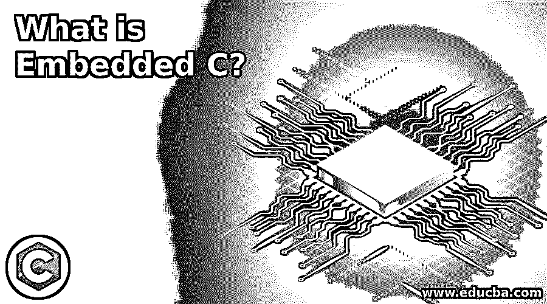

# 什么是嵌入式 C？

> 原文：<https://www.educba.com/what-is-embedded-c/>

## 嵌入式 C 语言简介

在嵌入式系统的开发中，嵌入式 C 语言是最常用的编程语言之一。所以我们可以在这个帖子里看到一些嵌入式 C 的基础知识和嵌入式 C 的编程框架。它可能是嵌入式系统编程中最常见的语言。许多常见的编程语言用于嵌入式系统的开发，如 Basic、汇编、C++等。，但是嵌入式 C 从性能、时间、可移植性来说还是很常见的。

### 什么是嵌入式系统？

*   具有硬件和软件并且被配置为执行特定任务的设备可以被最好地描述为嵌入设备。
*   对于许多家庭来说，洗衣机是嵌入式设备的典型代表。嵌入式系统可以是一个更广泛的框架的一部分，而不仅仅是像洗衣机这样的独立设备。
*   一个例子是汽车。现代汽车提供了许多嵌入式系统，它们执行特定的任务，以实现安全、平稳的驾驶。
*   车辆的任何内置系统是防抱死制动(ABS)、自动气候控制系统、轮胎压力监测系统、功率水平监测系统等。油位监控系统。

### 嵌入式 C #中的数据类型

*   c 编程语言数据类型(或任何这方面的编程语言)允许我们声明程序变量。
*   在 C 编程语言中有许多类型的数据，如有符号、浮点、有符号字符、无符号字符、无符号整数、双精度。除此之外，它还包括几种数据类型。

### 什么是嵌入式 C？

C 计算机语言是最常见和最常用的编程语言，由 Dennis Ritchie 在 20 世纪 60 年代末和 70 年代初开发。复杂的编译器(将程序转换成机器代码的软件)和到创建者指令的有效映射提供了低级别的内存访问。

<small>网页开发、编程语言、软件测试&其他</small>

C 编程语言提供嵌入式 C 编程语言是 C 编程语言的扩展，通常用于设计嵌入式系统。它使用与关键函数变量、循环、数据类型声明、函数、语句等相同的语法。从上述声明中可以明显看出，嵌入式设备软件组件对于硬件组件同样重要。程序(软件)写的很差的高级硬件模块是没用的。

以下是 Keil 的 Cx51 编译器的附加数据类型:

*   Sfr
*   少量
*   16 瑞士法郎
*   Sbit

### 成分

下面给出了组件:

*   预处理器指令:预处理器指令是对编译器的一个指示，表明程序没有指定的符号必须在这个文件中查找。我们通常在嵌入式 C 编程中使用预处理器指令来表示包含所有 sfr 和这些 sfr 中的位的微控制器专用头文件。
*   **主函数:**每个带 C 或内嵌 C 的程序都有一个主函数，程序执行从这个主函数开始。
*   **全局变量:**顾名思义，全局变量在程序之外，即程序中的任何地方都是可用的。

### C 的关键词

关键字(一种用作将 C 语言翻译成机器代码的方法的语言)是一个对编译器有特殊意义的特殊术语。

例如，当我们使用 Keil 编译器 Cx51(基于 8051 的通用编译器)时，一些关键字是:

*   大的
*   小的
*   Sbit
*   Sfr
*   少量

### **选择编程语言的因素**

这些只是为嵌入式系统开发选择编程语言时必须考虑的几个因素。

*   **速度:**程序必须尽可能快地运行，即由于应用程序运行缓慢，硬件不应变慢。
*   **大小:**程序占用的内存非常关键，因为像微控制器这样的嵌入式处理器的 ROM 量非常小。

### C 和 C 嵌入的区别

*   其实除了扩展不多和工作环境不同，C 和嵌入式 C 没有太大区别。
*   两个 ISO 标准 C 和 Embedded C 有几乎相同的数据类型、相同的语法、功能等。
*   嵌入式 C 语言本质上是标准 C 语言的扩展，具有 I / O 地址、算术定点和多存储器寻址等附加功能。

### 推荐文章

这是一个什么是嵌入式 C 的指南？这里我们讨论一下什么是嵌入式系统？数据类型，什么是嵌入式 c？组件，c 语言的关键字，差异。您也可以看看以下文章，了解更多信息–

1.  [C 语言中的编程错误](https://www.educba.com/programming-errors-in-c/)
2.  [C 语言中的错误类型](https://www.educba.com/types-of-errors-in-c/)
3.  [While C 中的循环](https://www.educba.com/while-loop-in-c/)
4.  [最佳 C 编译器](https://www.educba.com/best-c-compilers/)

