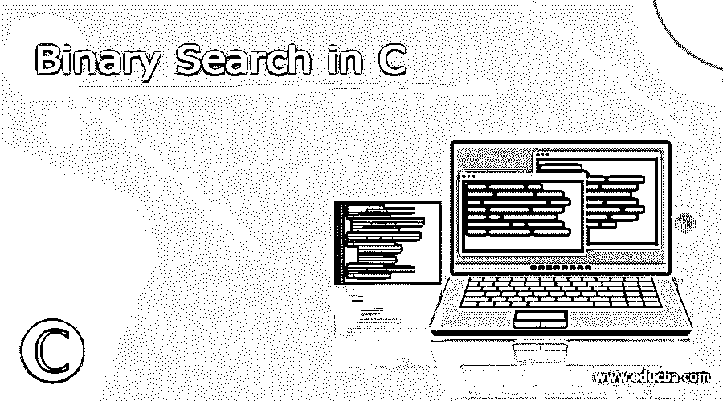
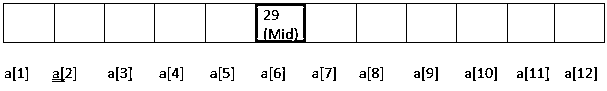
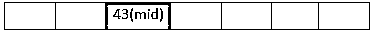
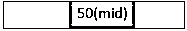
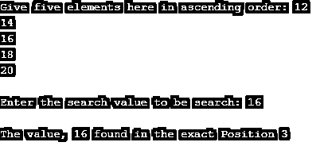

# C 中的二分搜索法

> 原文：<https://www.educba.com/binary-search-in-c/>




## C 语言中二分搜索法的定义

二分搜索法是一种重要的搜索方法，在有序数组中搜索元素时效果很好。这是一个用于解决复杂问题的简单工作流程。它比线性搜索快得多，因为它基于分而治之的方法，因此有助于立即跟踪错误，通常在最坏的情况下需要 log2(N)。

**语法:**

<small>网页开发、编程语言、软件测试&其他</small>

语法结构的格式如下

```
Int func_name (int, int, int)
{
{
If (middle > value)
Last=middle-1;
}
If (middle < value)
{
First=middle+1;
}
}
```

### 如何用 C 调演奏二分搜索法？

二分搜索法有两种表演方式:

**1。简单循环——迭代方法:**代码在循环下给出，以进行多次迭代。

**2。递归过程:**程序中声明的函数自己调用。

这种流行的二分搜索法作品是通过元素之间的比较来完成的。将一个元素作为数组的中间元素，并基于此格式化该过程。通过尽可能少的比较，确实如此。要做到这一点，我们需要一个数组来扫描，并应该以任何顺序排序(降序/升序)。意味着以特定的顺序排列元素。二分搜索法不适用于未排序的数组列表。

要按升序搜索各个项目，第一步是将项目值与列表的中间元素(整个数组)进行比较。如果项目值大于中间元素，则段的后半部分成为新的段。如果项目小于中间元素，则片段的前半部分被视为新的片段，以便继续处理。重复相同的过程，直到找到所搜索的项目。

让我们在这里看一个数组示例。

数组数据如下所示:


**步骤 1:** 搜索元素 45。在数组列表中分配两个指针，分别称为 first 和 last。通过上述数学计算找到中间元素。




先说= 1；last =12。mid 元素标识为 mid=(1+12)/2 = 6。所以中间的元素是 6。如果假设值== mid，则返回中间值。

**第二步:**第 6 位的值是 29。29 < 45

所以，first = mid+1；-> first=6+1=7 现在第一个变成了“7 ”,我们需要取数组列表的后半部分。

**第三步:** mid= (7+12)/2 =9

第 9 位的值是 43。嗯，43<45 那么 first = mid+1；首先给出的是 10。




a[6]a[7]a[8]a[9]a[10]a[11]a[12]

**第四步:**取 mid= (10+12)/2 =11

第 11 位的数据是 50。所以，50 >45。




一个，一个，一个

那么现在我们需要计算

Last=中 1 -> last = 11-1 -> last =10。因此，项目 50 被放置在第 10 个位置。

**Step-5:** mid= 10+10，因为最后一个和第一个元素是一样的。因此，mid 返回 10。

第一个也是最后一个位置是 8。数组中第 8 个位置的值是 45。现在，在位置号处搜索成功。而第 10 位的数据是 45。


中间的

### 例子

以下是一些例子:

#### 示例 1:递归实现

**代码:**

```
#include <stdio.h>
int bsearch(int narr[], int d, int b, int a)
{
if (b >= d) {
int midval = d + (b - d) / 2;
if (narr[midval] == a)
return midval;
if (narr[midval] > a)
return bsearch(narr, d, midval - 1, a);
return bsearch(narr, midval + 1, b, a);
}
return -1;
}
int main(void)
{
int narr[] = { 5, 6, 7, 20, 30 };
int s1 = sizeof(narr) / sizeof(narr[0]);
int a = 20;
int final =bsearch(narr, 0, s1 - 1, a);
(final == -1) ? printf("The element couldn’t find on the array list")
: printf("The element is found at the list %d",
final);
return 0;
}
```

**解释**

上面的 C 代码声明了一个函数 bsearch()，当计算大小时，项目与中间位置进行比较。每次该函数被自己调用以给出数字的精确位置。

**输出:**


#### 示例 2:迭代循环

**代码:**

```
#include <stdio.h>
int iterationdemo(int ardata[], int first_n, int last_n, int val){
while (first_n <= last_n){
int midd_n = first_n + (last_n- first_n )/2;
if (ardata[midd_n] == val)
return midd_n;
if (ardata[midd_n] <val)
first_n = midd_n + 1;
else
last_n = midd_n - 1;
}
return -1;
}
int main(void){
int ardata[] = {11, 13, 15, 22, 24, 29,32,38,43,45,50,54};
int size = 11;
int val = 50;
int z = iterationdemo(ardata, 0, size-1, val);
if(z == -1 ) {
printf("Not found, try with some other value ");
}
else {
printf("Element found at the position : %d",z);
}
return 0;
}
```

**解释**

这与前面的程序相同，但与迭代过程不同。执行 While 语句来查找值。

**输出:**


#### 例 3:不使用函数原型

**代码:**

```
#include<stdio.h>
#include<conio.h>
int main()
{
int k, ar_val[10], find, initial, final, midpos;
printf("Give five elements here in ascending order: ");
for(k=0; k<5; k++)
scanf("%d", &ar_val[k]);
printf("\nEnter the search value to be search: ");
scanf("%d", &find);
initial = 0;
final = 4;
midpos = (initial+final)/2;
while(initial <= final)
{
if(ar_val[midpos]<find)
initial = midpos+1;
else if(ar_val[midpos]==find)
{
printf("\nThe value, %d found in the exact Position %d", find, midpos+1);
break;
}
else
final = midpos-1;
midpos = (initial+final)/2;
}
if(initial>final)
printf("\nThe number, %d is not seen in a given sorted Array", find);
getch();
return 0;
}
```

**解释**

在这里，用户在运行时提供输入，输入五个数字，搜索过程立即从数组列表的给定列表中完成。

**输出:**




### 结论

因此，在本文中，我们学习了如何使用二分搜索法从给定的排序数组中搜索元素。并给出了分步演示。它通过不在两个子数组上工作来限制它的工作，并且通过具有指针的搜索空间来限制它的工作，这是这种搜索的附加优点。

### 推荐文章

这是一个 C 语言中二分搜索法的指南。这里我们讨论定义、语法和参数，如何在 C 语言中执行二分搜索法？代码实现示例。您也可以看看以下文章，了解更多信息–

1.  [c#中的 binary writer](https://www.educba.com/binarywriter-in-c-sharp/)
2.  [Java 中的 BinarySearch()](https://www.educba.com/binarysearch-in-java/)
3.  [C#二进制阅读器](https://www.educba.com/c-sharp-binaryreader/)
4.  [C 语言中的指针算法](https://www.educba.com/pointer-arithmetic-in-c/)


