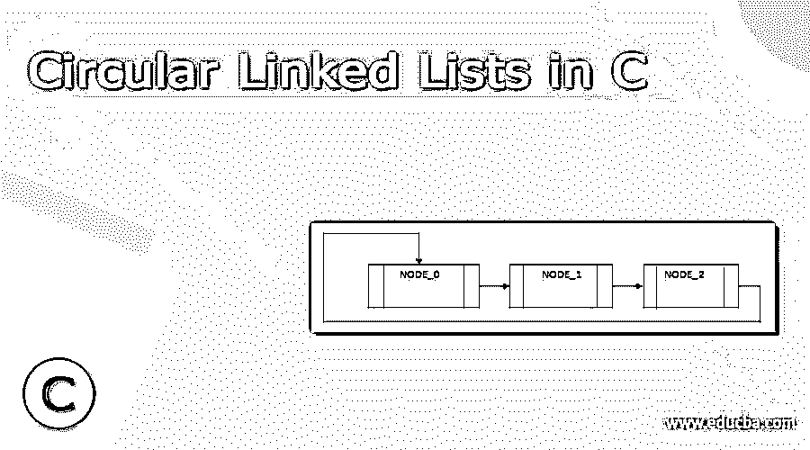
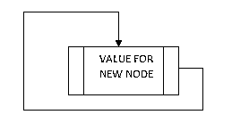
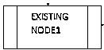
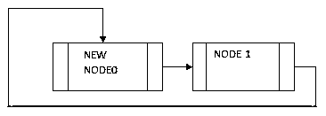
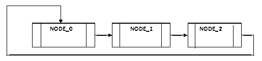
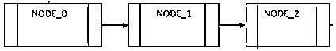
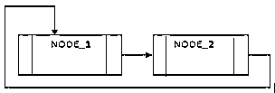
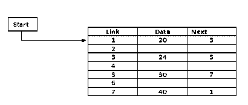
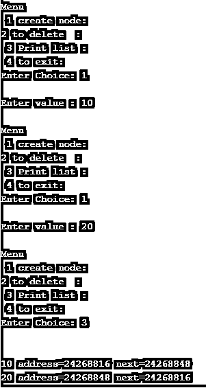

# C 中的循环链表

> 原文：<https://www.educba.com/circular-linked-lists-in-c/>




## C 语言中循环链表的定义

循环链表是链表的一种不同形式。在循环链表中，每个节点都连接到序列中的下一个节点、前一个节点以及最后一个节点，并且链接或连接到列表中的第一个节点，我们称之为循环链表。除了最后一个和第一个节点的连接之外，循环链表的正常工作类似于单个链表。当我们从第一个节点开始遍历时，如果我们需要访问链表中的任何一个节点，那么在一个链表中会发生什么呢？如果我们目前在列表的中间，那么就不可能访问节点，所以这个问题我们用循环链表来解决。

### 句法

基本上，我们可以对循环链表执行不同的操作，比如 insert 删除和遍历等。这里我们看到创建新节点的插入操作的语法如下。

<small>网页开发、编程语言、软件测试&其他</small>

```
void create()
{
node *n_node;
n_node=(node*)malloc(sizepof(node));
printf("\n Enter new value for new node: ");
scanf("%d",&n_node->data);
n_node->next=null;
if(rear=null)
front=rear=n_node;
else
{
rear->next=n_node;
rear=n_node;
}
rear-> next=front;
}
```

**解释**

通过使用上面的语法，我们创建了一个新的节点，这里我们使用 malloc 函数创建一个新的节点，其大小与节点的大小相同。之后，我们使用指针概念创建一个新节点，并指向循环链表中的下一个和上一个节点。这样，我们可以执行不同的插入操作，即在开始、结束和指定位置插入节点，我们还可以执行删除操作。

### C 中循环链表是如何工作的？

现在让我们看看循环链表是如何工作的，如下所示。基本上，我们执行如下操作。

#### 插入

基本上，插入用于根据需要在循环链表中的指定位置添加一个新节点。插入操作的第一步是我们需要使用上面的代码创建一个新的节点。




现在有如下两种不同的可能性。

第一种可能是我们可以在循环链表的当前位置插入节点。这个操作对应于在循环链表的开头和结尾插入，因为在这个链表中开头和结尾是相同的。

第二种可能性是在索引节点后执行插入。现在我们来看看插入操作的步骤如下。

1.首先，我们需要断开节点之间的现有链接。

2.之后，将新节点链接连接到现有节点。

3.现在，最后一个节点链接将指向新插入的节点。

所有这些插入操作如下图所示。

下图显示了现有的节点。




现在断开节点之间的现有链接，并在新节点和现有节点之间创建前向链接，如下图所示。




这样，我们就可以执行插入操作了。

#### 删除操作

现在假设循环链表中有三个节点，那么可能会产生以下几种情况。

1.第一种可能性是我们可以删除当前节点。

2.第二种可能性是我们可以删除后节点。

**在开始和结束时执行删除**

1.首先，我们需要遍历第一个节点到最后一个节点。

2.从最后一个节点删除。

3.删除最后一个节点和下一个节点之间的链接。

4.之后，我们需要将最后一个节点连接到第一个节点。

5.从循环链表中释放第一个节点。

如下图所示的所有删除操作如下。




首先，如下图所示，移除环形链接。




现在移除第一个节点和下一个节点之间的链接，如下图所示。


现在从循环链表中释放第一个节点，如下图所示。




同样，我们可以通过使用相同的步骤来执行删除 after 节点。

#### 循环链表的内存表示

在附图中，包含学生在 3 个科目中的分数的循环链表的记忆表示。尽管如此，图中显示了循环链表在内存中是如何存放的。纲要的开始或顶部突出显示文件 1 的组件，并在信息部分包含 20 个标记，在接下来的部分包含 3 个标记。这意味着它与被放在第三列表上的集线器相连接。

尽管如此，因为我们在内存中考虑循环链表连接的方式，所以链表的最后一个节点包含了链表主节点的位置。



### 例子

现在我们来看一个循环链表的例子，如下。

**代码:**

```
#include<stdio.h>
#include<stdlib.h>
typedef struct Node
{
int data;
struct Node *next;
}node;
node *start=NULL,*end=NULL,*temp_data;
void create_node();
void del_node();
void display_node();
int main()
{
int choice;
do
{
printf("\nMenu\n 1 create node: ");
printf("\n2 to delete : ");
printf("\n 3 Print list : ");
printf("\n 4 to exit: ");
printf("\nEnter Choice: ");
scanf("%d",&choice);
switch(choice)
{
case 1:
create_node();
break;
case 2:
del_node();
break;
case 3:
display_node();
break;
case 4:
return 1;
default:
printf("\nEntered choice is invalid :");
}
}while(1);
return 0;
}
void create_node()
{
node *n_node;
n_node=(node*)malloc(sizeof(node));
printf("\nEnter value : ");
scanf("%d",&n_node->data);
n_node->next=NULL;
if(end==NULL)
start=end=n_node;
else
{
end->next=n_node;
end=n_node;
}
end->next=start;
}
void del_node()
{
temp_data=start;
if(start==NULL)
printf("\nCircular linked list is Underflow :");
else
{
if(start==end)
{
printf("\n%d",start->data);
start=end=NULL;
}
else
{
printf("\n%d",start->data);
start=start->next;
end->next=start;
}
temp_data->next=NULL;
free(temp_data);
}
}
void display_node()
{
temp_data=start;
if(start==NULL)
printf("\nCircular linked list is Empty");
else
{
printf("\n");
for(;temp_data!=end;temp_data=temp_data->next)
printf("\n%d address=%u next=%u\t",temp_data->data,temp_data,temp_data->next);
printf("\n%d address=%u next=%u\t",temp_data->data,temp_data,temp_data->next);
}
}
```

**解释**

通过使用上面的代码，我们尝试实现一个循环链表。以上代码的结尾我们用下面的截图来说明如下。




### 结论

我们希望从这篇文章中你能学到 c 语言中的循环链表。从上面的文章中，我们已经学到了循环链表的基本语法，我们也看到了循环链表的不同例子。从这篇文章中，我们了解了如何以及何时在 c 语言中使用循环链表。

### 推荐文章

这是一个 c 语言循环链表的指南。这里我们讨论循环链表的定义、语法、工作原理以及代码实现的例子。您也可以看看以下文章，了解更多信息–

1.  [C 语言中的链表](https://www.educba.com/linked-list-in-c/)
2.  [数据结构中循环链表](https://www.educba.com/circular-linked-list-in-data-structure/)
3.  [在 C 中排队](https://www.educba.com/queue-in-c/)
4.  [在数据结构中合并排序](https://www.educba.com/merge-sort-in-data-structure/)


