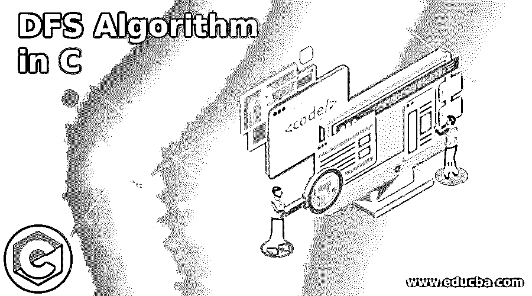
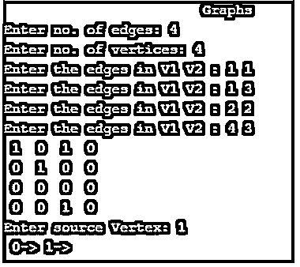
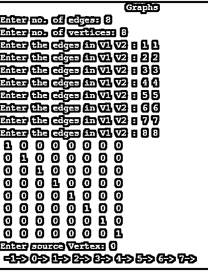
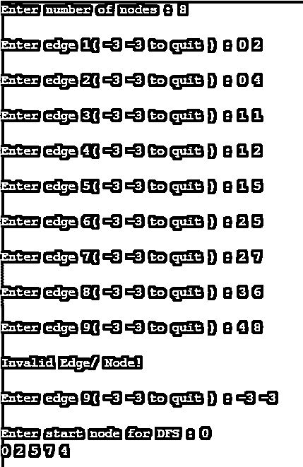

# C 语言中的 DFS 算法

> 原文：<https://www.educba.com/dfs-algorithm-in-c/>




## C 语言中的 DFS 算法介绍

C 中的 DFS 算法是一种图遍历技术，也称为深度优先搜索算法，用户从图的初始节点开始遍历，然后越来越深，直到用户找到所需的节点或没有子节点的节点。深度优先搜索可用于在树或图中搜索。图和树的遍历几乎是相似的，但是唯一的问题是图包含圈和节点，并且节点可以被访问两次。DFS 使用堆栈作为数据结构，其过程或算法类似于 BFS 算法。在 DFS 中，将用户导向未访问节点的边称为发现边，将导向已访问节点的边称为块节点。在本文中，我们将学习什么是 DFS 算法，以及它是如何在一种已知的编程语言中实现的。即 C

**语法:**

<small>网页开发、编程语言、软件测试&其他</small>

DFS 没有语法，但有可用于执行深度优先搜索算法的算法或步骤。

### C 语言中的 DFS 算法

*   **步骤 1:** 在开始 DFS 算法之前的一个标准规则是，DFS 将图的每个顶点分成两类，即已访问的&和未访问的。
*   第二步:记住每个顶点至少要被访问一次，不要循环。
*   **第三步:**首先，需要把任意一个图形顶点放在栈顶
*   **步骤 4:** 需要获取堆栈的顶部项目，并将其添加到已访问列表中
*   **步骤 5:** 然后，创建一个顶点相邻节点列表，并将不在已访问列表中的节点添加到堆栈的顶部
*   **第六步:**重复上面的第四步&第五步，直到堆栈清空。

DFS 采用了一些主要的遍历规则，

*   **规则 1:** 访问相邻的未访问顶点，标记为已访问。显示并将其压入堆栈
*   **规则 2:** 如果找不到相邻顶点，从栈顶移除顶点。它将从堆栈中移除所有没有相邻顶点的顶点。
*   **规则 3:** 继续重复规则 1 和规则 2，直到堆栈清空。

### DFS 在 C 中是如何工作的？

让我们通过一些例子来看看 DFS 实际上是如何工作的，

#### 示例 1–实现 DFS 算法的 C 程序

**代码:**

```
#include <stdio.h>
#include <stdlib.h>
intsourceV,Vertex,Edge,time,visited[10],Graph[10][10];
void DepthFirstSearch(inti)
{
int j;
visited[i]=1;
printf(" %d->",i++);
for(j=0;j<Vertex;j++)
{
if(Graph[i][j]==1&&visited[j]==0)
DepthFirstSearch(j);
}
}
intmain()
{
inti,j,vertex1,vertex2;
printf("\t\t\tGraphs\n");
printf("Enter no. of edges:");
scanf("%d",&Edge);
printf("Enter no. of vertices:");
scanf("%d",&Vertex);
for(i=0;i<Vertex;i++)
{
for(j=0;j<Vertex;j++)
Graph[i][j]=0;
}
for(i=0;i<Edge;i++)
{
printf("Enter the edges in V1 V2 : ");
scanf("%d%d",&vertex1,&vertex2);
Graph[vertex1-1][vertex2-1]=1;
}
for(i=0;i<Vertex;i++)
{
for(j=0;j<Vertex;j++)
printf(" %d ",Graph[i][j]);
printf("\n");
}
printf("Enter source Vertex: ");
scanf("%d",&sourceV);
DepthFirstSearch(sourceV-1);
return 0;
}
```

**输出 1:**




所以在这个输出中，边的数量是 4，顶点的数量也是 4。根据顶点，图的遍历已经显示。

**输出 2:边数=顶点数= 8**




#### 示例 2–图遍历的 DFS 示例

**代码:**

```
/******************************************************************************
Online C Compiler.
Code, Compile, Run and Debug C program online.
Write your code in this editor and press "Run" button to compile and execute it.
*******************************************************************************/
#include<stdio.h>
#include<stdlib.h>
#define MAXVALUE 100
#define initialValue 1
#define visitedValue 2
int node;
int adjacent[MAXVALUE][MAXVALUE];
int state[MAXVALUE];
void DFSTraversal();
void DFS(int vertex);
void createGraph();
int stack[MAXVALUE];
inttopValue = -1;
void pushNode(int vertex);
intpopNode();
intisEmpty();
main()
{
createGraph();
DFSTraversal();
}
void DFSTraversal()
{
int vertex;
for(vertex=0; vertex<node; vertex++)
state[vertex]=initialValue;
printf("\nEnter start node for DFS : ");
scanf("%d",&vertex);
DFS(vertex);
printf("\n");
}
void DFS(int vertex)
{
inti;
pushNode(vertex);
while(!isEmpty())
{
vertex = popNode();
if(state[vertex]==initialValue)
{
printf("%d ",vertex);
state[vertex]=visitedValue;
}
for(i=node-1; i>=0; i--)
{
if(adjacent[vertex][i]==1 && state[i]==initialValue)
pushNode(i);
}
}
}
void pushNode(int vertex)
{
if(topValue == (MAXVALUE-1)){
printf("\n Error: Stack Overflow\n");
return;
}
topValue=topValue+1;
stack[topValue] = vertex;
}
intpopNode()
{
int vertex;
if(topValue == -1)
{
printf("\nStack Underflow\n");
exit(1);
}
else
{
vertex = stack[topValue];
topValue=topValue-1;
return vertex;
}
}
intisEmpty( )
{
if(topValue == -1)
return 1;
else
return 0;
}
void createGraph()
{
inti,maxEdges,originNode,destinNode;
printf("\nEnter number of nodes : ");
scanf("%d",&node);
maxEdges=node*(node-1);
for(i=1;i<=maxEdges;i++)
{
printf("\nEnter edge %d( -3 -3 to quit ) : ",i);
scanf("%d %d",&originNode,&destinNode);
if( (originNode == -3) && (destinNode == -3) )
break;
if( originNode>= node || destinNode>= node || originNode<0 || destinNode<0)
{
printf("\nInvalid Edge/ Node!\n");
i--;
}
else
{
adjacent[originNode][destinNode] = 1;
}
}
}
```

**输出:**




至此，我们将结束“C 语言中的 DFS 算法”这篇文章。我们已经了解了 DFS 算法的全部内容，并且已经完成了算法步骤。处理了上面列出的两个示例，这些示例有助于从技术上和编程上理解 DFS 算法。这种 DFS 算法在许多方面都是适用的，例如，寻找路径，测试图是否是二分的，检测图中的圈，以及寻找图的强连通分量等。存在确定的时间复杂度，其以 0(V + E)的形式表示，其中 V 表示节点的数量，E 表示边的数量。因此，该算法的空间复杂度为 0(V)。

### 推荐文章

这是一个用 c 语言编写的 DFS 算法指南。在这里，我们也讨论了 DFS 的介绍和实际工作方式，以及不同的例子和代码实现。您也可以看看以下文章，了解更多信息–

1.  [信任管理命令](https://www.educba.com/rust-admin-commands/)
2.  [C 中的冒泡排序](https://www.educba.com/bubble-sort-in-c/)
3.  [# C 中的 else](https://www.educba.com/hash-else-in-c/)
4.  [c++中的新功能](https://www.educba.com/new-in-c-plus-plus/)


