# C 编程中的模式

> 原文：<https://www.educba.com/patterns-in-c-programming/>

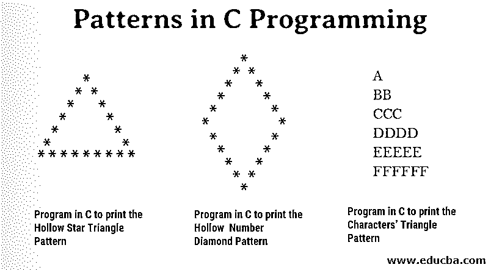


## C 编程中的模式介绍

c 是过程化的通用编程语言。它最初是由丹尼斯·里奇在 1969 年至 1973 年间创作的。低级内存访问、一组简单的关键字和容易实现是 C 语言的主要特点。有很多语言像 PHP，Java，Javascript 等。在某种程度上遵循 C 语言的特性或语法。在本文中，我们将介绍 C 编程中的模式

### C 语言的结构

**Header**# include<stdio . h>
T3】Main():int Main()
{
**变量声明:**int x = 12；
**正文:** printf("%d "，x)；
**返回:**返回 0；
}

<small>网页开发、编程语言、软件测试&其他</small>

### C 程序设计中的模式类型

C 语言中有各种各样的模式，如星形模式、数字模式和字符模式。在本节中，我们将讨论如何借助示例创建不同的模式。

#### 1.数字模式

在这一节中，我们将看到如何在 C 语言中打印不同的[数字模式](https://www.educba.com/number-patterns-in-c/)

**例 1:用 C 语言编写打印数字金字塔图案的程序**

在下面的 C 程序中，用户可以根据需要提供打印数字金字塔图案的行数，结果将显示在屏幕上:

```
#include<stdio.h>
#include<conio.h>
int main()
{
int n, x,  y, k;
printf("Enter the number of rows to show number pattern: ");
scanf("%d",&n);
for(x =1; x <= n; x++)
{
for(y =1; y <= n; y++)
{
if(y <= x)
printf("%d",y);
else
printf(" ");
}
for(y = n; y >= 1;y--)
{
if(y <= x)
printf("%d",y);
else
printf(" ");
}
printf("\n");
}
return 0;
}
```

**输出:**


**例 2:用 C 语言编程打印数字菱形图案**

在下面的 C 程序中，用户可以根据需要提供打印菱形图案的行数，结果将显示在屏幕上

```
#include<stdio.h>
#include<conio.h>
int main()
{
int n, x, y, k;
printf("Enter the number of rows to show number paatern: ");
scanf("%d",&n);
for(x = 1; x <= n; x++)
{
for(y = x; y <n; y++)
{
printf(" ");
}
for(k = 1; k < (x*2); k++)
{
printf("%d",k);
}
printf("\n");
}
for(x = 4; x >= 1; x--)
{
for(y = n; y >  x; y--)
{
printf(" ");
}
for(k = 1; k < (x*2); k++)
{
printf("%d",k);
}
printf("\n");
}
return 0;
}
```

**输出:**

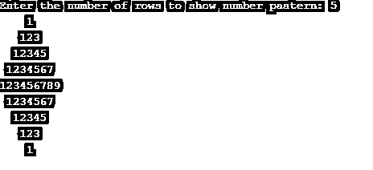


**例 3:用 C 程序打印 th** **e 号金字塔图案**

在下面的 C 程序中，用户可以根据需要提供打印数字金字塔图案的行数，结果将显示在屏幕上:

```
#include<stdio.h>
#include<conio.h>
int main()
{
int x, s, n,  y = 0, cntr = 0, cntr1 = 0;
printf("Enter the number of rows to show number pattern: ");
scanf("%d",&n);
for(x = 1; x <= n; ++x)
{
for(s = 1; s <= n-x; ++s)
{
printf("  ");
++cntr;
}
while(y != 2 * x - 1)
{
if (cntr <= n - 1)
{
printf("%d ", x + y);
++cntr;
}
else
{
++cntr1;
printf("%d ", (x + y - 2 * cntr1));
}
++y;
}
cntr1 = cntr = y = 0;
printf("\n");
}
return 0;
}
```

**输出:**

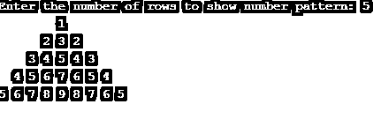


**例 4:用 C 语言编写打印垂直数字金字塔图案的程序**

在下面的 C 程序中，用户可以根据需要提供打印竖排数字金字塔图案的行数，结果将显示在屏幕上

```
#include<stdio.h>
#include<conio.h>
int main()
{
int  n, x, y;
printf("Enter the number of rows to show number pattern: ");
scanf("%d",&n);
for(int x = 1; x < n; x++)
{
for(int y = 1; y <= x; y++)
printf("%d",y);
printf("\n");
}
for(int x = n; x >= 0; x--)
{
for(int y = 1; y <= x; y++)
printf("%d",y);
printf("\n");
}
return 0;
}
```

**输出:**

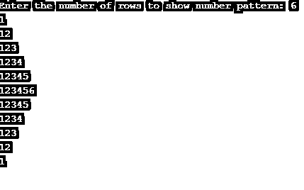


**例 5:用 C 语言编写打印数字金字塔图案的程序**

在下面的 C 程序中，用户可以根据需要提供打印数字金字塔图案的行数，结果将显示在屏幕上

```
#include<stdio.h>
#include<conio.h>
int main()
{
int  n, x, y;
printf("Enter the number of rows to show number patterns: ");
scanf("%d",&n);
for (int x = n; x >= 0; x--)
{
for (int y = 1; y <= x; y++)
printf("%d",y);
printf("\n");
}
for(int x = 1; x <= n; x++)
{
for(int y = 1; y <= x; y++)
printf("%d",y);
printf("\n");
}
return 0;
}
```

**输出:**

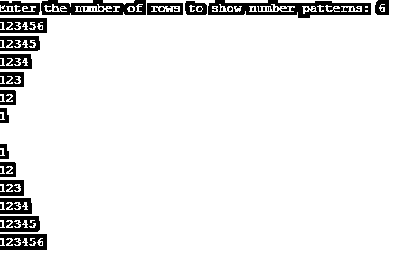


#### 2.星形图案

在这一节中，我们将看到如何用 C 语言打印不同的[星形图案](https://www.educba.com/star-patterns-in-c/)

**例 1:用 C 语言编程打印星形钻石图案**

在下面的 C 程序中，用户可以根据需要提供打印星形菱形图案的行数，结果将显示在屏幕上

```
#include<stdio.h>
#include<conio.h>
int main()
{
int n, s, x, y;
printf("Enter number of rows to show star pattern: ");
scanf("%d",&n);
for(x = 0; x <= n; x++)
{
for(s = n; s > x; s--)
printf(" ");
for(y = 0; y < x; y++)
printf("* ");
printf("\n");
}
for(x = 1; x < n; x++)
{
for(s = 0; s < x; s++)
printf(" ");
for(y = n; y > x;  y--)
printf("* ");
printf("\n");
}
return 0;
}
```

**输出:**

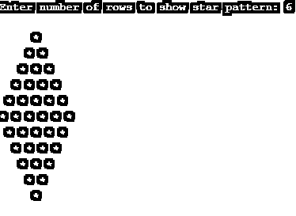


**例 2:用 C 编程打印竖曲线图案**

在下面的 C 程序中，用户可以根据需要提供打印竖曲线图案的行数，结果将显示在屏幕上

```
#include<stdio.h>
#include<conio.h>
int main()
{
int n, x , y;
printf("Enter number of rows to show star pattern: ");
scanf("%d",&n);
for(x = 1; x <= n; x++)
{
for(y = 1; y <= x;  y++)
{
printf("*");
}
printf("\n");
}
for(x = n; x >= 1; x--)
{
for(y = 1; y <= x; y++)
{
printf( "*");
}
// ending line after each row
printf("\n");
}
return 0;
}
```

**输出:**

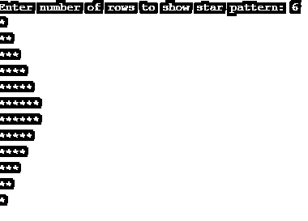


**例 3:用 C 编程打印空心数字菱形图案**

在下面的 C 程序中，用户可以根据需要提供打印空心菱形图案的行数，结果将显示在屏幕上

```
#include<stdio.h>
#include<conio.h>
int main()
{
printf("Enter the number of rows to show the star pattern:  ");
int n, x,  y,  s = 1, k;
scanf("%d",&n);
for(x = 0; x <= n; x++)
{
for(y = n; y > x; y--)
{
printf(" ");
}
printf("*");
if (x > 0)
{
for(k = 1; k <= s;  k++)
{
printf(" ");
}
s += 2;
printf("*");
}
printf("\n");
}
s -= 4;
for(x = 0; x <= n -1; x++)
{
for(y = 0; y <= x; y++)
{
printf(" ");
}
printf("*");
for(k = 1; k <= s; k++)
{
printf(" ");
}
s -= 2;
if(x != n -1)
{
printf ("*");
}
//ending line after each row
printf("\n");
}
return 0;
}
```

**输出:**

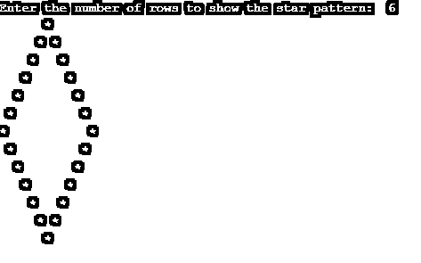


**例 4:用 C 语言编程打印空心星形三角形图案**

在下面的 C 程序中，用户可以根据需要提供打印空心星形三角形图案的行数，结果将显示在屏幕上

```
#include<stdio.h>
#include<conio.h>
int main()
{
int n, x, y, s;
printf("Enter number of rows to show the star pattern: ");
scanf("%d",&n);
for(x = 1; x <= n; x++)
{
//for loop to put space in pyramid
for (s = x; s < n; s++)
printf(" ");      //for loop to print star
for(y = 1; y <= (2 * n - 1); y++)
{
if(x == n || y == 1 || y == 2 * x - 1)
printf("*");
else
printf(" ");
}
//ending line after each row
printf("\n");
}
return 0;
}
```

**输出:**

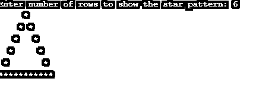


**例 5:用 C 语言编程打印星形三角形图案**

在下面的 C 程序中，用户可以根据需要提供打印星三角图案的行数，结果将显示在屏幕上

```
#include<stdio.h>
#include<conio.h>
int main()
{
int n, s, x, y;
printf("Enter number of rows to show star pattern: ");
scanf("%d",&n);
for(x = 1; x <= n; x++)
{
//for loop to put space
for(s = x; s < n; s++)
printf(" ");
//for loop for displaying star
for(y = 1; y <= x; y++)
printf("* ");
// ending line after each row
printf("\n");
}
return 0;
}
```

**输出:**

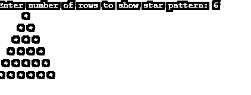


#### 3.字符模式

在这一节中，我们将看到如何在 C 语言中打印不同的字符模式

**例 1:用 C 编程打印连续字符的三角形图案**

在下面的 C 程序中，用户可以根据需要提供打印连续字符的三角形的行数，结果将显示在屏幕上

```
#include<stdio.h>
#include<conio.h>
int main()
{
int n, x, y;
printf("Enter number of rows to show character pattern: ");
scanf("%d",&n);
for(x = 1; x <= n; x++)
{
for(y = 1; y <= x; y++)
{
printf("%c",'A' + y -1);
}
printf("\n");
}
return 0;
}
```

**输出:**


**例 2** **:用 C 语言编程打印字符的三角形图案**

在下面的 C 程序中，用户可以根据需要提供打印字符三角形的行数，结果将显示在屏幕上

```
#include<stdio.h>
#include<conio.h>
int main()
{
int n, x, y;
printf("Enter number of rows to show character pattern: ");
scanf("%d",&n);
for(x = 1; x <= n; x++)
{
for(y = 1; y <= x; y++)
{
printf("%c",'A'-1 + x);
}
printf("\n");
}
return 0;
}
```

**输出:**

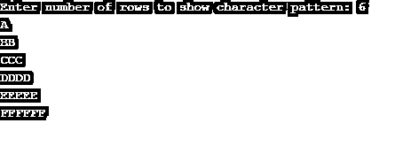


**例 3:用 C 语言编程打印字符的倒三角形图案**

在下面的 C 程序中，用户可以根据自己的需要提供打印字符倒三角图案的行数，结果将显示在屏幕上

```
#include<stdio.h>
#include<conio.h>
int main()
{
int n, x, y;
printf("Enter number of rows to show character pattern: ");
scanf("%d",&n);
for(x= 1; x <= n; x++)
{
for(y = n; y >= x; y--)
{
printf("%c",'A'-1 + x);
}
printf("\n");
}
return 0;
}
```

**输出:**

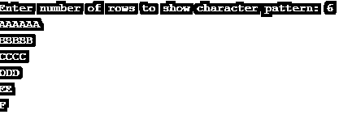


### 推荐文章

这是 C 编程模式的指南。这里我们用例子讨论不同的数字、星星和字符的模式。您也可以浏览我们推荐的其他文章，了解更多信息——

1.  [Java 面向对象编程](https://www.educba.com/object-oriented-programming-in-java/)
2.  [Java 中的星型模式](https://www.educba.com/star-patterns-in-java/)
3.  [c#中的模式](https://www.educba.com/patterns-in-c-sharp/)
4.  [C 编程矩阵乘法](https://www.educba.com/c-programming-matrix-multiplication/)


