# C 语言中的星形模式

> 原文：<https://www.educba.com/star-patterns-in-c/>


## C 语言中的星型模式介绍

在这篇文章中，首先，我们将借助例子来看看如何使用 C 编程来处理各种星形模式程序。在任何编程语言中，星型模式都是被广泛使用的常见模式之一，因为它有助于提高逻辑思维和流程控制知识。要在 C 语言中创建一个星形模式，只需使用两个或三个循环。循环的数量取决于您需要创建的模式。对于图案，至少使用两个，即一个用于行，一个用于列。第一个循环称为显示行的外部循环，第二个循环称为显示列的内部循环。

### C 语言中星形模式的例子

让我们讨论一些例子，以便于理解 C 语言中的概念。

<small>网页开发、编程语言、软件测试&其他</small>

#### 例 1:用 C 语言编程打印星形金字塔图案。

在下面的程序中，用户可以根据自己的意愿输入打印星形金字塔图案的行数，然后结果会显示在屏幕上:

```
#include<stdio.h>
#include<conio.h>
int main()
{
int n, s, i, j;
printf("Enter number of rows: ");
scanf("%d",&n);
for(i = 1; i <= n; i++)
{
//for loop for displaying space
for(s = i; s < n; s++)
{
printf(" ");
}
//for loop to display star equal to row number
for(j = 1; j <= (2 * i - 1); j++)
{
printf("*");
}
// ending line after each row
printf("\n");
}
}
```

**输出:**

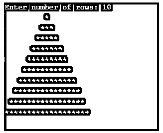


#### 例 2:用 C 语言编程输入行数。

在下面的程序中，用户可以根据自己的意愿输入打印星形金字塔图案的行数，然后结果会显示在屏幕上:

```
#include<stdio.h>
#include<conio.h>
int main()
{
int n, s, i, j;
printf("Enter number of rows: ");
scanf("%d",&n);
for(i = n; i >= 1; i--)
{
//for loop to put space
for(s = i; s < n; s++)
printf(" ");
//for loop for displaying star
for(j = 1; j <= (2 * i - 1); j++)
printf("* ");
// ending line after each row
printf("\n");
}
return 0;
}
```

**输出:**

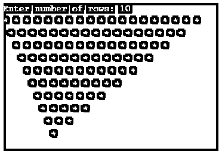


#### 例 3:用 C 语言编程打印半星形金字塔图案。

在下面的程序中，用户可以根据自己的意愿输入打印半星形金字塔图案的行数，然后结果会显示在屏幕上:

```
#include<stdio.h>
#include<conio.h>
int main()
{
int i, j, n;
printf("Enter number of rows: ");
scanf("%d",&n);
for(i = 1; i <= n; i++)
{
for(j = 1; j <= i; j++)
{
printf("* ");
}
//Ending line after each row
printf("\n");
}
return 0;
}
```

**输出:**

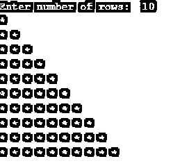


#### 例 4:用 C 语言编写程序，打印倒半星形金字塔图案。

在下面的程序中，用户可以根据自己的意愿输入打印倒半星金字塔图案的行数，然后结果会显示在屏幕上:

```
#include<stdio.h>
#include<conio.h>
int main()
{
int i, j, n;
printf("Enter number of rows: ");
scanf("%d",&n);
for(i = n; i >= 1; i--)
{
for(j = 1; j <= i; j++)
{
printf("* ");
}
// ending line after each row
printf("\n");
}
return 0;
}
```

**输出:**

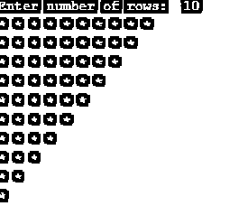


#### 例 5:用 c 语言打印完整的星形钻石图案的程序。

在下面的程序中，用户可以输入菱形尺寸的行数，按照自己的意愿打印菱形图案，然后结果会显示在屏幕上:

```
#include<stdio.h>
#include<conio.h>
int main()
{
int n, s, i, j;
printf("Enter number of rows: ");
scanf("%d",&n);
for(i = 0; i <= n; i++)
{
for(s = n; s > i; s--)
printf(" ");
for(j=0; j<i; j++)
printf("* ");
printf("\n");
}
for(i = 1; i < n; i++)
{
for(s = 0; s < i; s++)
printf(" ");
for(j = n; j > i; j--)
printf("* ");
// ending line after each row
printf("\n");
}
return 0;
}
```

**输出:**

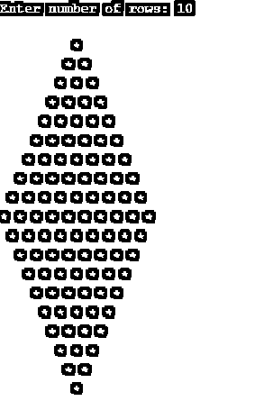


#### 例 6:用 C 语言编程打印倒星形金字塔图案。

在下面的程序中，用户可以根据自己的意愿输入打印倒星形金字塔图案的行数，然后结果会显示在屏幕上:

```
#include<stdio.h>
#include<conio.h>
int main()
{
int n, s, i, j;
printf("Enter number of rows: ");
scanf("%d",&n);
for(i = n; i >= 1; i--)
{
//for loop to put space
for(s = i; s < n; s++)
printf(" ");
//for loop for displaying star
for(j = 1; j <= i; j++)
printf("* ");
// ending line after each row
printf("\n");
}
return 0;
}
```

**输出:**

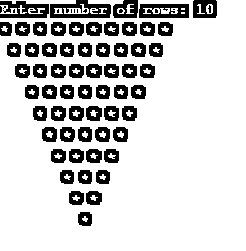


#### 例 7: **用 C 语言编程输入行数。**

在下面的程序中，用户可以根据自己的意愿输入打印星形金字塔图案的行数，然后结果会显示在屏幕上:

```
#include<stdio.h>
#include<conio.h>
int main()
{
int n, s, i, j;
printf("Enter number of rows: ");
scanf("%d",&n);
for(i = 1; i <= n; i++)
{
//for loop to put space
for(s = i; s < n; s++)
printf(" ");
//for loop for displaying star
for(j = 1; j <= i; j++)
printf("* ");
// ending line after each row
printf("\n");
}
return 0;
}
```

**输出:**

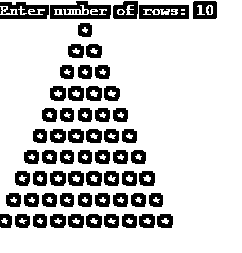


#### 例 8:用 C 语言编程输入要打印的行数。

在下面的程序中，用户可以根据自己的意愿输入打印星形金字塔图案的行数，然后结果会显示在屏幕上:

```
#include<stdio.h>
#include<conio.h>
int main()
{
int n, i , j;
printf("Enter number of rows: ");
scanf("%d",&n);
for(i = 1; i <= n; i++)
{
for(j = 1; j <= i; j++)
{
printf("*");
}
printf("\n");
}
for(i = n; i >= 1; i--)
{
for(j = 1; j <= i; j++)
{
printf( "*");
}
// ending line after each row
printf("\n");
}
return 0;
}
```

**输出:**

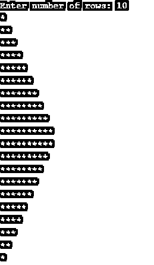


#### 例 9: **用 C 程序输入打印星号的行数**

在下面的程序中，用户可以根据自己的意愿输入打印星形金字塔图案的行数，然后结果会显示在屏幕上:

```
#include<stdio.h>
#include<conio.h>
int main()
{
int n, i, j;
printf("Enter number of rows: ");
scanf("%d",&n);
for(i = 1; i <= n; i++)
{
for(j = i; j < n; j++)
{
printf(" ");
}
for(j = 1; j <= i; j++)
{
printf("*");
}
printf("\n");
}
for(i = n; i >= 1; i--)
{
for(j = i; j <= n; j++)
{
printf(" ");
}
for(j = 1; j < i; j++)
{
printf("*");
}
// ending line after each row
printf("\n");
}
return 0;
}
```

**输出:**

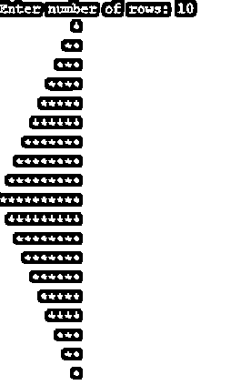


#### 示例 10:用 c++程序打印菱形的空心星形金字塔。

在下面的 C 程序中，用户可以输入行数，按照自己的意愿将空心星形金字塔打印成菱形图案，然后结果会显示在屏幕上:

```
#include<stdio.h>
#include<conio.h>
int main()
{
printf("Enter size of Daimond: ");
int n, i, j, m = 1, k;
scanf("%d",&n);
for(i = 0; i <= n; i++)
{
for(j = n; j > i; j--)
{
printf(" ");
}
printf("*");
if (i > 0)
{
for(k = 1; k <= m; k++)
{
printf(" ");
}
m += 2;
printf("*");
}
printf("\n");
}
m -= 4;
for(i = 0; i <= n-1; i++)
{
for(j = 0; j <= i; j++)
{
printf(" ");
}
printf("*");
for(k = 1; k <= m; k++)
{
printf(" ");
}
m -= 2;
if(i != n-1)
{
printf ("*");
}
//ending line after each row
printf("\n");
}
return 0;
}
```

**输出:**

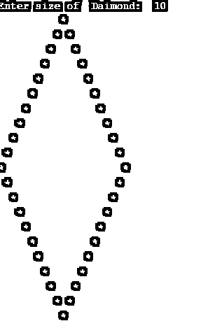


#### 例 11:用 c 语言打印空心星形金字塔图案的程序。

在下面的程序中，用户可以根据自己的意愿输入打印空心星形金字塔图案的行数，然后结果会显示在屏幕上:

```
#include<stdio.h>
#include<conio.h>
int main()
{
int r, i, j, s;
printf("Enter number of rows: ");
scanf("%d",&r);
for(i = 1; i <= r; i++)
{
//for loop to put space in pyramid
for (s = i; s < r; s++)
printf(" ");
//for loop to print star
for(j = 1; j <= (2 * r - 1); j++)
{
if(i == r || j == 1 || j == 2*i - 1)
printf("*");
else
printf(" ");
}
//ending line after each row
printf("\n");
}
return 0;
}
```

**输出:**

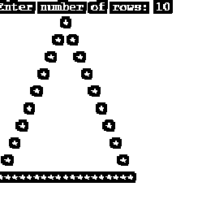


#### 例 12:用 c 语言打印倒空星形金字塔图案的程序。

在下面的程序中，用户可以根据自己的意愿输入打印倒空星形金字塔图案的行数，然后结果会显示在屏幕上:

c 程序显示倒空的星形金字塔。

```
#include<stdio.h>
#include<conio.h>
int main()
{
int r, i, j, s;
printf("Enter number of rows: ");
scanf("%d",&r);
for(i = r; i >= 1; i--)
{
//for loop to put space in pyramid
for (s = i; s < r; s++)
printf(" ");
//for loop to print star in pyramid
for(j = 1; j <= 2 * i - 1; j++)
{
if(i == r || j == 1 || j == 2*i - 1)
printf("*");
else
printf(" ");
}
printf("\n");
}
return 0;
}
```

**输出:**

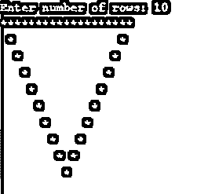


### 结论

这里我们已经看到了如何打印各种星形图案的程序。如何打印星形金字塔图案以及在行数上打印倒置的空心星形金字塔图案。包括公式，以更好地成长和逐步理解。

### 推荐文章

这是 C 语言中星形模式的指南。这里我们用 12 种不同的图像和代码来讨论 C 语言中星形模式的例子。你也可以浏览我们推荐的其他文章来了解更多信息-

1.  [C 语言中的 If-else 语句](https://www.educba.com/if-else-statement-in-c/)
2.  [PHP 中的星形模式](https://www.educba.com/star-patterns-in-php/)
3.  [Matlab 中的 IF-Else 语句](https://www.educba.com/if-else-statement-in-matlab/)
4.  [c#中的模式](https://www.educba.com/patterns-in-c-sharp/)


