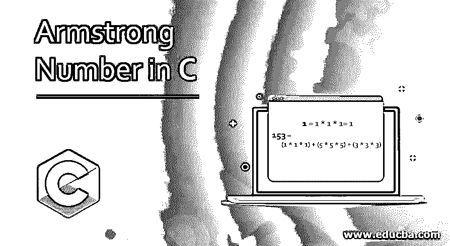
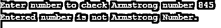
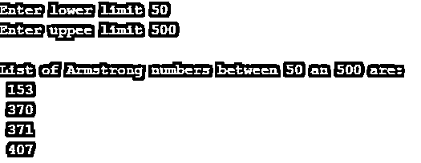

# C 语言中的阿姆斯特朗数

> 原文：<https://www.educba.com/armstrong-number-in-c/>




## C 语言中阿姆斯特朗数的介绍

阿姆斯特朗数是等于其位数的立方之和的任何数。它的所有数字的立方之和等于该数是一个阿姆斯特朗数。本文将讨论如何使用 C 编程语言来检查数字，无论它是否是阿姆斯特朗数字。阿姆斯特朗的数字是-0，1，153 和 407。检查阿姆斯特朗数的数学计算如下:

*   0 = 0 * 0 * 0 = 0
*   1 = 1 * 1 * 1= 1
*   153 = (1 * 1 * 1) + (5 * 5 * 5) + (3 * 3 * 3) = 1 + 125 + 27 = 153
*   407 = (4 * 4 * 4) + (0 * 0 * 0) + (7 * 7 * 7) = 64 + 0 + 343 = 407

### 检验阿姆斯特朗数的算法

**第一步:**输入任意数字

<small>网页开发、编程语言、软件测试&其他</small>

**第二步:**求输入数字的每一位的立方。

**第三步:**然后，把所有数字的立方相加。

**第四步:**如果第三步的结果等于输入的数字，即第一步。则打印输入的号码是阿姆斯特朗号码。

**第五步:**如果第三步的结果等于输入的数字，即第一步。那么打印输入的号码不是阿姆斯特朗号码。

### 阿姆斯特朗数的例子

本节将讨论如何使用各种方法检查阿姆斯特朗的数字。

#### 示例#1

使用 while 循环检查 Armstrong 数的程序

```
#include<stdio.h>
#include<conio.h>
int main()
{
int num, r, sum=0, temp_num;
printf("Enter number to check Armstrong number ");
scanf("%d", &num);
temp_num = num;
while(num > 0)
{
r = num % 10;
sum = sum + (r * r * r);
num = num / 10;
}
if(temp_num == sum)
{
printf("Entered number is Armstrong Number.");
printf("\n");
}
else
{
printf("Entered number is not Armstrong Number.");
printf("\n");
}
return 0;
}
```

**输出:**


**说明:**

这是一个使用 while 循环来检查阿姆斯特朗的数字的程序。在这个程序中，首先，它要求用户输入。然后将输入的数字复制到 temp_num 中。这里 temp_num 将比较最终结果和输入值。While 条件检查数字是否大于 0。如果该数字超过 0，它将随后执行语句。首先，通过执行 num%10 将最后一位数字与 num 分开。然后对该数字进行立方运算，并存储总和。然后使用 num/10 丢弃最后一个数字。这个过程将在号码中的所有数字上执行。然后比较 temp_num 和 num；如果输入值和最终结果相等，它将显示输入的数字是阿姆斯特朗数字。如果两者不相等，它将打印输入的数字，而不是阿姆斯特朗的。

#### 实施例 2

使用 do-while 循环检查 Armstrong 数的程序

```
#include<stdio.h>
#include<conio.h>
int main()
{
int num, r, sum=0, temp_num;
printf("Enter number to check Armstrong number ");
scanf("%d", &num);
temp_num = num;
do
{
r = num % 10;
sum = sum + (r * r * r);
num = num / 10;
}  while(num > 0);
if(temp_num == sum)
{
printf("Entered number is Armstrong Number.");
printf("\n");
}
else
{
printf("Entered number is not Armstrong Number.");
printf("\n");
}
return 0;
}
```

**输出:**





**说明:**

这个程序使用 do-while 循环检查输入的数字是否是 Armstrong 数字。这个程序的工作与上面的例子 1 相同。然而，在上面的例子中，唯一的区别是它首先测试条件，即 number > 0。在这里，这个例子在循环结束时验证了相同的条件。

#### 实施例 3

使用 for 循环打印阿姆斯特朗数

```
#include<stdio.h>
#include<conio.h>
int main()
{
int lower_limit, upper_limit, i, r, sum, temp_num;
printf("Enter lower limit ");
scanf("%d", &lower_limit);
printf("Enter uppee limit ");
scanf("%d", &upper_limit);
printf("\nList of Armstrong numbers between %d an %d are: ", lower_limit, upper_limit);
for(i = lower_limit; i <= upper_limit; i++)
{
sum = 0;
temp_num = i;
for(; temp_num >0; temp_num /= 10)
{
r = temp_num % 10;
sum = sum + (r * r * r);
}
if(sum == i)
printf("\n %d", i);
}
return 0;
}
```

**输出:**




**说明:**

在这个程序中，用户将输入两个数字，程序将检查一个阿姆斯特朗数字并打印出来。下限取最小数，上限取最大数。如果上限的数字很小，下限就会产生错误。因此，上限的数量应该大于下限。每个数字存储在临时数字之间的时间间隔。然后在变量 r 中，检索数字的每一位，然后找到立方体。产品就是立方体。

### 结论

在这篇文章中，我们看到了阿姆斯特朗的数字，以及在 c 中使用各种循环来检查数字是否是阿姆斯特朗的各种程序。

### 推荐文章

这是一个关于 C 语言中阿姆斯特朗数的指南。这里我们讨论了导言，检查阿姆斯特朗数的算法，以及 C 语言中阿姆斯特朗数的例子和输出。您也可以浏览我们推荐的其他文章，了解更多信息——

1.  [反转 C 中的数字](https://www.educba.com/reverse-number-in-c/)
2.  [弱大数定律](https://www.educba.com/weak-law-of-large-numbers/)
3.  PHP 中的质数
4.  [C 中的质数](https://www.educba.com/prime-numbers-in-c/)


