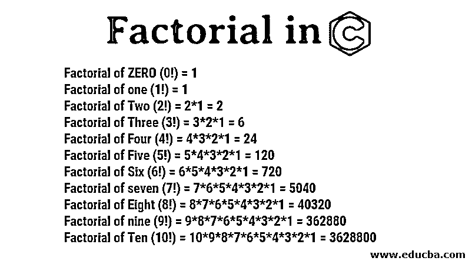
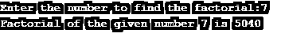

# C 中的阶乘

> 原文：<https://www.educba.com/factorial-in-c/>




## C 程序中的阶乘介绍

下面这篇文章，C 程序中的阶乘，提供了 C 语言最顶层阶乘方法的概要。阶乘的符号用这个来表示！签名。例如，数字 6 的阶乘被称为 6！.数字阶乘被描述为“数字的乘积，并且所有条目都小于零和负数。”对于阶乘概念，使用大于零的自然数(非负实体)。

让我们看一些例子来理解阶乘是如何计算的。下面我们计算了数字 1 到 10 的阶乘。

<small>网页开发、编程语言、软件测试&其他</small>

*   零的阶乘(0！) = 1
*   一(1！) = 1
*   两的阶乘(2！) = 2*1 = 2
*   三的阶乘(3！) = 3*2*1 = 6
*   四的阶乘。) = 4*3*2*1 = 24
*   五的阶乘。) = 5*4*3*2*1 = 120
*   六的阶乘(6！) = 6*5*4*3*2*1 = 720
*   七的阶乘。) = 7*6*5*4*3*2*1 = 5040
*   八的阶乘(8！) = 8*7*6*5*4*3*2*1 = 40320
*   九(9！) = 9*8*7*6*5*4*3*2*1 = 362880
*   十的阶乘(10！) = 10*9*8*7*6*5*4*3*2*1 = 3628800

下面是确定数字“n”因子的常用数学公式。

n！= n(n–1)(n–2)(n–3)……

### C 语言阶乘的多种方法举例

在这一节中，我们将讨论如何在 C 程序中使用不同的方法计算阶乘。

#### 示例 1–使用 if-else 语句

如果在 if-else 语句中对该语句求值，如果其中的语句为 true，它将给出输出。如果条件不为真，则中的语句将控制转移到 else 语句，并且正在执行 else 语句。让我们看看如何使用 if-else 语句计算阶乘。

**代码**

```
#include<stdio.h>
#include<conio.h>
int main()
{
int number, i, fact = 1;
printf("Enter the positive number to find the factorial: ");
scanf("%d",&number);
// if number is negative show the error
if (number < 0)
printf("Error! You have entered negative number and Factorial for negative number does not exist.");
else
{
for(i = 1; i <= number; ++i)
{
fact *= i;              // factorial = factorial*i;
}
printf("Factorial of the given number %d is %llu", number, fact);
}
return 0;
}
```

**上述代码的解释**

在上面的例子中，我们已经初始化了三个变量 number，即 I 和 fact。然后使用扫描功能允许用户按照他们的意愿输入号码。如果条件首先检查给定的数是否为负数，如果是负数，它将执行 If 语句并抛出错误，停止程序。

**输出为负数:**


如果给定的数字是正数，它会将控制转移到 else 语句，并在 else 语句中给定条件后执行，它会计算给定数字的[阶乘。正数的输出如下。](https://www.educba.com/factorial-in-c-sharp/)

**正数输出:**


#### 示例 2–使用 For 循环

在 For 循环中，第一个初始化步骤在整个程序中只执行一次。在这一步中，您可以为代码初始化和声明变量。在条件被评估之后。如果条件为真，那么它将执行 For 循环块内的代码。如果条件为 false，它将跳转到 For 循环之后的代码，而不执行 For 循环代码。

在 For 循环之后，将执行 increment 语句。之后，再次检查条件。如果条件为真，循环将被执行，循环将重复自身，即循环体、增量语句和条件。当条件为假时，循环结束。

**代码**

```
#include<conio.h>
#include<stdio.h>
int main()
{
int i, fact = 1, number;
printf("Enter the number to find the factorial: ");
scanf("%d", &number);
for(i = 1; i <= number; i++){
fact = fact * i;
}
printf("Factorial of the given number %d is %llu", number, fact);
return 0;
}
```

**输出:**


**上述程序的说明**

在这个程序中，我们已经初始化了变量 I，fact 和 number。当 for 循环的条件。扫描功能用于允许用户根据自己的意愿输入号码。之后，For 循环将如上所述工作。

#### 示例 3–使用递归方法

递归是一种方法，例如，在下面的软件工厂函数中调用特性本身。您首先需要以递归形式传达其答案，以通过资源解决问题。

**代码**

```
#include<stdio.h>
#include<conio.h>
factorial(int);
int main()
{
int number, fact;
printf("Enter the number to find the factorial:");
scanf("%d", &number);
if(number < 0)
printf("Negative integer factorial is not described.\n");
else
{
fact = factorial(number);
printf("Factorial of the given number %d is %llu ", number, fact);
}
return 0;
}
factorial(int number)
{
if (number == 0)
return 1;
else
return(number * factorial(number - 1));
}
```

**输出:**




#### 示例 4–使用函数

**代码**

```
#include <stdio.h>
#include<conio.h>
factorial(int);
int main()
{
int number, fact = 1;
printf("Enter the number to find the factorial: ");
scanf("%d", &number);
printf("Factorial of the given number %d is %llu", number, factorial(number));
return 0;
}
factorial(int n)
{
int c, result = 1;
for (c = 1; c <= n; c++)
result = result * c;
return result;
}
```

**输出:**


### 结论

在本文中，我们看到了如何使用条件语句和函数在 C 中计算一个数的阶乘。我希望这篇文章能帮助你理解 c 语言中的阶乘运算。

### 推荐文章

这是一个 C 语言阶乘的指南。这里我们讨论数字 1 到 10 的阶乘，使用不同方法的 C 语言阶乘的例子，带有代码和输出的“n 因子”公式。你也可以浏览我们的文章来了解更多-

1.  [Python 中的阶乘](https://www.educba.com/factorial-in-python/)
2.  [PHP 中的阶乘](https://www.educba.com/factorial-in-php/)
3.  [Java 中的阶乘](https://www.educba.com/factorial-in-java/)
4.  [JavaScript 中的阶乘程序](https://www.educba.com/factorial-program-in-javascript/)


