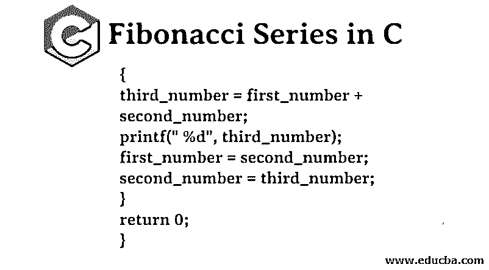
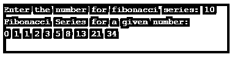
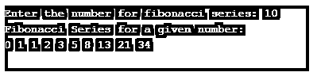
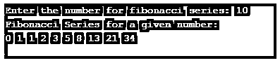
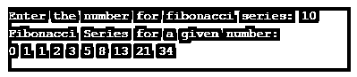
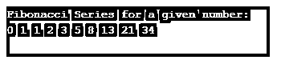

# C 语言中的斐波那契数列

> 原文：<https://www.educba.com/fibonacci-series-in-c/>




## C 语言中的斐波那契数列介绍

在 C 语言的斐波那契数列中，数列的一个数是数列最后两个数相加的结果。一个 c 语言程序，带有斐波那契数列的循环和递归。您可以使用下面的代码根据需要打印任意多的系列术语。斐波那契数列是指那个数列的数字。例如，数列的第一个数字是 0，1，2，3，5，8，…除了前两个序列项之外，其他每个词都是前面两个项的和，例如 10 = 2+8(2 和 8 的和)。

递归关系用数学术语描述了斐波那契数列的 Fn。

<small>网页开发、编程语言、软件测试&其他</small>

联合国=联合国-1 +联合国-2

### C 语言中斐波那契数列的例子

以下是一些例子:

#### 例子# 1——没有递归

**代码:**

```
#include<stdio.h>
#include<conio.h>
int main()
{
int first_number = 0, second_number = 1, third_number, i, number;
printf("Enter the number for fibonacci series:");
scanf("%d",&number);
printf("Fibonacci Series for a given number:");
printf("\n%d %d", first_number, second_number); //To print 0 and 1
for(i = 2; i < number; ++i) //loop will starts from 2 because we have printed 0 and 1 before
{
third_number = first_number + second_number;
printf(" %d", third_number);
first_number = second_number;
second_number = third_number;
}
return 0;
}
```

**输出:**




#### 示例 2——使用递归

**代码:**

```
#include<stdio.h>
#include<conio.h>
void printFibonacci(int number)
{
static int first_number = 0, second_number = 1, third_number;
if(number > 0)
{
third_number = first_number + second_number;
first_number = second_number;
second_number = third_number;
printf("%d ",third_number);
printFibonacci(number - 1);
}
}
int main()
{
int number;
printf("Enter the number for fibonacci series:");
scanf("%d",&number);
printf("Fibonacci Series for a given number: \n");
printf("%d %d ", 0, 1);
printFibonacci(number - 2); //number-2 is used because we have already print 2 numbers
return 0;
}
```

**输出:**


#### 示例 3–使用 For 循环

在 For 循环中，初始化步骤在整个程序中只执行一次。在这一步中，您可以为代码初始化和声明变量。然后条件将得到评估。

如果条件为真，那么它将执行 For 循环块内的代码。如果条件为 false，它将跳转到 for 循环之后的代码，而不执行 For 循环代码。

在 For 循环之后，将执行 increment 语句。之后，再次检查条件。如果条件为真，循环将被执行，循环将重复自身，即循环体、增量语句和条件。当条件为假时，For 循环结束。

**使用 For 循环生成斐波那契数列的程序:**

**代码:**

```
#include<stdio.h>
#include<conio.h>
int main()
{
int first_number = 0, second_number = 1, third_number, i, number;
printf("Enter the number for fibonacci series:");
scanf("%d",&number);
printf("Fibonacci Series for a given number:");
printf("\n%d %d", first_number, second_number); //To print 0 and 1
for(i = 0; i < number; i++) //loop will starts from 2 because we have printed 0 and 1 before
{
if(i <= 1)
third_number = i;
else
{
third_number = first_number + second_number;
printf(" %d", third_number);
first_number = second_number;
second_number = third_number;
}
}
return 0;
}
```

**输出:**




#### 示例 4–使用 While 循环

在 While 循环中，根据条件，While 循环被执行多次。

如果条件为真，那么它将执行 While 循环块内的代码。如果条件为 false，则跳转到 while 循环之后的代码，而不执行 While 循环代码的；看看我们如何使用 While 循环生成斐波那契数列。

**代码:**

```
#include<stdio.h>
#include<conio.h>
int main()
{
int first_number = 0, second_number = 1, third_number = 0, i = 3, number;
printf("Enter the number for fibonacci series:");
scanf("%d",&number);
printf("Fibonacci Series for a given number:");
printf("\n%d %d", first_number, second_number); //To print 0 and 1
while(i <= number)
{
third_number = first_number + second_number;
printf(" %d", third_number);
first_number = second_number;
second_number = third_number;
i = i + 1;
}
return 0;
}
```

**输出:**

**

** 

#### 示例 5–使用数组

设 f(n)是第 n 项。

f(0)= 0；

f(1)= 1；

f(n)= f(n-1)+f(n-2)；(对于 n>=2 的情况)

**系列将如下:**

Zero

One

0 + 1 = 1

1 +1 = 2

1 + 2 = 3

2 + 3 = 5

3 + 5 = 8

5 + 8 = 13

8 + 13 = 21

13 + 21 = 34

21 + 34 = 55

…等等

**使用数组生成斐波那契数列的程序:**

**代码:**

```
#include<stdio.h>
#include<conio.h>
int main()
{
int fibonacci[25], i, number;
printf("Enter the number for fibonacci series:");
scanf("%d",&number);
fibonacci[0] = 0;
fibonacci[1] = 1;
for (i = 2; i < number; i++)
{
fibonacci[i] = fibonacci[i - 1] + fibonacci[i - 2];
}
printf("Fibonacci Series for a given number: \n");
for (i = 0; i < number; i++)
{
printf("%d ", fibonacci[i]);
}
return 0;
}
```

**输出:**




#### 例 6–使用指定的数字

前两个数字是 0 和 1，序列中的其他数字是通过使用循环将序列的最后两个数字相加而生成的。这些数字存储在一个数组中，并将作为输出打印出来。

**使用指定数字生成斐波那契数列的程序:**

**代码:**

```
#include<stdio.h>
#include<conio.h>
int main()
{
int first_number = 0, second_number = 1, third_number, i;
printf("Fibonacci Series for a given number:");
printf("\n%d %d", first_number, second_number); //To print 0 and 1
for(i = 2; i < 10; ++i) //loop will starts from 2 because we have printed 0 and 1 before
{
third_number = first_number + second_number;
printf(" %d", third_number);
first_number = second_number;
second_number = third_number;
}
return 0;
}
```

**输出:**




### 结论

在本文中，我们已经看到了如何通过各种方法在 C 中生成斐波那契数列。我希望这篇文章对你有所帮助。

### 推荐文章

这是一个用 c 语言编写的斐波纳契数列的指南。这里我们讨论斐波纳契数列的介绍，如何使用 For 循环，While 循环和指定的数字以及一些示例代码。您也可以阅读以下文章，了解更多信息——

1.  [C 程序中的基数排序](https://www.educba.com/radix-sort-in-c-program/)
2.  [C 编程矩阵乘法](https://www.educba.com/c-programming-matrix-multiplication/)
3.  [最佳 C 编译器](https://www.educba.com/best-c-compilers/)
4.  [C# While 循环](https://www.educba.com/c-sharp-while-loop/)


